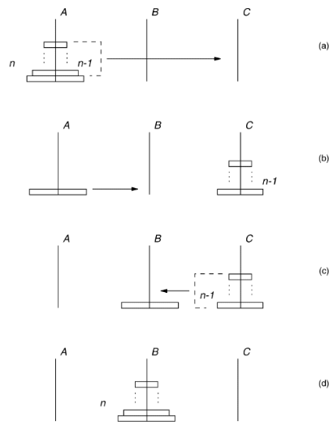

# Noções gerais de algoritmos

Após termos tido uma introdução à linguagem que trabalharemos ao longo do curso, nesta aula veremos algumas características básicas dos algoritmos que serão trabalhados na disciplina. O objetivo aqui é dar uma noção geral de como podemos avaliar um algoritmo como sendo ótimo, e como podemos pensar em otimizar algoritmos existentes.

### Índice

- [Noções gerais de algoritmos](#noções-gerais-de-algoritmos)
    - [Índice](#índice)
  - [Algoritmos](#algoritmos)
    - [Apresentação dos Algoritmos](#apresentação-dos-algoritmos)
  - [Recursividade](#recursividade)
  - [Complexidade de Algoritmos](#complexidade-de-algoritmos)
    - [A Notação O](#a-notação-o)

## Algoritmos

Um algoritmo é um processo sistemático para a resolução de um problema. O desenvolvimento de algoritmos é particularmente importante para problemas a serem solucionados em um computador, pela própria natureza do instrumento utilizado.

Existem dois aspectos básicos no estudo de algoritmos: a correção e a análise. O primeiro consiste em verificar a exatidão do método empregado, o que é realizado através de uma prova matemática. A análise visa à obtenção de parâmetros que possam avaliar a eficiência do algoritmo em termos de tempo de execução e memória ocupada. A análise é realizada através de um estudo do comportamento do algoritmo.

Um algoritmo computa uma saída, o resultado do problema, a partir de uma entrada, as informações inicialmente conhecidas e que permitem encontrar a solução do problema. Durante o processo de computação o algoritmo manipula dados, gerados a partir da sua entrada.

Quando os dados são dispostos e manipulados de uma forma homogênea, constituem um tipo abstrato de dados. Este é composto por um modelo matemático acompanhado por um conjunto de operações definido sobre esse modelo. Na representação do modelo matemático emprega-se uma estrutura de dados.

O estudo de estruturas de dados não pode ser desvinculado de seus aspectos algorítmicos. A escolha correta da estrutura adequada a cada caso depende diretamente do conhecimento de algoritmos para manipular a estrutura de maneira eficiente.

### Apresentação dos Algoritmos

Ao longo do curso, os algoritmos serão descritos através de uma linguagem de leitura simples. Contudo, para facilitar a sua interpretação será adotado o estilo do livre formato, quando conveniente.

As convenções seguintes serão utilizadas com respeito à linguagem:

* Utilizamos duas barras, `//`, para indicar comentários no algoritmo, que não devem ser processados;
* O início e o final de cada bloco são determinados por indentação, isto é, pela posição da margem esquerda. Se uma certa linha do algoritmo inicia um bloco, ele se estende até a última linha seguinte, cuja margem esquerda se localiza mais à direita do que a primeira do bloco;
* A declaração de atribuição é indicada pelo símbolo `:=`;
* As declarações seguintes são empregadas com significado semelhante ao usual:

``` cmd
se... então
se... então... senão
enquanto... faça
para... faça
pare
```

* Variáveis simples, vetores, matrizes e registro são considerados como tradicionalmente em linguagens de programação. Os elementos de vetores e matrizes são identificados por índices entre colchetes. Por exemplo, `A[5]` e `B[i, 3]` indicam, respectivamente, o quinto elemento do vetor `A` e o elemento identificado pelos índices `(i, 3)` da matriz `B`. No caso de registros, a notação `T.chave` indica o campo chave do registro `T`;
* A referência a registros pode ser também realizada por meio de ponteiros, que armazenam endereços, com o uso do símbolo `*`. Cada ponteiro é associado a um único tipo de registro. Por essa razão, o nome de registro pode ser omitido. Por exemplo, `pt*.info` representa o campo info de um registro alocado no endereço contido em `pt`;
* São usados procedimentos e funções. A passagem de parâmetros é feita por referência, isto é, o endereço do parâmetro é transmitido para a rotina. Essa forma de transmissão possibilita a alteração do conteúdo da variável utilizada;
* A sentença imediatamente posterior ao símbolo `%` deve ser interpretada como comentário.

Como exemplo, seja uma sequência de elementos armazenada no vetor S[i], com `1 <= i <= n`. Deseja-se inverter os elementos da sequência no vetor, isto é, considerá-la de trás para frente. Um algoritmo para resolver esse problema é simples. Basta trocar de posição o primeiro com o último elemento, em seguida o segundo com o antepenúltimo, e assim por diante. A formulação seguinte descreve o processo.

```
// inversão de sequência
para i := 1, ..., |_n/2_|
    temp := S[i]
    S[i] := S[n - i + 1]
    S[n - i + 1] := temp
```


A notação `|_x_|`, que aparece no algoritmo, significa _piso de x_ e representa o maior inteiro menor ou igual a `x`. Analogamente, `|~x~|` é o _teto de x_ e corresponde ao menor inteiro maior ou igual a x. Assim, `|_9/2_| = 4` e `|~9/2~| = 5`.

## Recursividade

Um tipo especial de procedimento será utilizado, algumas vezes, ao longo do curso. É aquele que contém, em sua descrição, uma ou mais chamadas a si mesmo. Um procedimento dessa natureza é denominado _recursivo_, e a chamada a si mesmo é dita _chamada recursiva_. Naturalmente, todo procedimento, recursivo ou não, deve possuir pelo menos uma chamada proveniente de um local exterior a ele. Essa chamada é denominada _externa_. Um procedimento não recursivo é, pois, aquele em que todas as chamadas são externas.

De modo geral, a todo procedimento recursivo corresponde um outro não recursivo que executa, exatamente, a mesma computação. Contudo, a recursividade pode apresentar vantagens concretas. Frequentemente, os procedimentos recursivos são mais concisos do que um não recursivo correspondente. Além disso, muitas vezes é aparente a relação direta entre um procedimento recursivo e uma prova por indução matemática. Nesses casos, a verificação da correção pode se tornar mais simples. Entretanto, muitas vezes há desvantagens no emprego prático da recursividade. Um algoritmo não recursivo equivalente pode ser mais eficiente.

O exemplo clássico mais simples de recursividade é o cálculo do fatorial de um inteiro `n >= 0`. Um algoritmo recursivo para efetuar esse cálculo encontra-se descrito em seguida. A ideia do algoritmo é muito simples. Basta observar que o fatorial de `n` é `n` vezes o fatorial de `n - 1`, para `n > 0`. Por convenção, sabe-se que `0! = 1`. No algoritmo a seguir, chamadas recursivas são representadas pela função `fat`. A chamada externa é `fat(n)`.

```
função fat(i)
    fat(i) := se i <= 1 então 1 senão i * fat(i - 1)
```

Para efeito de comparação, o algoritmo abaixo descreve o cálculo do fatorial de `n` de forma não recursiva. A variável `fat` representa, agora, um vetor e não mais uma função. O elemento `fat[n]` contém, no final, o valor do fatorial desejado.

```
fat[0] := 1
para j := 1, ..., n faça
    fat[j] := j * fat[j - 1]
```

Um exemplo conhecido, onde a solução recursiva é natural e intuitiva, é o do *Problema da Torre de Hanói*. Este consiste em três pinos, A, B e C, denominados origem, destino e trabalho, respectivamente, e n discos de diâmetros diferentes. Inicialmente, todos os discos se encontram empilhados no pino-origem, em ordem decrescente de tamanho, de baixo para cima. O objetivo é empilhar todos os discos no pino-destino, atendendo às seguintes restrições: (i) apenas um disco pode ser movido de cada vez, e (ii) qualquer disco não pode ser jamais colocado sobre outro de tamanho menor.

A solução do problema é descrita a seguir. Naturalmente, para `n > 1`, o pino-trabalho deve ser utilizado como área de armazenamento temporário. O raciocínio utilizado para resolver o problema é semelhante ao de uma prova matemática por indução. Suponha que se saiba como resolver o problema até `n - 1` discos, `n > 1`, de forma recursiva. A extensão para `n` discos pode ser obtida pela realização dos seguintes passos:

* Resolver o problema da Torre de Hanói para os `n - 1` discos do topo do pino-origem A, supondo que o pino-destino seja C e o trabalho seja B;
* Mover o n-ésimo pino (maior de todos) de A para B;
* Resolver o problema da Torre de Hanói para os `n - 1` discos localizados no pino C, suposto origem, considerando os pinos A e B como trabalho e destino, respectivamente.

Ao final desses passos, todos os discos se encontram empilhados no pino B e as duas restrições (i) e (ii) foram satisfeitas. O algoritmo abaixo implementa o processo. O procedimento recursivo `hanoi` é utilizado com quatro parâmetros n, A, B e C, representando, respectivamente, o número de discos, o pino-origem, o destino e o trabalho.

```
procedimento hanoi(n, A, B, C)
se n > 0 então
    hanoi(n - 1, A, C, B)
    mover o disco do topo de A para B
    hanoi(n - 1, C, B, A)
```

A imagem abaixo ilustra os passos efetuados pelo algoritmo. A chamada externa é `hanoi(n, A, B, C)`.



## Complexidade de Algoritmos

Conforme já mencionado, uma característica muito importante de qualquer algoritmo é o seu tempo de execução. Naturalmente, é possível determiná-lo através de métodos empíricos, isto é, obter o tempo de execução através da execução propriamente dita do algoritmo, considerando-se entradas diversas.

Em contrapartida, é possível obter uma ordem de grandeza do tempo de execução através de métodos analíticos. O objetivo desses métodos é determinar uma expressão matemática que traduza o comportamento de tempo de um algoritmo. Ao contrário do método empírico, o analítico visa aferir o tempo de execução de forma independente do computador utilizado, da linguagem e dos compiladores empregados e das condições locais de processamento.

As seguintes simplificações serão introduzidas para o modelo proposto:

* Suponha que a quantidade de dados a serem manipulados pelo algoritmo seja suficientemente grande. Isto é, algoritmos cujas entradas consistam em uma quantidade reduzida de dados não serão considerados. Somente o comportamento assintótico será avaliado, ou seja, a expressão matemática fornecerá valores de tempo que serão válidos unicamente quando a quantidade de dados correspondente crescer o suficiente.
* Não serão consideradas constantes aditivas ou multiplicativas na expressão matemática obtida. Isto é, a expressão matemática obtida será válida, a menos de tais constantes.

É necessário, ainda, definir a variável em relação à qual a expressão matemática avaliará o tempo de execução. O próprio conceito de algoritmo oferece a sugestão. Um algoritmo opera a partir de uma entrada para produzir uma saída, dentro de um tempo que se deseja avaliar. A ideia é exprimir o tempo de execução em função da entrada.

O processo de execução de um algoritmo pode ser dividido em etapas elementares, denominadas _passos_. Cada passo consiste na execução de um número fixo de operações básicas cujos tempos de execução são considerados constantes. A operação básica de maior frequência de execução do algoritmo é denominada _operação dominante_. Como a expressão do tempo de execução do algoritmo será obtida a menos de constantes aditivas e multiplicativas, o número de passos de um algoritmo pode ser interpretado como sendo o número de execuções da operação dominante.

Por exemplo, em diversos algoritmos para ordenar os elementos de uma sequência dada, cada passo corresponde a uma comparação entre dois elementos da sequência. Na realidade, o número de passos de um algoritmo constitui a informação de que se necessita para avaliar o seu comportamento de tempo. Assim, um algoritmo de um único passo possui tempo de execução constante.

Portanto, a expressão matemática a ser definida, do tempo de execução de um algoritmo, pode ser apresentada como uma função que fornece o número de passos efetuados pelo algoritmo a partir de uma entrada.

Como exemplo, no algoritmo de inversão de sequência, cada entrada é uma sequência que se deseja inverter. O algoritmo efetua exatamente as mesmas operações para sequência de mesmo tamanho `n`. Cada passo corresponde à troca de posição entre dois elementos da sequência. Ou seja, à execução das três instruções de atribuição dentro do bloco *para* do algoritmo. O número de passos é, pois, igual ao número de execuções do bloco *para*, ou `|_n / 2_|`, `n > 1`.

Como exemplos adicionais, considere os problemas de determinar as matrizes soma C e produto D de duas matrizes dadas, `A = (a_ij)` e `B = (b_ij)`, ambas `n x n`. Nesse caso, C e D também possuem dimensão `n x n` e seus elementos `c_ij` e `d_ij` podem ser calculados, respectivamente, por:

```
c_ij = a_ij + b_ij
d_ij = sum_(1<=<=n) a_ij * b_kj
```

O algoritmo abaixo descreve a computação da matriz soma de duas matrizes, enquanto o seguinte fornece o produto.

```
// soma de matrizes
para i := 1, ..., n faça
    para j := 1, ..., n faça
        C[i][j] := A[i][j] + B[i][j]
```

```
// produto de matrizes
para i:= 1, ..., n faça
    para j := 1, ..., n faça
        C[i][j] := 0
        para k := 1, ..., n faça
            C[i][j] := C[i][j] + A[i][k] * B[k][j]
```

Como no caso do algoritmo de inversão de sequência, ambos os algoritmos de soma e produto efetuam as mesmas operações, respectivamente, sempre que A, B forem matrizes de mesma dimensão `n x n`. A variável independente é o parâmetro `n`. Cada passo do algoritmo de soma corresponde à execução de uma soma `a_ij + b_ij`, enquanto, no produto de matrizes, corresponde ao produto `a_ik * b_kj`. O número total de passos é, pois, igual ao número total de somas `a_ij + b_ij` e produtos `a_ik * b_kj`, respectivamente, para cada caso. Ou seja, o algoritmo de somar matrizes efetua n² passos, enquanto o de multiplicar matrizes efetua n³.

A noção de complexidade de tempo é descrita a seguir.

> Seja A um algoritmo, `{E_1, ..., E_m}`, o conjunto de todas as entradas possíveis de A. Denote por `t_i` o número de passos efetuados por A, quando a entrada for `E_i`. Definem-se, com `p_i` sendo a probabilidade de ocorrência da entrada `E_i`:

* Complexidade do pior caso: `max_(E_i in E) {t_i}`;
* Complexidade do melhor caso: `min_(E_i in E) {t_i}`;
* Complexidade do caso médio: `sum_(1 <= i <= m) p_i * t_i`.

De forma análoga, podem ser definidas complexidades de espaço de um algoritmo.

As complexidades têm por objetivo avaliar a eficiência de tempo ou espaço. A complexidade de tempo de pior caso corresponde ao número de passos que o algoritmo efetua no seu pior caso de execução, isto é, para a entrada mais desfavorável. De certa forma, a complexidade de pior caso é a mais importante das três mencionadas. Ela fornece um limite superior para o número de passos que o algoritmo pode efetuar, em qualquer caso. Deste modo, o termo _complexidade_ será empregado com o significado de complexidade de pior caso.

### A Notação O

Observe que as definições de complexidade da seção anterior implicam o atendimento das duas simplificações mencionadas no início do parágrafo. Em consequência, quando se considera o número de passos efetuados por um algoritmo, podem-se desprezar constantes aditivas ou multiplicativas. Por exemplo, um valor de número de passos igual a `3n` será aproximado para `n`. Além disso, como o interesse é restrito a valores assintóticos, termos de menor grau também podem ser desprezados. Assim, um valor de número de passos igual a `n ^ 2 + n` será aproximado para `n ^ 2`. O valor `6n ^ 3 + 4n - 9` será transformado em `n ^ 3`.

Torna-se útil, portanto, descrever operadores matemáticos que sejam capazes de representar situações como essas. A *notação O* será utilizada com essa finalidade.

Sejam `f`, `h` funções reais positivas de variável inteira `n`. Diz-se que `f` é `O(h)`, escrevendo-se `f = O(h)`, quando existir uma constante `c > 0` e um valor inteiro `n_o`, tal que `n > n_o => f(n) <= c * h(n)`. Ou seja, a função `h` atua como um limite superior para valores assintóticos da função `f`. Em seguida são apresentados alguns exemplos da notação O.

```
f = n ^ 2 - 1 => f = O(n ^ 2)
f = n ^ 3 - 1 => f = O(n ^ 3)
f = 403 => f = O(1)
f = 5 + 2 * log n + 3 * log ^ 2n => f = O(log ^ 2n)
```

As seguintes propriedades são úteis para manipular expressões em notação O. Elas decorrem diretamente da definição.

Sejam `g`, `h` funções reais positivas e `k` uma constante. Então:

* `O(g + h) = O(g) + O(h)`;
* `O(k * g) = k * O(g) = O(g)`.

Essas duas propriedades foram empregadas, implicitamente, nos exemplos anteriores.

A notação O será utilizada, ao longo deste curso, para exprimir complexidades. Por exemplo, seja determinar as complexidades de pior, melhor e caso médio dos algoritmos já apresentados neste capítulo. Todos eles apresentam a propriedade o número de passos manter-se o mesmo quando aplicados a entradas diferentes do mesmo tamanho. Ou seja, para um mesmo valor de `n` o número de passos mantém-se constante. Como a variável independente é o valor `n`, conclui-se que as complexidades de pior, melhor e caso médio são todas iguais entre si para cada algoritmo.

O algoritmo de inverter uma sequência efetua sempre `|_n/2_|` passos. Logo, a complexidade é O(n). No fatorial não recursivo, o número de passos é igual ao número de produtos `j * fat(j - 1)`, isto é, `n`. Sua complexidade, portanto, é O(n). Da mesma forma, verifica-se de imediato que as complexidades dos algoritmos de soma e produto de matrizes são respectivamente iguais a O(n^2) e O(n^3).

Para encontrar a complexidade de procedimentos recursivos, pode-se aplicar a seguinte técnica. Determina-se o número total de chamadas ao procedimento recursivo. Em seguida, calcula-se a complexidade da execução correspondente a uma única chamada, sem que se considerem as chamadas recursivas encontradas. A complexidade total será o produto do número de chamadas pela complexidade da computação de uma chamada isolada. Por exemplo, para calcular o fatorial de `n > 0`, de forma recursiva, o algoritmo recursivo efetua um total de `n` chamadas ao procedimento `fat`. A complexidade da computação correspondente a uma chamada é constante, isto é, O(1). De fato, para `n > 1`, apenas um produto é efetuado e, quando `n <= 1`, apenas uma atribuição é executada. Logo, a complexidade final do algoritmo é O(n). A complexidade do algoritmo para resolver o problema da Torre de Hanói, é O(2 ^ pi).
