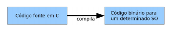
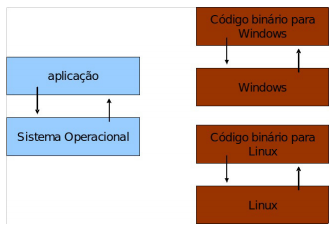
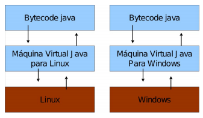

# Introdução ao curso

Neste material discutimos sobre alguns tópicos introdutórios ao curso e à carreira de um programador de software. Vamos entender o porquê a programação é um conhecimento fundamental para os próximos anos, e faremos um breve histórico da linguagem Java, que será usada durante este curso. Por fim, traremos algumas opções de configurações de ambientes de desenvolvimento.

### Índice

- [Introdução ao curso](#introdução-ao-curso)
    - [Índice](#índice)
  - [Afinal, o que é programar?](#afinal-o-que-é-programar)
    - [Um pouco de história...](#um-pouco-de-história)
    - [Um computador para cada programa](#um-computador-para-cada-programa)
    - [Programando com zeros e uns](#programando-com-zeros-e-uns)
    - [Programando nos tempos modernos](#programando-nos-tempos-modernos)
  - [Linguagens de programação](#linguagens-de-programação)
    - [Linguagens formais](#linguagens-formais)
  - [Por que aprender a programar?](#por-que-aprender-a-programar)
  - [Paradigmas de programação](#paradigmas-de-programação)
  - [Sobre a linguagem Java](#sobre-a-linguagem-java)
    - [Um breve histórico](#um-breve-histórico)
    - [Máquinas virtuais](#máquinas-virtuais)
    - [Quando usar Java](#quando-usar-java)
  - [Configurando e preparando o ambiente de trabalho](#configurando-e-preparando-o-ambiente-de-trabalho)
  - [Sugestões de conteúdos](#sugestões-de-conteúdos)

## Afinal, o que é programar?

### Um pouco de história...

Os computadores como conhecemos hoje, eletrônicos e de uso geral, surgiram na década de 1940, com o ENIAC (_Eletronic Numerical Integrator and Computer_). Este computador começou a ser desenvolvido no final da II Guerra Mundial para cálculos balísticos de grande complexidade, mas ele só entrou em operação após o final da guerra. Ele pesava cerca de 30 toneladas e ocupava uma sala inteira de 10m x 15m.

Para que ele funcionasse, era necessário dezenas de pessoas (normalmente mulheres, chamadas de computadores humanos), que percorriam longas filas de interruptores. Cada interruptor representava um valor binário, 0 ou 1, conforme ele estivesse desligado ou ligado, respectivamente. A sequência de interruptores possibilitava que o ENIAC processasse os cálculos inseridos pelos computadores humanos. Era possível realizar até 5000 somas por segundo, ou 300 multiplicações (para referência, em computadores modernos esse número está na casa dos trilhões).

Essa operação de configurar o computador para que ele realizasse as operações desejadas é chamada de **programação**. Conceitualmente, hoje ainda fazemos a mesma coisa que os computadores humanos faziam na década de 1940: passamos instruções específicas para o computador, para que ele possa apresentar um comportamento específico. Na prática, temos algumas diferenças entre a programação contemporânea e a programação nos primeiros computadores eletrônicos.

### Um computador para cada programa

O ENIAC e outros computadores à sua época eram considerados com programas fixos, ou seja, eles executavam exatamente as mesmas operações definidas no momento do seu projeto. Uma alteração simples no programa do ENIAC significava religar os componentes eletro-eletrônicos, o que poderia demorar até três semanas para que ele começasse a trabalhar. Guardadas as devidas proporções, o ENIAC era como uma calculadora de mesa tradicional: era possível realizar operações matemáticas e até mesmo cálculos complexos, mas era inviável desenvolver uma solução de editor de textos, por exemplo.

O matemático John von Neumann, um dos construtores do ENIAC, percebeu essa limitação e propôs uma arquitetura de tal forma que o programa e os dados processados seriam armazenados em um mesmo lugar, a memória do computador. Essa solução possibilitou o desenvolvimento de **computadores de programas armazenados**. Um computador dessa categoria inclui, inicialmente, um conjunto de instruções, e pode armazenar na memória um outro conjunto de instruções (programa) que detalha o cálculo a ser realizado. A arquitetura de von Neumann ainda permite que os programas possam se modificar durante a execução. Ela ainda é a arquitetura usada nos computadores modernos, apesar de já haverem discussões em torno de outras arquiteturas, como a do computador quântico.

### Programando com zeros e uns

O processo de programação no ENIAC e em computadores similares era, claramente, pouco produtivo. Codificar um programa era algo muito similar à forma que as telefonistas estabeleciam conexões entre diferentes telefones. Mesmo que o processo de configuração dos interruptores fosse simplificado, o programador ainda precisaria codificar o seu programa em valores binários, zeros e uns. Isso criava uma barreira enorme no entendimento e na disseminação do conhecimento da programação de computadores, fazendo desse trabalho algo de nicho, específico a grandes corporações e a entidades governamentais.

Com a arquitetura de von Neumann e o conceito de computadores de programas armazenados, surgiram computadores que possibilitavam a simplificação do processo de programação. Em 1951, o UNIVAC I se tornou o primeiro computador comercialmente disponível que utilizava o conceito de programa armazenado. Em 1952, uma das pessoas que participou do time que projetou o UNIVAC I, Grace Hopper, desenvolveu o programa **A-0** que convertia instruções simples em inglês em código de máquina. Este programa é considerado o primeiro **compilador**, e revolucionou o processo de programação. A partir deste momento não era mais necessário programar um computador utilizando zeros e uns: bastava inserir alguns comandos pré-definidos em inglês, que um outro programa armazenado no computador fazia a conversão para o código da máquina.

### Programando nos tempos modernos

Com a criação dos compiladores e a constante evolução tanto dos hardwares, quanto dos softwares desenvolvidos, o processo de programação se tornou muito mais simples. Em essência, sua definição continua a mesma: **programar um computador significa fornecer à máquina um conjunto de instruções que indica o que você quer que ela faça**. Se você está desenvolvendo um aplicativo de mensagens e precisa criar um botão "enviar", você define uma série de instruções que devem ser executadas pelo computador na sequência correta, de forma a realizar o envio da mensagem de um celular para outro. A programação atual, então, passa por acessar as características e funcionalidades internas do computador, de forma a ser capaz de usá-las.

A programação se resume a uns poucos conceitos fundamentais:

- _Entrada de dados_: define de que forma a máquina obtém informações, que podem ser recebidas via teclado, arquivos, rede, mouse ou outros dispositivos. Essas informações tanto podem estar sendo produzidas por usuários humanos quanto por outros dispositivos;
- _Saída de dados_: define como a máquina apresenta respostas ao mundo externo, que podem ser exibidas através de um monitor, impressora ou outros dispositivos. Da mesma forma que as entradas, as saídas podem ser enviadas usuários humanos ou a outros dispositivos.
- _Processamento_: define como os dados de entrada são transformados e combinados com outras informações eventualmente já armazenadas pela máquina, ou obtidas por ela, para produzir as saídas. O processamento segue uma lógica de execução que é conhecida como “algoritmo”. Um algoritmo é basicamente uma lista finita de instruções que resolve um problema específico e se estrutura a partir de:
  - _Comandos_: instruções individuais que o programador dá à máquina e que ela é capaz de executar;
  - _Seleção_: estruturas que permitem à máquina decidir quando executar uma determinada lista de comandos ou outra;
  - _Repetição_: estruturas que permitem à máquina repetir uma lista de comandos um número fixo de vezes ou até que uma determinada condição seja obtida.

## Linguagens de programação

O conceito de compiladores criado inicialmente por Grace Hopper trouxe para os programadores uma nova perspectiva sobre como programar. A partir de então, já não era mais necessário desenvolver código em linguagem de máquina, ou seja, zeros e uns. Os conjuntos pré-definidos de instruções em inglês (ou qualquer outro idioma), que são traduzidos pelo compilador, passaram então a ser chamados de **linguagens de programação**. Alan Turing, considerado hoje um dos pais da computação moderna, também esteve interessado na programação das operações de um computador. Turing estava convencido de que operações de cálculo eram apenas a ponta do iceberg em termos de utilização dos computadores. Ele elaborou tabelas de instruções que automaticamente converteriam a escrita decimal em códigos binários, que poderiam ser lidos pelas máquinas.

As linguagens que utilizavam, então, os conceitos propostos por Hopper e Turing, foram chamadas de **linguagens de alto nível**, ou seja, linguagens que são facilmente lidas e interpretadas por seres humanos, em oposição às linguagens de máquina, denominadas de **linguagens de baixo nível**. Atualmente, programadores de linguagens de baixo nível são pouquíssimos, sendo altamente especializados e focados em situações muito específicas, ligadas ao controle das funções mais básicas da máquina.

Apesar de terem existido linguagens de alto nível anteriores, a primeira a ser comercializada foi o **FORTRAN**, em 1957. O FORTRAN teve diversas versões e atualizações ao longo dos anos, e em 2022 está na 23ª posição no índice TIOBE, que mede a popularidade de linguagens de programação. Sua aplicação hoje se restringe a cálculos complexos e que exijam alto desempenho e precisão. Outras linguagens criadas nas décadas de 1950 e 1960 que são usadas até hoje incluem o COBOL (usado em praticamente todos os sistemas bancários governamentais) e o BASIC (suas versões mais recentes ainda são muito usadas para aplicações desktop). Dentre as linguagens compiladas mais populares atualmente, temos C e C++

Um pouco depois, em 1958, surgiu a linguagem **LISP**, a primeira **linguagem interpretada**. Ao invés das linguagens compiladas, como o FORTRAN, uma linguagem interpretada não exige uma "tradução" prévia do código. Ao invés de um compilador, entra em cena um interpretador, que lê cada linha do código inserido e a executa independentemente. Nas linguagens interpretadas mais populares hoje em dia, podemos mencionar Python, Ruby e Lua.

Linguagens compiladas tendem a ser, usualmente, mais eficientes que linguagens interpretadas, já que, no momento da execução do código, este já foi traduzido para linguagem de máquina e não precisa ser processado em alto nível. Como nas linguagens interpretadas essa tradução é em tempo real, isso causa um custo computacional que pode reduzir sua eficiência. Por outro lado, linguagens interpretadas tendem a permitir uma melhor análise linha a linha do código, já que é possível executá-las separadamente, estudando os seus resultados e permitindo modificações sem a necessidade de recompilar todo o código.

### Linguagens formais

Existe uma diferença fundamental entre a linguagem humana (ou natural) e as linguagens de programação. Os seres humanos são capazes de compreender expressões mesmo que elas não estejam escritas corretamente. Considere, por exemplo, a frase "Olá! Td bem c vc?". Um ser humano (que entenda português, claro) compreende facilmente que, nesse contexto, "td" significa "tudo" e "c vc" significa "com você". Com os computadores, no entanto, não há essa análise de contexto. A não ser que ele seja programado para entender que "vc" e "você" são a mesma coisa em uma linguagem, é necessário utilizar aquilo que está previsto na sua documentação.

Ou seja, programas são escritos em uma linguagem formal. Cada letra e cada sinal matemático ou de pontuação têm um significado muito preciso. Mudar qualquer um destes sinais pode, muitas vezes, mudar o sentido do programa, ou até fazê-lo parar de funcionar.

## Por que aprender a programar?

É indiscutível que, atualmente, computadores fazem parte da nossa vida. No entanto, apesar de hoje sermos grandes utilizadores de computadores, dos celulares na nossa mão aos aviões em que embarcamos para viajar, a maiora das pessoas simplesmente ignora o funcionamento interno dessas máquinas.

As pessoas confiam quase que cegamente na tecnologia que lhes é apresentada. Muitos utilizam, no dia-a-dia, computadores para ler e enviar e-mail, preencher planilhas e elaborar relatórios. Mas como as mensagens são enviadas de uma conta de e-mail para a outra? Como uma célula de uma planilha consegue realizar uma operação de soma? Como o processador de texto entende quando uma palavra foi digitada incorretamente? Quem entende os princípios básicos de programação pode ter a real consciência do que está acontecendo por trás desses programas, e poderá ser capaz, inclusive, de modificar esses processos para obter resultados diferenciados.

Muitos profissionais poderão precisar de cálculos especiais para os dados que estão utilizando, sejam eles números ou textos, e nem sempre os aplicativos disponíveis no mercado oferecem as funções necessárias. Uma pessoa que saiba programar poderá criar praticamente qualquer função de que necessite de forma muito mais flexível, sem depender de aplicativos específicos. Alguém que saiba programar ainda pode modificar aplicativos existentes, de forma a provocar comportamentos específicos que não ocorreriam normalmente.

Além das possibilidades apresentadas, que podem favorecer praticamente qualquer profissional em um escritório hoje em dia, talvez um dos maiores motivos para se aprender programação hoje em dia seja porque a sociedade **precisa** de cada vez mais programadores. O número de computadores circulando no mercado é gigantesco, variando desde geladeiras a carros autônomos, passando por celulares, relógios e televisores, e chegando a satélites e ônibus espaciais. A demanda pelo desenvolvimento de software tem crescido exponencialmente desde que a computação contemporânea surgiu, nas décadas de 1940 e 1950, e não dá sinais de estar desacelerando.

Então, por que tão poucas pessoas aprendem a programar? A resposta talvez esteja no fato de que, para ser realmente compreendida, uma linguagem de programação precisa ser aplicada. Da mesma forma que ler um livro ou assistir a um curso teórico que explique a gramática e a sintaxe de uma língua estrangeira não é suficiente para que uma pessoa se torne fluente, apenas assistir a um curso de programação não torna uma pessoa programadora. Para uma língua estrangeira, é preciso não apenas saber sua gramática e sintaxe, mas também resolver pequenos problemas, como pedir um copo d'água ou informações sobre um determinado percurso. Com programação é o mesmo: é necessário muita prática, esbarrar em alguns obstáculos, entendê-los e eliminá-los. Aos poucos a pessoa adquire fluência e terá desenvoltura para escrever códigos complexos e sofisticados usando uma linguagem de programação.

## Paradigmas de programação

Um paradigma, por definição, é um conceito que define um exemplo típico ou modelo de algo. É a representação de um padrão a ser seguido. Um **paradigma de programação** é uma forma de classificação de linguagens de programação, baseada nas suas funcionalidades. Um paradigma é, portanto, um tipo de estruturação ao qual a linguagem deverá respeitar.

Cada paradigma surgiu de necessidades diferentes. Dado isso, cada um apresenta maiores vantagens sobre os outros dentro do desenvolvimento de determinado sistema. Sendo assim, um paradigma pode oferecer técnicas apropriadas para uma aplicação específica.

Abaixo indicaremos alguns paradigmas mais conhecidos atualmente. É importante ressaltar que uma linguagem de programação não precisa, necessariamente, seguir um único paradigma de programação. Existem linguagens, como o Python, que são consideradas multi-paradigma, ou seja, podem ser utilizadas segundo o paradigma procedural, orientado a objetos ou funcional.

* **Paradigma imperativo ou procedural:** Neste tipo de construção, as instruções são passadas ao computador na sequência em que devem ser executadas. Linguagens mais antigas neste paradigma, como Cobol ou FORTRAN, não possuem nem mesmo propriedades como estruturas de repetição ou criação de funções ou rotinas. O código criado usando esse paradigma é uma espécie de passo-a-passo dos procedimentos que a máquina deverá executas. Costuma produzir um código eficiente, mas de muito difícil legibilidade, o que afeta significativamente a sua manutenção e evolução. Portanto, é mais indicado utilizar este paradigma em projetos que não sofrerão mudanças significativas no futuro;
* **Paradigma declarativo:** Já neste paradigma, é focado muito mais no "quê" precisa ser resolvido, ao invés do "como". Sendo assim, depois de algumas interações entre as interações, o resultado sempre será o mesmo, ao contrário do paradigma imperativo, em que um mesmo trecho de código pode retornar resultados diferentes. Por conta disso, o paradigma declarativo possui um nível de abstração muito maior. Linguagens que usam este paradigma são Lisp, Prolog e Haskell. Atualmente, o paradigma declarativo possui muitas aplicações com Groovy, que é uma linguagem para definir processos de integração e entrega contínuas;
* **Paradigma funcional:** No paradigma funcional, o uso de funções possui uma destaque. O programa é dividido em blocos, e cada um é implementado através de funções, que utilizam variáveis dentro do seu escopo e retornam algum resultado para a função que a chamou. Uma característica importante do paradigma funcional é que ele possui alocação de memória automática, que elimina possíveis "efeitos colaterais" nos cálculos matemáticos das funções. Como linguagens que utilizam este paradigma pode-se mencionar Lisp, Scheme e Haskell;
* **Paradigma orientado a objetos:** Apesar de ter sido um dos primeiros paradigmas criados, foi popularizado na década de 1990 com a linguagem Java. Outros exemplos de linguagens que usam esse paradigma são Smalltalk, C++ e C#. Este paradigma permite uma programação multiplataforma de uma mesma maneira, e se apoia nas abstrações de classes e objetos ao tentar retratar a programação tal qual se enxerga o mundo real. Cada objeto possui determinadas propriedades (atributos) e comportamentos (métodos). É um paradigma que possui diversos conceitos e alicerces para o correto uso e funcionamento, como herança, polimorfismo e encapsulamento;
* **Paradigma orientado a eventos:** É utilizado por qualquer linguagem de programação que tem uso de recursos gráficos, como jogos e formulários, como Visual Basic, C# e Delphi. A execução das rotinas se dá à medida que determinados gatilhos (ou eventos) são disparados pelo usuário ou por outros atores do sistema.

## Sobre a linguagem Java

A linguagem Java começou a ser concebida no início da década de 1990, com o objetivo de resolver alguns dos problemas comuns em programação na época, tais como uso de ponteiros, gerenciamento de memória, organização, falta de bibliotecas e pacotes disponíveis, necessidade de reescrever parte do código ao mudar de sistema operacional e o custo financeiro de se usar a tecnologia.

Uma das grandes motivações para a criação da plataforma Java era de que essa linguagem fosse usada em pequenos dispositivos, como TVs. Apesar disso, a linguagem teve seu lançamento focado no uso de clientes web (browsers) para rodar pequenas aplicações, chamadas de _applets_. Hoje em dia esse não é o grande mercado do Java: apesar de ter sido idealizado com um propósito e lançado com outro, o Java ganhou destaque no lado do servidor.

### Um breve histórico

A Sun criou um time (conhecido como Green Team) para desenvolver inovações tecnológicas em 1992. Esse time foi liderado por James Gosling, considerado o pai do Java. O time voltou com a ideia de criar um interpretador (já era uma máquina virtual, veremos o que é isso mais a frente) para pequenos dispositivos, facilitando a reescrita de software para aparelhos eletrônicos, como vídeo cassete, televisão e aparelhos de TV a cabo.

A ideia não deu certo. Tentaram fechar diversos contratos com grandes fabricantes de eletrônicos, como Panasonic, mas não houve êxito devido ao conflito de interesses e custos. Hoje, sabemos que o Java domina o mercado de aplicações para celulares com mais de 2.5 bilhões de dispositivos compatíveis, porém em 1994 ainda era muito cedo para isso.

Com o advento da web, a Sun percebeu que poderia utilizar a ideia criada em 1992 para rodar pequenas aplicações dentro do browser. A semelhança era que na internet havia uma grande quantidade de sistemas operacionais e browsers, e com isso seria grande vantagem poder programar numa única linguagem, independente da plataforma. Foi aí que o Java 1.0 foi lançado: focado em transformar o browser de apenas um cliente magro (thin client ou terminal burro) em uma aplicação que possa também realizar operações avançadas, e não apenas renderizar HTML.

Os applets deixaram de ser o foco da Sun, e nem a Oracle nunca teve interesse. É curioso notar que a tecnologia Java nasceu com um objetivo em mente, foi lançado com outro, mas, no final, decolou mesmo no desenvolvimento de aplicações do lado do servidor. Sorte? Há hoje o Java FX, tentando dar força para o Java não só no desktop mas como aplicações ricas na web, mas muitos não acreditam que haja espaço para tal, considerando o destino de tecnologias como Adobe Flex e Microsoft Silverlight.

Em 2009 a Oracle comprou a Sun, fortalecendo a marca. A Oracle sempre foi, junto com a IBM, uma das empresas que mais investiram e fizeram negócios através do uso da plataforma Java. Em 2014 surge a versão Java 8 com mudanças interessantes na linguagem.

### Máquinas virtuais

Em uma linguagem de programação como C e Pascal, temos a seguinte situação quando vamos compilar um programa:

O código fonte é compilado para código de máquina específico de uma plataforma e sistema operacional. Muitas vezes o próprio código fonte é desenvolvido visando uma única plataforma!

Esse código executável (binário) resultante será executado pelo sistema operacional e, por esse motivo, ele deve saber conversar com o sistema operacional em questão.

Isto é, temos um código executável para cada sistema operacional. É necessário compilar uma vez para Windows, outra para o Linux, e assim por diante, caso a gente queira que esse nosso software possa ser utilizado em várias plataformas. Esse é o caso de aplicativos como o OpenOffice, Firefox e outros.

Como foi dito anteriormente, na maioria das vezes, a sua aplicação se utiliza das bibliotecas do sistema operacional, como, por exemplo, a de interface gráfica para desenhar as "telas". A biblioteca de interface gráfica do Windows é bem diferente das do Linux: como criar então uma aplicação que rode de forma parecida nos dois sistemas operacionais?

Precisamos reescrever um mesmo pedaço da aplicação para diferentes sistemas operacionais, já que eles não são compatíveis.

Já o Java utiliza do conceito de máquina virtual, onde existe, entre o sistema operacional e a aplicação, uma camada extra responsável por "traduzir" - mas não apenas isso - o que sua aplicação deseja fazer para as respectivas chamadas do sistema operacional onde ela está rodando no momento:

Dessa forma, a maneira com a qual você abre uma janela no Linux ou no Windows é a mesma: você ganha independência de sistema operacional. Ou, melhor ainda, independência de plataforma em geral: não é preciso se preocupar em qual sistema operacional sua aplicação está rodando, nem em que tipo de máquina, configurações, etc.

Repare que uma máquina virtual é um conceito bem mais amplo que o de um interpretador. Como o próprio nome diz, uma máquina virtual é como um "computador de mentira": tem tudo que um computador tem. Em outras palavras, ela é responsável por gerenciar memória, threads, a pilha de execução, etc.

Sua aplicação roda sem nenhum envolvimento com o sistema operacional! Sempre conversando apenas com a *Java Virtual Machine (JVM)*.

Essa característica é interessante: como tudo passa pela JVM, ela pode tirar métricas, decidir onde é melhor alocar a memória, entre outros. Uma JVM isola totalmente a aplicação do sistema operacional. Se uma JVM termina abruptamente, só as aplicações que estavam rodando nela irão terminar: isso não afetará outras JVMs que estejam rodando no mesmo computador, nem afetará o sistema operacional.

Essa camada de isolamento também é interessante quando pensamos em um servidor que não pode se sujeitar a rodar código que possa interferir na boa execução de outras aplicações

Essa camada, a máquina virtual, não entende código java, ela entende um código de máquina específico. Esse código de máquina é gerado por um compilador java, como o javac, e é conhecido por "bytecode", pois existem menos de 256 códigos de operação dessa linguagem, e cada "opcode" gasta um byte. O compilador Java gera esse bytecode que, diferente das linguagens sem máquina virtual, vai servir para diferentes sistemas operacionais, já que ele vai ser "traduzido" pela JVM.

### Quando usar Java

Antes de mais nada, é preciso ficar claro que a premissa do Java não é a de criar sistemas pequenos, onde temos um ou dois desenvolvedores. Para esses casos, outras linguagens são mais indicadas, como PHP, Perl, e outras. O foco da plataforma é outro: aplicações de médio a grande porte, com milhares (ou milhões) de linhas de código, onde o time de desenvolvedores é grande, distribuído, e cujo produto final pode vir a crescer e sofrer manutenções frequentes.

Não tenha dúvidas que criar a primeira versão de uma aplicação usando Java, mesmo através de IDEs e ferramentas de apoio, será mais trabalhoso que muitas linguagens de script ou de alta produtividade. Porém, com uma linguagem orientada a objetos e madura como o Java, será extremamente mais rápido e fácil fazer alterações no sistema, desde que você siga as boas práticas e recomendações sobre design orientado a objetos.

Além disso, a quantidade enorme de bibliotecas gratuitas para realizar os mais diversos trabalhos (tais como relatórios, gráficos, sistemas de busca, geração de código de barra, manipulação de XML, tocadores de vídeo, manipuladores de texto, persistência transparente, impressão, etc) é um ponto fortíssimo para adoção do Java: você pode criar uma aplicação sofisticada, usando diversos  recursos, sem precisar comprar um componente específico, que costuma ser caro. O ecossistema do Java é enorme.

Cada linguagem tem seu espaço e seu melhor uso. O uso do Java é interessante em aplicações que virão a crescer, em que a legibilidade do código é importante, onde temos muita conectividade e se há muitas plataformas (ambientes e sistemas operacionais) heterogêneas (Linux, Unix, OSX e Windows misturados).

Você pode ver isso pela quantidade enorme de ofertas de emprego procurando desenvolvedores Java para trabalhar com sistemas web e aplicações de integração no servidor.

Apesar disto, a Sun empenhou-se em tentar popularizar o uso do Java em aplicações desktop, mesmo com o fraco marketshare do Swing/AWT/SWT em relação às tecnologias concorrentes (em especial Microsoft .NET). A atual tentativa é o Java FX, onde a Oracle tem investido bastante.

## Configurando e preparando o ambiente de trabalho

Todas as instruções para instalação e configuração inicial do Java estão contidas [nos slides da disciplina](/./assets/poo/slides.pdf). Uma alternativa inicial, para quem não quiser ou não puder instalar o Java na sua máquina no momento, é utilizar o [replit](https://replit.com/), que provê um ambiente de desenvolvimento online, completamente configurado para Java (e outras linguagens). O replit atende perfeitamente a quase que a integridade do nosso curso. Alguns tópicos mais avançados, como teste de software e padrões da linguagem, não são inteiramente suportados, então é interessante configurar uma máquina com um ambiente Java.

Os programas que utilizamos para escrever código são comumente chamados de **IDEs**, do inglês _Integrated Development Environment_, ou ambiente integrado de desenvolvimento. Os IDEs possuem inúmeros recursos que simplificam a vida do programador, como marcação sintática de palavras (palavras específicas da linguagem recebem uma cor diferente), integração com o console do computador e execução/depuração integrados.

A escolha por qual IDE utilizar tende a ser bem pessoal. Algumas pessoas preferem ambientes já previamente configurados e que exijam pouca intervenção para funcionar bem, outras gostam de ter um espaço altamente customizável. Dois IDEs que eu recomendo usar para Java:

* **Eclipse**: é um dos IDEs mais clássicos para desenvolvimento Java. Criado pela IBM, possui diversas funcionalidades que simplificam o processo de se desenvolver nessa linguagem. Apesar de possuir suporte para outras linguagens, como C++, o Eclipse tende a ser usado pela comunidade exclusivamente para Java;
* **VSCode**: é o IDE que tenho usado nos últimos anos. Desenvolvido pela Microsoft, ele é altamente configurável, e possui inúmeros recursos que ajudam no dia-a-dia. Ele também é adequado a inúmeras linguagens de programação, bastando instalar algumas extensões da sua vasta biblioteca. A sua maior desvantagem é a sua relativa complexidade de configuração e uso, de longe ele é um dos IDEs que mais demanda adaptação do desenvolvedor. No entanto, minha opinião é que já vale a pena começar a trabalhar com o VSCode.

## Sugestões de conteúdos

* Filmes:
  * [O Jogo da Imitação](https://www.primevideo.com/detail/0RE594TD30MV9KITHPFBQ312IA/ref=atv_dp_share_cu_r) (Prime Video), que conta a história de como Alan Turing foi essencial para antecipar o encerramento da II Guerra Mundial;
  * [Estrelas Além do Tempo](https://www.disneyplus.com/pt-br/movies/estrelas-alem-do-tempo/2xa2YdiOJXQt) (Disney+), fala sobre os bastidores da NASA na década de 1960 sob a perspectiva de três mulheres que atuaram em diferentes frentes no desenvolvimento tecnológico que fizeram o homem chegar à Lua em 1969.
* Livros:
  * WAZLAWICK, R.S. [História da Computação](https://www.amazon.com.br/Hist%C3%B3ria-Computa%C3%A7%C3%A3o-Raul-Sidnei-Wazlawick-ebook/dp/B01JMAC3F8/ref=sr_1_1?__mk_pt_BR=%C3%85M%C3%85%C5%BD%C3%95%C3%91&crid=HG6K4QWB6SEJ&keywords=hist%C3%B3ria+da+computa%C3%A7%C3%A3o&qid=1646582183&sprefix=hist%C3%B3ria+da+computa%C3%A7%C3%A3%2Caps%2C203&sr=8-1). Rio de Janeiro: Elsevier, 2016.
* Material online:
  * [TecMundo - A história do ENIAC](https://www.youtube.com/watch?v=dy0wpDfnpzo);
  * [Biografia de Grace Hopper](https://president.yale.edu/biography-grace-murray-hopper), pela Universidade Yale, onde ela cursou seu PhD;
  * [Evolução das linguagens de programação entre 1965 e 2019](https://www.youtube.com/watch?v=Og847HVwRSI).
