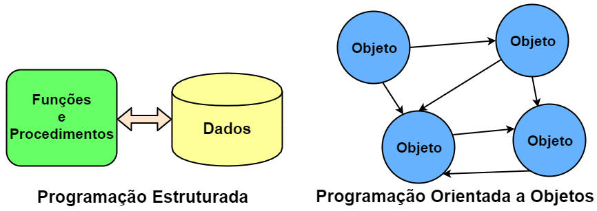

# Fundamentos da Orientação a Objetos

Dentre os vários paradigmas de programação surgidos desde a década de 1950, o Paradigma Orientado a Objeto (POO) veio com a missão de cobrir as insuficiências existentes nos paradigmas anteriores, como o Procedural.

O POO tem como principal característica uma melhor e maior expressividade das necessidades do nosso dia-a-dia. Ele possibilita criar unidades de código mais próximas da forma como pensamos e agimos, facilitando o processo das necessidades diárias para uma linguagem orientada a objetos.

Dá-se o nome de Programação Orientada a Objeto ao processo de usar uma linguagem orientada a objeto. Percebe-se que a sigla POO termina se fundindo entre o paradigma e a programação. Entretanto, é válido ressaltar que, em alguns casos, somente utilizar uma linguagem orientada a objetos não garante que se esteja programando efetivamente orientado a objetos, devido a "vícios procedurais" dos novos programadores desse paradigma, ou mesmo de programadores experientes.

Veremos ao longo do curso os principais conceitos e aplicabilidades do POO. Veremos como a OO trabalha para atingir os objetivos aos quais se propõe: ser um paradigma que represente de forma mais realista as necessidades das aplicações, em comparação ao paradigma procedural.

### Índice

1. [Um breve histórico da Orientação a Objetos](#um-breve-histórico-da-orientação-a-objetos)
2. [Por que usar a Orientação a Objetos](#por-que-usar-a-orientação-a-objetos)
3. [Introdução a Orientação a Objetos](#introdução-a-orientação-a-objetos)
4. [Sugestões de conteúdos](#sugestões-de-conteúdos)

## Um breve histórico da Orientação a Objetos

### O conceito de Simulação

O principal insumo para a OO da forma como ela é conhecida hoje foi o conceito de **Simulação**, que no mundo da computação significa "simular os eventos do dia-a-dia em sistemas digitais". A simulação pode ser classificada em três tipos:

* _Discrete Events Simulation_: Usa modelos lógicos e matemáticos para retratar mudanças de estado através do tempo, assim como os relacionamentos que levaram a essas mudanças;
* _Continuous Simulation_: Usa equações matemáticas que não se preocupam em representar mudanças de estados e relacionamentos, mas apenas manipular dados brutos que serviram de insumos para outros processamentos;
* _Monte Carlo Simulation_: Usa modelos de incerteza, em que a representação de tempo não é necessária. Uma melhor definição é "um processo onde a solução é atingida através de tentativa e erro, e tal solução se aplicará somente ao problema específico".

### Da Noruega para o mundo

Em 1962, no Centro Norueguês de Computação (NCC) da Universidade de Oslo havia dois pesquisadores, Kristen Nygaard e Ole-Johan Dahl, que aceitaram o projeto de criar uma linguagem de simulação de eventos discretos. Eles decidiram batizar sua linguagem de SIMULA I, tendo uma segunda versão chamada SIMULA 67. Essa última é reconhecida como a primeira linguagem de renome no que diz respeito ao universo da Orientação a Objetos.

Um dos conceitos bases na criação de SIMULA I e SIMULA 67 foi de que a nova linguagem deveria ser *orientada a problemas* e não *orientada a computadores*. Isso implicou em um aumento da expressividade e facilidade de uso da linguagem. SIMULA I foi inicialmente baseada em FORTRAN, o que infelizmente se configurou em uma má decisão de projeto.

FORTRAN possuía uma estrutura de bloco que não possibilitava a expressividade essencial para a abordagem desejada por eles. Foi a partir dessa deficiência que SIMULA 67, que se baseou em ALGO 60 po possuir uma estrutura de blocos e dados mais amigável, foi lançada.

### A nova roupagem da Orientação a Objetos

Embora SIMULA 67 seja considerada a linguagem que originou a OO e, com isso, tenha modificado de forma radical a maneira como se desenvolvia software até aquele momento, ainda se tinha o seguinte problema: a computação ainda era "fechada". Embora as linguagens citadas anteriorments tenham impactado de forma considerável na evolução das linguagens de programação, elas não podiam ser usadas em qualquer computador. SIMULA 67, por exemplo, rodava apenas em uma UNIVAC 1107.

Com isso, embora as linguagens trouxessem mais facilidades no processo de desenvolvimento, ainda existia o problema da portabilidade. Essas linguagens eram específicas para os computadores que foram usados para desenvolvê-las.

A linguagem que, efetivamente, tornou a OO conhecida até os dias de hoje foi o **Smalltalk**. Ela foi desenvolvida na década de 1970 por Alan Kay, um pesquisador da Xerox Parc, que recebeu o projeto de criar uma linguagem que pudesse se usada nos emergentes PCs.

O Smalltalk trouxe facilidades como: interface gráfica amigável, um IDE, capacidade de ser executada em máquinas de pequeno porte, entre outras características.

## Por que usar a Orientação a Objetos

Segundo o Paradigma Procedural, é possível representar todo e qualquer processo do mundo real a partir da utilização de **apenas** três estruturas básicas:

* **Sequência:** Os passos devem ser executados um após o outro, linearmente. Ou seja, o programa seria uma sequência finita de passos. Em uma unidade de código, todos os passos devem ser feitos para se programar o algoritmo desejado;
* **Decisão:** Uma determinada sequência de código pode ou não ser executada. Para isto, um teste lógico deve ser realizado para determinar ou não sua execução. A partir disto, verifica-se que duas estruturas de decisão (também conhecida como seleção) podem ser usadas: a `if-else` e a `switch`.
* **Iteração:** É a execução repetitiva de um segmento (parte do programa). A partir da execução de um teste lógico, a repetição é realizada um número finito de vezes. Estruturas de repetição conhecidas são: `for`, `foreach`, `while`, `do-while`, `repeat-until`, entre outras (dependendo da linguagem de programação).

Inicialmente, pode-se pensar que estas três estruturas são o suficiente para trabalhar. Entretanto, ao começarmos a fazer uma avaliação mais minuciosa, é possível notar algumas limitações. Por exemplo, somos acostumados a usar linguagens procedurais para aprender a programar. Ou seja, criamos programas simples como cálculo de média, soma de números, um joguinho da velha, etc. Porém, quanto mais complexo o programa se torna, mais difícil fica a manutenção de uma sequência organizada de código.

E se a necessidade agora for um controle de estoque? Uma aplicação deste tipo manipulará conceitos como produto, venda, estoque, cliente, etc. Este terá operações como vender, comprar, atualizar estoque, cadastrar produto, cadastrar cliente, etc. Logo, nota-se que isso levará a um emaranhado de código, muitas vezes muito extenso e propício à duplicação.

Para tentar amenizar essa situação, podemos recorrer a modularizações que essas linguagens proveem. Entretanto, o código começará a ficar mais complexo.

Em resumo, a simplificação da representação das reais necessidades dos problemas a serem automatizados leva a uma facilidade de entendimento e representação. Porém, isso pode levar a uma complexidade de programação caso o nicho de negócio do sistema-alvo seja complexo.

Devido à sua fraca representatividade do mundo real, a Programação Procedural foca na representação dos dados e operações desassociadas. Isto é, dados e operações de diversos conceitos são misturados, não ficando claro qual operação realmente está ligada aos específicos dados. A imagem abaixo ilustra essa situação e mostra que a OO tem o objetivo de colocar ordem na casa com a interação entre objetos, que tem seu escopo bem delimitado.



Explicando de forma mais clara a figura anterior, na Programação Procedural, devido ao fato de os dados não serem intimamente ligados às possíveis operações sobre estes, acabamos encontrando códigos similares ao apresentado a seguir:

``` c
struct produto {
    char nome[150];
    double valor;
};
typedef struct produto Produto;

struct venda {
    Produto produtos[];
    double desconto;
};
typedef struct venda Venda;

void finalizarVenda() {
    ...
}

double calcularTotalVenda(Produto *produtos) {
    ...
}

void adicionarProduto(Venda venda, Produto produto) {
    ...
}
```

Nesse código, há uma mistura de dados diferentes que representam entidades diferentes, mas que estão definidos em uma mesma unidade de código. Isto acaba por levar também a uma mistura das operações que vão manipular tais dados. Assim, nota-se que a Programação Procedural tem como filosofia que funções afins manipulem diversas variáveis definidas de forma global - no caso, `structs`. Com isso, facilmente seria possível fazer, de forma errônea, uma função usar dados que não lhe dizem respeito.


Ao contrário disto, a OO preconiza que os dados relativos a uma representação de uma entidade do mundo real devem somente estar juntos de suas operações, quais são os responsáveis por manipular - exclusivamente - tais dados. Assim, há uma separação de dados e operações que não dizem respeito a uma mesma entidade. Todavia, se tais entidades necessitarem trocar informações, farão isto através da chamada de seus métodos, e não de acessos diretos a informações da outra. A figura a seguir ilustra tal modo de funcionamento.


Tendo em vista as diferentes formas de funcionamento desses paradigmas, para se fazer uma transição segura do procedural para o OO, é necessário saber que, devido a essa desassociação entre dados/funções na Programação Procedural, somente os dados são trafegados dentro da aplicação. Já na OO, os dados são transmitidos junto com suas operações, pois, ao contrário do outro paradigma, ambos - dados e operações, estão definidos em uma única e organizada unidade de código. Isso torna a manipulação de tais dados mais segura e simplificada.

A partir do que foi exposto, verifica-se que esta simplicidade culmina em algumas dificuldades, que podem onerar, tornar mais complexo, ser mais propenso à geração de erros no processo de desenvolvimento. A seguir, serão apresentadas quais são essas deficiências e, de forma introdutória, como a OO provê a solução para elas.

### Reuso

Em linguagem de programação podemos reutilizar duas coisas:

* Comportamentos - no caso operações, serviços, ações;
* Informações - no caso dados, características.

Sem utilizar a OO, podemos atingir o reuso, porém isso tem um custo. Quanto mais complexo o sistema que queremos desenvolver, teremos cada vez mais redefinições, propícios a erros de esquecimento e pontos de falhas. Linguagens procedurais, como C, possuem mecanismos que permitem o reuso em certo grau, como o uso de `structs` ou de `headers`, porém a quantidade de estruturas necessárias para possibilitar a reutilização do código é extensa e muitas vezes trabalhosa.

Para suprir tais dificuldades, a OO disponibiliza dois mecanismos para reuso de código: a herança e a associação. A partir deles é possível criarmos unidades de código que compartilham códigos de forma procedural, ou seja, não são blocos de código dispersos. Eles criam um relacionamento que, além de possibilitar o reuso de forma mais prática e menos propícia a erros, ainda gera uma modelagem mais próxima do mundo real. Quando for aprsentado o termo *gap semântico*, a ideia de "modelagem mais próxima do mundo real" ficará mais clara.

### Coesão

Este princípio preconiza que cada unidade de código deve ser responsável somente por possuir informações e executar tarefas que dizem respeito somente ao conceito que ela pretende representar. A ideia por detrás da coesão é não misturar responsabilidades, para evitar que a unidade de código fique sobrecarregada com dados e tarefas que não lhe dizem respeito.

Em linguagens procedurais, como C, é necessário recorrermos a `headers` e módulos que, como já vimos, pode trazer complexidade excessiva ao código, gerando maior risco de falhas.

Para agilizar o processo de desenvolvimento, a OO disponibiliza conceitos que facilitam a vida do desenvolvedor: classe e associação. Criar unidades de código mais coesas com esses conceitos é mais simples do que trabalhar com `headers` e módulos. Concomitantemente a esses dois conceitos, o uso de métodos e atributos contribui para a definição de unidades de código que sejam responsáveis somente por tarefas e conceitos às quais elas se propõem, assim evitando uma "salada mista" de responsabilidades.

### Acoplamento

Acoplamento é um termo usado para medir (quantificar) o relacionamento entre unidades de código que são unidas, acopladas, para que nossa aplicação consiga executar suas atividades da forma desejada. A princípio, podemos pensar que linguagens procedurais não possuem acoplamento, pois elas possuem somente uma unidade de código, o Módulo Principal. Todavia, o conceito de acoplamento é mais amplo.

Em uma linguagem procedural, o acoplamento existe entre o Módulo Principal com suas _funções_ - ou mesmo entre funções, com `headers`, módulos e qualquer outra estrutura que possua seu próprio código. Em linguagens procedurais, o acoplamento pode se tornar um problema devido ao processo de compilação ou `linkagem` dessas linguagens. Em resumo, quanto mais baixo for o nível de estruturação do código, mais complexo torna-se o processo de se trabalhar com o acoplamento.

Não obstante, é necessário usar acoplamento para organizar o código e dividir responsabilidades com outras unidades de código. Ao citar "dividir responsabilidades", logo, nota-se que há um relacionamento muito íntimo entre acoplamento e coesão. Ou seja, para atingirmos uma boa coesão, é necessário dividir responsabilidades e acoplar a outras unidades de código. A partir disto, verificamos que este "relacionamento íntimo" é importante, mas deve ser muito bem dosado para não gerar códigos difíceis de serem mantigos.

Na OO, os conceitos de classe e associação podem ser usados para facilitar o uso de acoplamento. Ao usar o conceito de classe, consegue-se criar unidades de códigos mais autocontidas e coesas. A partir disto, o acoplamento entre elas torna-se mais alto nível do que entre porções de código como funções, `headers` etc. Conseguir criar aplicações com uma boa coesão e acoplamento é um dos desafios da OO.

### Gap semântico

Também chamado de _Fosso Semântico_, este termo caracteriza a diferença existente entre duas representações de conceitos por diferentes representações linguísticas. No contexto da computação, refere-se à diferença entre a representação de um contexto do conhecimento em linguagens (paradigmas) de programação.

Representar os conceitos que as aplicações necessitam para se tornarem projetos de sucesso de forma adequada e realista é um desafio. Em linguagens como C - em que é necessário se preocupar mais em definir entradas, processá-las e gerar saídas -, fica difícil trabalhar em alto nível. Trabalhar com variáveis (globais ou locais) e funções que são definidas desassociadamente dessas variáveis - mas que devem operar sobre elas - não é um trabalho amigável, principalmente em aplicações de grande porte, que são mais complexas por natureza.

Por mais que criemos `structs`para tentar aglutinar informações, as funções ainda estariam desassociadas delas. Esse gap da representação procedural em relação ao mundo real é o que torna este paradigma limitado. Essa dificuldade é a grande diferença da Orientação a Objetos. Ela disponibiliza, principalmente, os conceitos de classe, atributo, método e objeto para conseguir representar de forma mais realista os conceitos que a aplicação deseja representar.

## Introdução a Orientação a Objetos

### Definição

Como já foi apresentado, a OO não se limita em ser uma nova forma de programação. Ela também se preocupa com a modelagem (análise e projeto) dos processos/tarefas que devem ser realizados. Mais do que um tipo de "linguagem de programação", a OO é uma nova forma de se pensar e representar de forma mais realista as necessidades dos softwares.

### Os fundamentos

Antes de serem enumerados todos os conceitos nas próximas aulas, é importante prover um embasamento sobre os pilares (fundamentos) da OO. Todos os conceitos que este curso apresenta têm como finalidade possibilitar e facilitar a aplicação desses pilares. Mais uma vez, o uso correto destes conceitos eleva e facilita o processo de programação.

#### Abstração

Dentre as várias definições do termo **abstração**, a seguinte se encaixa bem no nosso contexto: _"Processo pelo qual se isolam características de um objeto, considerando os que tenham em comum certos grupos de objetos"_.

A ideia que essa definição transmite é que não devemos nos preocupar com características menos importantes, ou seja, acidentais. Devemos, neste caso, nos concentrar apenas nos aspectos essenciais. Por natureza, as abstrações devem ser incompletas e imprecisas, mas isto não significa que ela perderá sua utilidade. Na verdade, esta é a sua grande vantagem, pois nos permite, a partir de um contexto inicial, modelar necessidades específicas. Isso possibilita flexibilidade no processo de programação, já que é possível não trabalharmos com o conceito alvo diretamente, mas sim com suas abstrações.

Por exemplo, se uma fábrica de cadeiras fosse representar os produtos que ela já fabrica e vende, ou mesmo que um dia venha a fabricar e vender, ela poderia pensar inicialmente em uma cadeira da forma mais básica (abstrata) possível. Com isto, seu processo de produção seria facilitado, pois ela não saberia inicialmente quais os tipos de cadeiras que ela poderia fabricar, mas saberia que a cadeira teria, pelo menos, pernas, assento e encosto.

A partir disto, ela poderia fabricar diversos tipos: cadeira de praia, cadeira de aula, cadeiras com design contemporâneo, entre vários outros tipos, a medida que novas demandas viessem a surgir. Neste caso, ela adaptaria sua linha de produção a partir de um molde inicial.

Em cada tipo, algo poderia ser acrescentado ou modificado de acordo com sua especificidade. Assim, na cadeira de aula, teria um braço, já a de praia seria reclinável. Por fim, a contemporânea teria o assento acoplado ao encosto.

Os processos de inicialmente se pensar no mais abstrato e, posteriormente, acrescentar ou se adaptar são também conhecidos como generalização e especialização, respectivamente. Mais à frente, serão explicados os conceitos de classe e herança, bases para entendermos melhor o conceito de abstração.


#### Reuso

Não existe pior prática em programação do que a repetição de código. Isto leva a um código frágil, propício a resultados inesperados. Quanto mais códigos são repetidos pela aplicação, mais difícil vai se tornando sua manutenção. Isso porque facilmente se pode esquecer de atualizar algum ponto que logo levará a uma inconsistência, pois se é o mesmo código que está presente em vários lugares, é de se esperar que ele esteja igual em todos eles.

Para alcançar este fundamento, a OO provê conceitos que visam facilitar sua aplicação. O fato de simplesmente utilizarmos uma linguagem OO não é suficiente para se atingir a reusabilidade, temos de trabalhar de forma eficiente para aplicar os conceitos de herança e associação, por exemplo.

Na herança, é possível criar classes a partir de outras classes. Como consequência disto, ocorre um reaproveitamento de códigos - dados e comportamentos - da chamada classe mãe. Neste caso, a classe filha, além do que já foi reaproveitada, pode acrescentar o que for necessário para si.

Já na associação, o reaproveitamento é diferente. Uma classe pede ajuda a outra para poder fazer o que ela não consegue fazer por si só. Em vez de simplesmente repetir, em si, o código que está em outra classe, a associação permite que uma classe forneça uma porção de código a outra. Assim, esta troca mútua culmina por evitar a repetição de código.

#### Encapsulamento

Uma analogia com o mundo real será feita para inicialmente entendermos o que vem a ser o encapsulamento. Quando alguém se consulta com um médico, por estar com um resfriado, seria desesperados se ao final da consulta o médico entregasse a seguinte receita:

```
Receituário (Complexo)

- 400mg de ácido acetilsalicílico
- 1mg de maleato de dexclorfeniramina
- 10mg de cloridrato de fenilefrina
- 30mg de cafeína

Misturar bem e ingerir com água. Repetir em momentos de crise.
```

A primeira coisa que viria em mente seria: onde achar essas substâncias? Será que é vendido tão pouco? Como misturá-las? Existe alguma sequência? Seria uma tarefa difícil - até complexa - de ser realizada. Mais simples do que isso é o que os médicos realmente fazer: passam uma cápsula onde todas estas substâncias já estão prontas. Ou seja, elas já vêm encapsuladas.

Com isso, não será preciso se preocupar em saber quanto e como as substâncias devem ser manipuladas para no final termos o comprimido que resolverá o problema. O que interessa é o resultado final, no caso, a cura do resfriado. A complexidade de chegar a essas medidas e como misturá-las não interessa. É um processo que não precisa ser do conhecimento do paciente.

```
Receituário (Encapsulado)

1 comprimido de Resfriol. Ingerir com água. Repetir em momentos de crise.
```

Essa mesma ideia se aplica na OO. No caso, a complexidade que desejamos esconder é a de implementação de alguma necessidade. Com o encapsulamento, podemos esconder a forma como algo foi feito, dando a quem precisa apenas o resultado gerado.

Uma vantagem deste princípio é que as mudanças se tornam transparentes, ou seja, quem usa algum processamento não será afetado quando seu comportamento interno mudar.

## Sugestões de conteúdos

* Material online:
  * [Esta apostila](https://www.caelum.com.br/apostila/apostila-java-orientacao-objetos.pdf) bem completa sobre Java.
  * [Este vídeo](https://www.youtube.com/watch?v=sTX0UEplF54) sobre a história do Java.
