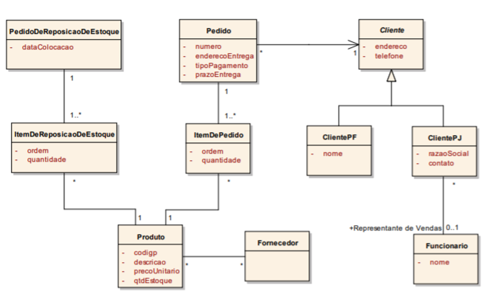
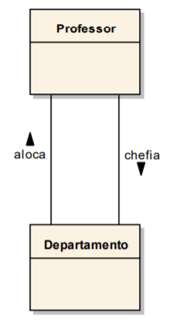
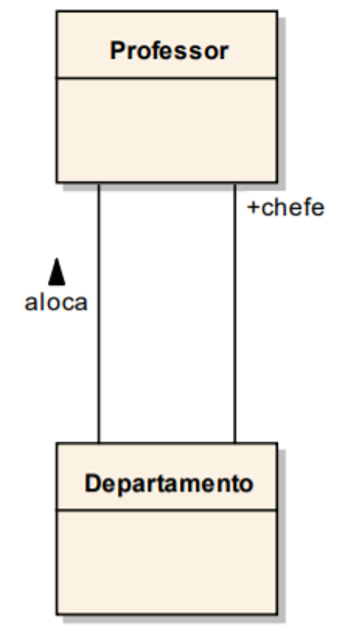
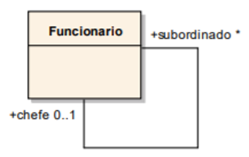
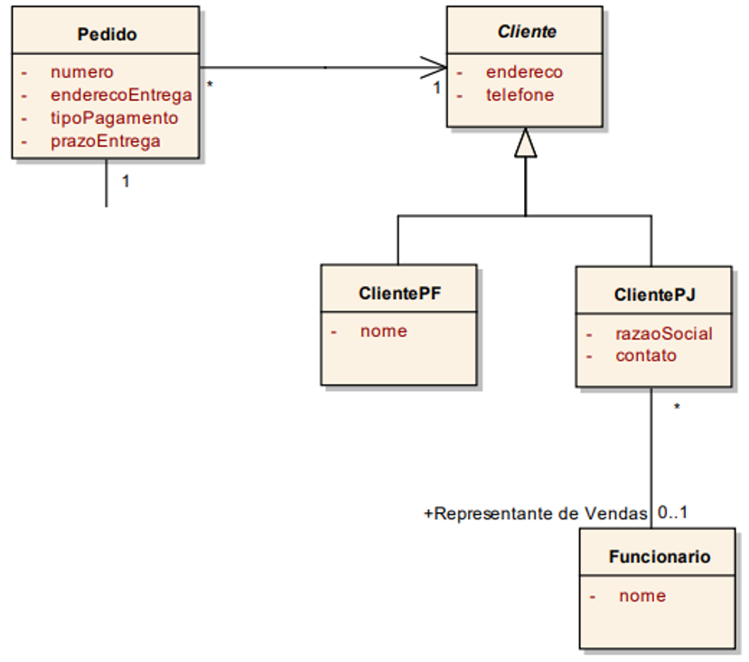
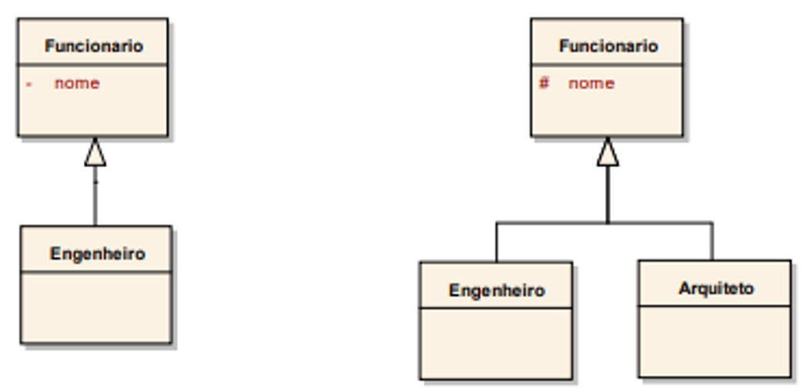
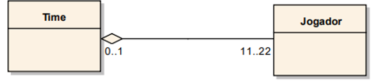
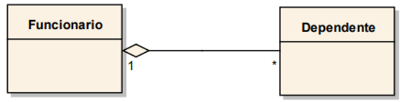
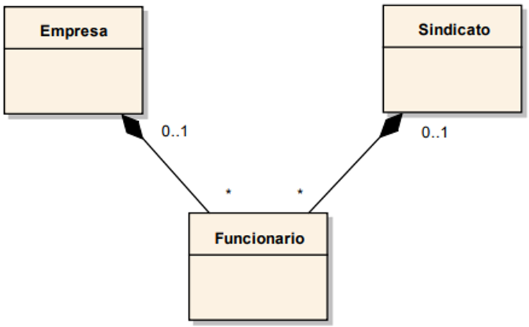

# Introdução à UML

Agora que vimos os conceitos básicos que permeiam toda a POO, precisamos ver como organizar todo o conhecimento para podermos implementar, de fato, um projeto orientado a objetos. A UML é uma poderosa ferramenta com esse propósito, e é conhecimento fundamental para todo desenvolvedor de sistemas OO. Nesta nota de aula, veremos alguns conceitos básicos da UML e, com um pouco mais de detalhe, falaremos dos diagramas de classe.

### Índice

1. [Origens](#origens)
2. [Objetivos](#objetivos)
3. [Classificação dos diagramas](#classificação-dos-diagramas)
4. [Diagramas de Classes](#diagramas-de-classes)
5. [Classes](#classes)
6. [Atributos](#atributos)
7. [Métodos](#métodos)
8. [Relacionamentos](#relacionamentos)
9. [Exercícios resolvidos](#exercícios-resolvidos)
10. [Exercícios complementares](#exercícios-complementares)

## Origens

A UML, ou _Unified Modelling Language_, nasceu em 1994 a partir da junção das metodologias de Grady Booch, James Rumbaugh e Ivas Jacobson. Os três autores desenvolveram, em anos anteriores, várias metodologias para modelar projetos de software, principalmente aqueles implementados usando o paradigma Orientado a Objetos, daí o significado da sigla.

A UML é uma linguagem para especificar, visualizar, construir e documentar os artefatos de software. Trata-se de uma notação que normatiza um conjunto de diagramas. Também pode ser usada como ferramenta para modelagem de negócios.

Atualmente, ela é mantida como um padrão da indústria da **Object Management Group**, e se encontra na versão 2.5.1. A documentação oficial da UML pode ser encontrada no [site oficial](https://www.omg.org/spec/UML/About-UML/).

## Objetivos

A UML tem como objetivos:

- Padronizar a comunicação entre equipes através de uma linguagem visual, independente do processo de desenvolvimento de sistemas utilizado;
- Viabilizar a documentação de ideias para resolver problemas recorrentes, os chamados **design patterns**;
- Estabelecer a associação explícita entre o conceitual e a implementação.

> Um **design pattern**, ou padrão de projeto, descreve uma solução geral reutilizável para um problema recorrente no desenvolvimento de sistemas de software orientados a objeto. Não é um código final, é uma descrição - ou modelo - de como resolver o problema do qual trata, que pode ser usada em muitas situações diferentes. Os design patterns normalmente definem as relações e interações entre as classes ou objetos sem especificar os detalhes das classes ou objetos envolvidos - estão em um nível de abstração mais alto.

## Classificação dos diagramas

A UML é composta por diversos tipos de diagramas, cada um com sua finalidade e aplicabilidade. Normalmente, quanto maior o projeto, maior a diversidade de diagramas que deve ser considerada pela equipe de desenvolvimento. Isso significa que não é necessário implementar todos os diagramas em todo projeto de software. A equipe deve levar em consideração a complexidade do projeto, bem como a dificuldade de abstração do problema pelos _stakeholders_, para definir quais diagramas serão adotados.

### Diagramas estruturais

- **Diagrama de classes:** é uma representação da estrutura e relações das classes que servem de modelo para objetos;
- **Diagrama de Objetos:** é uma variação do diagrama de classes e utiliza quase a mesma notação. A diferença é que o diagrama de objetos mostra os objetos que foram instanciados nas classes. O diagrama de objetos poderia representar o perfil do sistema em um certo momento de sua execução;
- **Diagrama de Componentes:** ilustra como as classes deverão se encontrar organizadas através da noção de componentes de trabalho. Componente é uma peça física distribuível e substituível de código e que contém elementos que apresentam um conjunto de _interfaces_ requeridas e fornecidas;
- **Diagrama de Estruturas Compostas:** destina-se à descrição dos relacionamentos entre os elementos. Utilizado para descrever a colaboração interna de classes, _interfaces_ ou componentes de forma a especificar uma funcionalidade;
- **Diagrama de Pacotes:** descreve os pacotes ou pedaços do sistema divididos em agrupamentos lógicos mostrando as dependências entre estes, ou seja, pacotes podem depender de outros pacotes;
- **Diagrama de Implantação:** descreve os componentes de hardware e software e sua interação com outros elementos de suporte ao processamento;
- **Diagrama de Artefatos:** mostra um conjunto de artefatos e seus relacionamentos com outros artefatos e com classes que implementam.

### Diagramas comportamentais

- **Diagrama de Casos de Uso:** descreve a funcionalidade proposta para um novo sistema que será projetado;
- **Diagrama de Sequência:** também chamado de diagrama de sequência de mensagens, representa a sequência de processos (mais especificamente, de mensagens transmitidas entre objetos) em um caso de uso;
- **Diagrama de Comunicação:** dá ênfase à organização estrutural dos objetos que enviam e recebem mensagens, mostrando o conjunto de papeis e as mensagens enviadas e recebidas pelas instâncias;
- **Diagrama de Estados:** mostra uma máquina de estados, que consiste de estados, transições, eventos e atividades, com a finalidade de modelarem o comportamento de uma interface, classe ou colaboração. Os diagramas de estado dão ênfase ao comportamento de um objeto, solicitado por eventos, que é de grande ajuda para a modelagem de sistemas reativos;
- **Diagrama de Atividades:** representa os fluxos conduzidos por processamentos. É, essencialmente, um gráfico e um fluxo, mostrando o fluxo de controle da uma atividade para outra;
- **Diagrama de Temporização:** apresenta o comportamento dos objetos e sua interação em uma escala de tempo, focalizando as condições que mudam no decorrer desse período.

## Diagramas de Classes

Os diagramas de classes proveem as bases de qualquer metodologia de análise e projeto de sistemas computacionais orientada a objetos. Não há, portanto, um sistema minimamente documentado para o qual não tenhamos desenvolvido um diagrama de classes.

Os diagramas de classes em modelos de sistemas podem especifica as perspectivas conceitual, de especificação e de implementação. Cada perspectiva representa o problema ou a solução com graus diferentes de abstração:

- Um diagrama de classes conceitual contém apenas classes de conceito (daí o nome conceitual), dotando o modelo de alto grau de abstração, ou seja, onde os detalhes são esquecidos. Modelos conceituais especificam parte do problema a ser solucionado pelo sistema;
- No extremo oposto, na perspectiva de implementação, representamos todos os detalhes necessários para a implementação do sistema considerando todas as características das tecnologias escolhidas. Dizemos que, na perspectiva de implementação, estamos no nível de abstração zero, em que nada é esquecido. Esses diagramas são bastante extensos e complexos por detalharem as minúcias da solução que os projetistas conceberam;
- A perspectiva de especificação se situa entre essas duas, ou seja, começa no instante em que adicionamos ao modelo conceitual completo a primeira classe ou detalhe da solução que o projetista está dando para o problema e termina quando obtemos o modelo de implementação. O nome _especificação_ está associado à fase em que o projetista especifica a solução que está dando para o problema.

Focaremos neste curso apenas no nível conceitual, discutindo assuntos do nível de especificação quando for pertinente. Os diagramas de classes que elaboraremos terão o objetivo de representar os conceitos de negócios, seus relacionamentos e restrições (regras de negócio).

## Classes

Os diagramas de classes compõem-se de classe, dos relacionamentos entre elas e de restrições do negócio. A classe é o elemento-chave em um diagrama de classes. No nível conceitual, uma classe representa um conceito do negócio. Assim, como mostrado na figura abaixo, **Pedido**, **Cliente**, etc. são conceitos que fazem parte de um contexto típico em uma empresa fictícia - à qual demos o nome de ZYX - que lida com pedidos feitos por sua clientela.



As classes conceituais, também chamadas de classes de entidades, são entidades das quais nos interessa ter suas propriedades armazenadas em um arquivo convencional (pastas suspensas e fichas), em um sistema manual, ou no banco de dados de sistema informatizado.

Os conceitos representados pelas classes conceituais são de pleno conhecimento dos participantes do negócio, ou seja, no exemplo anterior, nosso cliente conhece bem os conceitos de **Pedido**, **Fornecedor**, **Pedido de Reposição de Estoque**, etc.

Nos diagramas de classes, as classes são representadas por retângulos com um ou mais compartimentos, dependendo do nível de detalhamento. O nome da classe é colocado no primeiro compartimento em negrito e centralizado. Recomenda-se que os nomes sejam substantivos ou expressões breves, preferencialmente com base no jargão usado no negócio. Os nomes são únicos em um _espaço de nomes_ (_namespaces_, em inglês), pois identificam univocamente as classes no modelo.

Um espaço de nomes é um local abstrato que fornece contexto para os itens colocados nele. Um espaço de nomes é um conjunto abstrado de coisas, um container. Em um dado espaço de nomes, cada elemento nele contido precisa ter um identificador - um nome - que deve ser único nesse espaço. Identificadores podem ser repetidos em espaços de nomes distintos, entretanto, quando compostos com o respectivo espaço de nomes, se tornam únicos no domínio.

Uma dada classe pode ter mais de uma cópia em um mesmo (ou em outro) diagrama do modelo. A propósito, podemos, sim, ter mais de um diagrama de classes compondo o modelo de classes de um sistema. Isso, por sinal, é até bastante usual, especialmente em sistemas grandes.

Durante o desenvolvimento do modelo de classes, o analista deve ter preocupação com o nome que dará a cada classe; o nome, embora deva ser um substantivo ou uma expressão breve, deve transmitir bem o conceito que a classe representa. Em modelos conceituais, o trabalho de dar nomes às classes é, de certa forma, facilitado, já que os nomes devem ser preferencialmente retirados do jargão do negócio.

Uma boa técnica para descobrirmos se determinada classe é ou não conceitual é perguntar sobre o conceito a ela relacionado ao cliente especialista do negócio que está sendo entrevistado. Se ele não souber responder a respeito, não conhece, nunca usou aquele termo no seu dia-a-dia, provavelmente a classe não deverá fazer parte do modelo conceitual.

Objetos são instâncias ou ocorrências das classes. Cada pedido da coleção de pedidos feitos à empresa ZYX, por exemplo, é uma instância da classe **Pedido**. As classes que podemos instanciar, ou seja, das quais podemos solicitar a criação de objetos, são chamadas de **classes concretas**. A classe **Pedido** é, portanto, um exemplo de classe concreta. Outros exemplos de classes concretas na figura anterior são **ItemDePedido**, **Produto**, **Funcionario**, **ClientePF** e **ClientePJ**.

## Atributos

As informações a respeito dos conceitos (por exemplo, o endereço e o telefone do cliente na figura anteriro) que gostaríamos de manter em um cadastro são chamadas de **atributos** das classes. A relação de atributos é colocada no segundo compartimento do retângulo da classe, justificada à esquerda. A necessidade de mantermos valores de atributos para as ocorrências de uma determinada classe justifica, como já mencionamos, a existência dessa classe, ou seja, se desejamos armazenar as informações sobre uma categoria de coisas em um negócio, provavelmente essa categoria se tornará uma classe no modelo de classes do sistema.

Os atributos que desejamos relacionar no modelo conceitual são aqueles que os especialistas do negócio mencionam. Não é certo relacionarmos atributos nessa fase além daqueles que os especialistas julgam necessários. Podemos, claro, lembrá-los de alguns atributos que são típicos, mas eles é que dão a palavra final sobre a necessidade ou não. Também não é certo nos preocuparmos com detalhes, como os tipos dos atributos, se cadeias de caracteres, se numéricos e com qual precisão numérica etc. No modelo da figura anterior, a classe **Fornecedor** não possui atributos relacionados, o que sugere que ainda não terminamos o modelo conceitual.

Os nomes dos atributos são suficientes nos modelos conceituais. Mais adiante, no ciclo de desenvolvimento do sistema, mais especificamente na fase de projeto, devemos completar os nomes dos atributos com outros detalhes. Além dos nomes, a notação UML um pouco mais completa para rótulos de atributos (atributos são referenciados pela UML como propriedades) é:

```
[visibilidade][/]nome:tipo[multiplicidade][=valorDefault]
```

onde os valores entre "[" e "]" nem sempre ocorrem e:

- _Visibilidade_ é o caractere `-` (para privado), `+` (para público) ou `#` (para protegido), que indica se o atributo é visível ou não de outros objetos. Atributos privados só podem ser acessados (consultados diretamente e/ou modificados) pelos objetos que os contêm. Atributos públicos podem ser acessados por outros objetos e atributos protegidos são acessados pelos objetos que os contêm ou por objetos instanciados de classes especializadas. A visibilidade deve ser omitida no modelo conceitual;
- A `/` antes do nome indica que o atributo é _derivado_, ou seja, seu valor pode ser determinado por um algoritmo a partir de outro(s). Por exemplo, se tivermos os atributos **idade** e **dataDeNascimento**, o atributo idade deve ser precedido da `/`, já que a idade de um indivíduo pode ser determinada a partir da sua data de nascimento;
- _Tipo_ define o tipo de dados: inteiro, real, cadeia de caracteres, data etc.;
- _Multiplicidade_ indica as possíveis cardinalidades para a ocorrência do atributo. Se a multiplicidade é omitida, significa que ela é exatamente 1. Veremos multiplicidades em maiores detalhes um pouco mais adiante;
- O valor _default_ é o valor que o atributo assume de início.

A visibilidade à qual nos referimos anteriormente tem a ver com a ideia de encapsulamento, que recomenda deixarmos escondido o que não é preciso ser mostrado. Aumentamos a facilidade com que damos manutenção em um sistema (manutenibilidade), definindo como privado o maior número possível de atributos (e operações, como veremos adiante). Mesmo os atributos que precisam ser "vistos” por outros objetos devem ser definidos como privados e devem ser criadas operações públicas de acesso para leitura e escrita a eles. Por meio dessas operações garantimos acessos mais “policiados” aos atributos.

## Métodos

O terceiro compartimento do retângulo da classe contém a lista de operações que os objetos da classe implementam para realizar suas responsabilidades. É praxe, no entanto, que esses compartimentos fiquem vazios no modelo de análise, pois as operações normalmente só começam a ser descobertas quando iniciamos o nível de especificação, ao elaborar os diagramas de sequência.

Para o propósito de nosso curso, a notação UML suficientemente completa para os rótulos de operações é:

```
[visibilidade]nome([listaDeParametros])[:tipoDeRetorno]
```

onde os valores entre "[" e "]" nem sempre ocorrem e:

- _Visibilidade_ é o caractere `-` (privado), `+` (público) ou `#` (protegido) que indica que a operação é visível ou não de outros objetos, do mesmo jeito que com os atributos;
- O nome da operação também é formado segundo o padrão _CamelCase_;
- _Tipo_ define o tipo de retorno da operação: inteiro, real, cadeia de caracteres, data, etc.;
- A lista de parâmetros é formada pelos parâmetros de entrada e saída separados por vírgulas, da seguinte forma: `[direção]nome:tipo`, onde `direção` (opcional) é `in` ou `out` ou `inout`, significando parâmetro de entrada, de saída e de entrada e saída, respectivamente. O nome e o tipo são da mesma forma que nos atributos.

## Relacionamentos

Os conceitos identificados em um dado contexto invariavelmente se ligam de alguma forma. **Relacionamentos** em diagramas de classes expressam essas ligações, que, por também fazerem parte do conhecimento a respeito do negócio, precisam ser capturadas e especificadas no modelo de classes.

### Associação:

**Associações** são o tipo mais comum de relacionamentos entre classes em um diagrama de classes. No diagrama do nosso exemplo, está especificado que um determinado cliente pode estar associado a qualquer número de pedidos (inclusive zero, ou seja, empresas ou pessoas físicas são consideradas clientes mesmo não tendo feito qualquer pedido), e um determinado pedido está associado a somente um cliente.

As associações são representadas nos diagramas de classes por segmentos de retas, poligonais ou arcos que ligam as classes associadas. Uma associação é opcionalmente rotulada com o nome da associação, que deve ser colocado sempre que o significado da associação não é claro no diagrama.

O nome da associação deve vir acompanhado do símbolo de sentido de leitura (só a ponta cheia de seta) e deve exprimir bem o significado da associação, sendo preferencialmente um verbo na voz ativa. A vantagem de usarmos verbos na voz ativa em nomes de associações é que também podemos ler o nome da associação no sentido contrário ao da seta, bastando mudar o verbo para a voz passiva (exemplos: "professor é alocado a departamento"; "departamento é chefiado por professor").



As pontas das associações (no pontos onde elas se encontram com as caixas das classes) chamam-se papéis, que também podem ser usados para dar nomes aos papéis que as classes representam nas associações. Quando não especificamos o rótulo do papel (que deve ficar bem junto do ponto onde a associação encontra a caixa da classe), este leva o nome da classe.

As pontas de uma associação entre classes devem especificar também as multiplicidades, que indicam quantas instâncias das classes podem participar da associação. Essa indicação é feita por meio dos valores máximo e mínimo. As multiplicidades podem ser:

- Obrigatórias, quando especificadas por meio de um número natural diferente de zero;
- Opcionais, se `0..1`;
- Multivaloradas, se `*` ou `0..*` (as duas notações têm o mesmo significado).

Intervalos de multiplicidades podem ser especificados com os `..` (exemplo, `1..3`, para 1, 2 ou 3, ou de 1 a 3). Se houver mais de um intervalo, eles são especificados entre vírgulas (exemplos: “1..3, 5..7”).

As pontas das associações também podem conter o sinal de navegabilidade, indicada por uma seta aberta, que representa a responsabilidade que um objeto tem de localizar os objetos da outra classe com os quais se associa. No nosso exemplo, os objetos da classe Pedido “têm a responsabilidade” de localizar os clientes a eles relacionados que, em outras palavras, quer dizer que os objetos da classe Pedido devem dispor de recursos para localizar os clientes a eles relacionados. Isso equivale a dizer no negócio que um pedido deve conter informações para a localização do cliente que o colocou, possivelmente o nome dele ou seu código para a localização no cadastro de clientes.



As navegabilidades podem ser unidirecionais (uma seta), bidirecionais (duas setas ou nenhuma seta, se for assim convencionado) ou indeterminada (nenhuma seta). Navegabilidades são usualmente raras em modelos conceituais, pois normalmente refletem a preocupação dos projetistas com a rapidez de acesso aos objetos na memória e a economia de espaço em disco, preocupações estas associadas à fase de projeto dos sistemas.

**Autoassociações** são associações entre objetos da mesma classe. São representadas no diagrama de classes usando-se poligonais ou arcos partindo de uma classe e chegando nela própria.



### Especializações-Generalizações

A nossa empresa fictícia ZYX necessita manter em seu cadastro dois tipos diferentes de clientes: pessoas físicas (classe **ClientePF**) e pessoas jurídicas (classe **ClientePJ**), que possuem semelhanças e diferenças entre si: os endereços e telefones devem ser armazenados nos cadastros para todos os clientes, independentemente se são pessoas físicas ou jurídicas, os nomes são necessários apenas para as pessoas físicas e as razões sociais e nomes de contato são necessários apenas para as pessoas jurídicas.

Utilizando o relacionamento de especialização-generalização, os atributos, operações e relacionamentos comuns ficam na classe que chamamos de superclasse ou classe-base, enquanto as diferenças vão para as subclasses, também chamadas de classes derivadas. Estas herdam da superclasse os atributos, as operações e os relacionamentos comuns.

Sendo assim, os clientes pessoas físicas do modelo ao lado têm endereço, telefone e nome como atributos e estão associados a qualquer número de pedidos. Os clientes pessoas jurídicas, além do endereço e telefone, têm como atributos a razão social e o contato e estão associados a qualquer número de pedidos. Podem possuir, ainda, um representante de vendas, que é um funcionário da ZYX. Os relacionamentos de generalização-especialização são representados por setas com pontas triangulares vazadas.



Cabe aqui explicar um detalhe sobre outro tipo de visibilidade de atributos e métodos que deixamos de explicar anteriormente porque ainda não tínhamos visto os relacionamentos de especialização-generalização: os atributos e métodos protegidos.

Em uma classe, ser protegido significa que o atributo ou método é protegido do acesso externo de forma geral, mas pode ser acessado pelos métodos das classes que a especializam. Um atributo ou método protegido tem sua visibilidade denotada por um `#`.

Como ilustra o diagrama abaixo, o atributo nome da classe **Funcionario** só pode ser acessado diretamente pelo próprio objeto instanciado dessa classe, porque o atributo está marcado como sendo privado. Nesse caso, nem um objeto da classe **Engenheiro** tem acesso direto a esse atributo. Já no diagrama ao lado, o atributo **nome** pode ser acessado diretamente por objetos das classes **Funcionario** e **Arquiteto**.



Há situações em que não queremos que uma classe possa ser instanciada, ou seja, que não possa haver objetos criados dela (ao contrário das classes concretas, que já vimos). Essas classes são chamadas de classes **abstratas**. Por exemplo: no modelo anterior, a classe **Cliente** foi definida como uma classe abstrata porque não pode haver objetos instanciados dessa classe, ou seja, não há nenhum cliente da ZYX que não seja pessoa física nem pessoa jurídica (eles têm de ser, obrigatoriamente, instâncias de **ClientePF** ou **ClientePJ** – quem nos disse isso foi o especialista do negócio na ZYX).

Classes abstratas existem no modelo somente para agruparmos em uma só classe os atributos, operações e associações comuns a duas ou mais classes. A esse processo de agrupamento, em superclasses, de atributos e operações comuns a duas ou mais classes damos o nome de **fatoração**.

Classes abstratas são denotadas na UML com seus nomes em itálico ou colocando abstract logo abaixo de seus nomes, dentro do compartimento do nome na caixa da classe.

Por fim, nada impede que façamos especializações de especializações em qualquer quantidade de níveis. A única recomendação é que muitos níveis de especialização (mais do que cinco, conforme cita a literatura) prejudicam o entendimento do modelo.

### Agregações

Há situações em que precisamos especificar conceitos que representam conjuntos de entidades. Nesse caso, além das entidades que correspondem às partes, os conjuntos também são entidades que devem ser representadas em nosso modelo. O conjuntos e as partes são ligadas entre si por meio de relacionamentos ditos de **agregação** – pois conjuntos agregam suas partes. Exemplos de conjuntos e suas partes são times de futebol e seus jogadores, empregados e seus dependentes, departamentos e suas divisões, divisões e seus colaboradores, etc.

O relacionamento de agregação é um relacionamento do tipo todo-parte; representamos o "todo" associado às "partes" que o compõem.

A UML possui uma notação especial para agregações: um losango vazado, conforme ilustrado abaixo. Nessa figura representamos os funcionários em uma organização e seus dependentes: cada dependente está associado a um funcionário específico, enquanto funcionários têm qualquer número de dependentes, eventualmente nenhum.

Abaixo, na primeira imagem, é indicada uma situação em que um time é composto de 11 a 22 jogadores e que cada jogador ou não está associado a um time ou está associado a, no máximo, um time.





### Agregações compostas (ou composições)

Agregação composta, também chamada composição, é um tipo mais forte de agregação. É também um relacionamento todo-parte representado por um losango cheio (veja abaixo). A principal, e fundamental, diferença entre composições e agregações é que nas composições as partes não podem pertencer, em um mesmo instante, a mais do que um todo. Como consequência, se o todo deixa de existir, as partes também deixam. É importante notar que, quando permitido pela multiplicidade, uma parte pode ser removida da composição antes de ela deixar de existir.

As composições são indispensáveis quando, no modelo, uma entidade parte está associada a mais de uma entidade todo e queremos especificar que uma instância da parte não pode estar associada, ao mesmo tempo, a mais de uma instância de entidade todo. Por exemplo, segundo a figura abaixo, se um determinado funcionário está associado a uma determinada empresa, não pode estar associado, ao mesmo tempo, a um sindicato.

Na figura, uma empresa (o todo) tem qualquer número de funcionários (as partes) associados a ela, da mesma forma que sindicatos (o outro todo). Além disso, um funcionário pode estar associado a nenhuma ou uma empresa ou a nenhum ou a um sindicato. O que o modelo especifica ainda, por se tratar de composições, é que, se um funcionário está associado a uma empresa, não pode estar associado ao mesmo tempo a um sindicato, já que uma parte não pode pertencer a mais de um todo nas composições.



## Exercícios resolvidos

1. Elabore o modelo conceitual de classes para um projeto indicado a seguir ([gabarito](https://drive.google.com/file/d/1FGD_kJYbGtz3A2udtJavGduYeSLTcRzh/view?usp=sharing)).

    ```
    Foi solicitado que você desenvolvesse um sistema de controle de marcação de consultas e ficha dos pacientes para uma rede de clínicas médicas no Rio de Janeiro.

    Para os pacientes, é preciso controlar: nome, CPF, endereço, telefones de contato, data de nascimento, e-mail, e se é particular ou conveniado a plano de saúde. No caso de ser conveniado, registrar qual é o plano de saúde. Para cada plano de saúde credenciado é preciso controlar o limite de consultas no mês, por paciente.

    A rede de clínicas possui algumas unidades pela cidade. Cada unidade é registrada com endereço, CNPJ e telefone de contato. A rede possui vários médicos, que são registrados com nome, CPF, CRM, telefones de contato, e-mail, especialidade e agenda de atendimento.

    Por "agenda", considera-se qualquer faixa de horário em que um(a) médico(a) esteja disponível para atendimento em um determinado dia da semana e em uma determinada unidade da rede, além da duração do invervalo das consultas, em minutos.

    As consultas são marcadas de acordo com a disponibilidade do(a) médico(a) informada na agenda. Uma consulta possui registrado o dia, hora e unidade, bem como se é uma consulta de revisão, por exemplo, para apresentação de exames. Caso seja uma consulta de revisão, não há cobrança. Caso seja a primeira consulta do(a) paciente, há um desconto de 50% no valor da consulta.

    O sistema deve poder realizar agendamentos de consulta e emitir cobranças para uma determinada consulta.
    ```

## Exercícios complementares

1. Identifique e nomeie as classes conceituais no texto a seguir. Lembre-se de que as classes conceituais são entidades sobre as quais nos interessa armazenar alguma informação. Relacione uma ou mais dessas informações para cada classe identificada, não se preocupando em ser completo. Apenas pense em algumas delas como mecanismos para identificar as classes.

    ```
    As universidades do município de Sertãozinho Alegre são separadas em _campi_, e cada _campus_ é dividido em um ou mais departamentos (Letras, Matemática etc.). Um departamento é chefiado por um de seus professores, mas há casos em que esse cargo está vago. Não há acúmulo de chefia. Os professores podem estar alocados em um ou mais departamentos. Um departamento pode ser criado sem que haja professores alocados a ele. Um aluno pode estar matriculado em mais de uma universidade e pode frequentar mais de uma disciplina na mesma universidade. As universidades podem não ter alunos matriculados. Cada departamento tem seu conjunto específico de disciplinas (pelo menos uma). Cada disciplina pode ser ministrada por um ou mais professores. Cada professor pode ministrar qualquer número de disciplinas.
    ```

2. Relacione e dê nomes adequados a alguns atributos que você imagina serem importantes para as classes identificadas no exercício anterior. Adote a notação da UML para formar rótulos completos de atributos. Use visibilidades, tipos, multiplicidades e valores default que julgar mais convenientes.
3. Elabore o modelo conceitual de classes referente ao texto do primeiro exercício.
4. Implemente em Java o projeto referente ao primeiro exercício.
