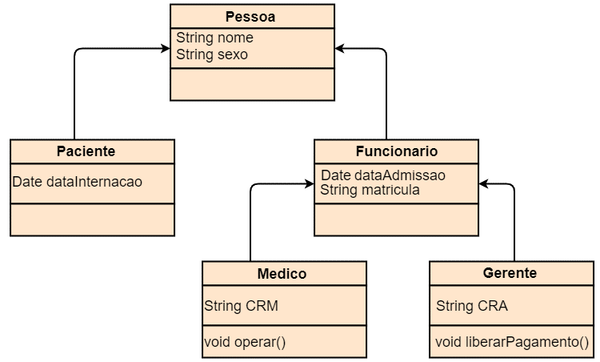
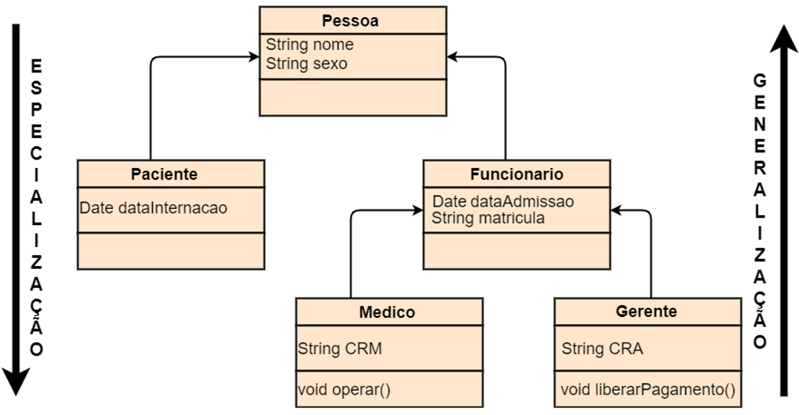
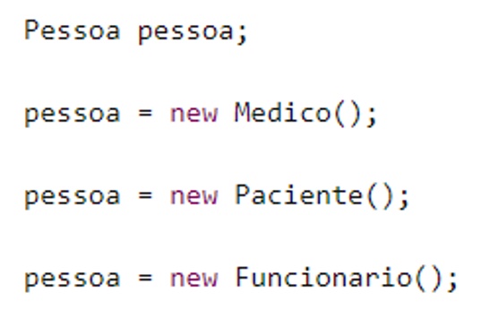
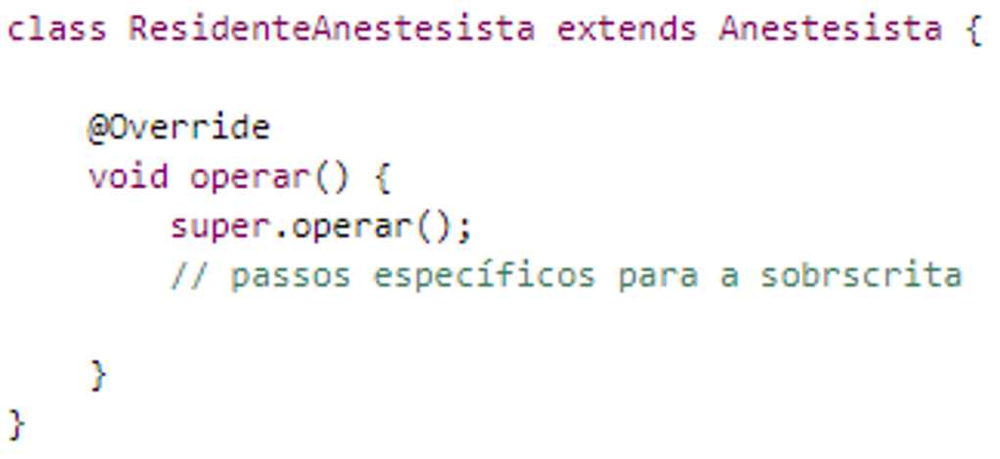
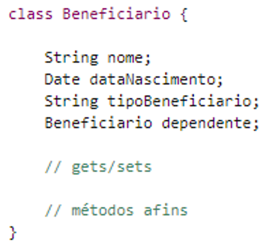
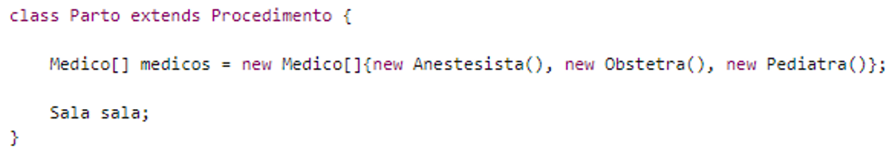
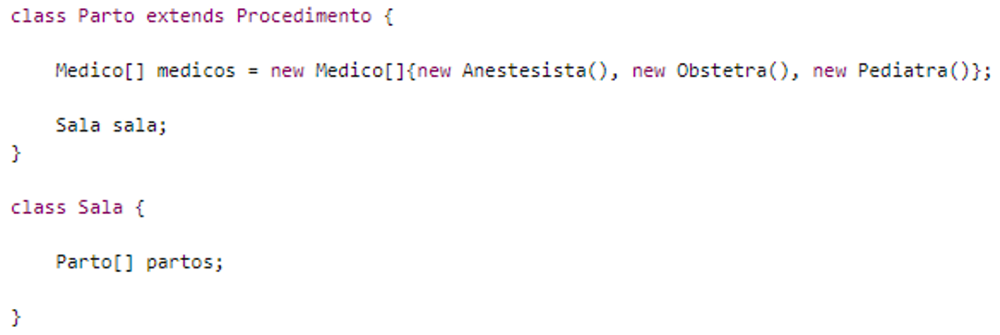
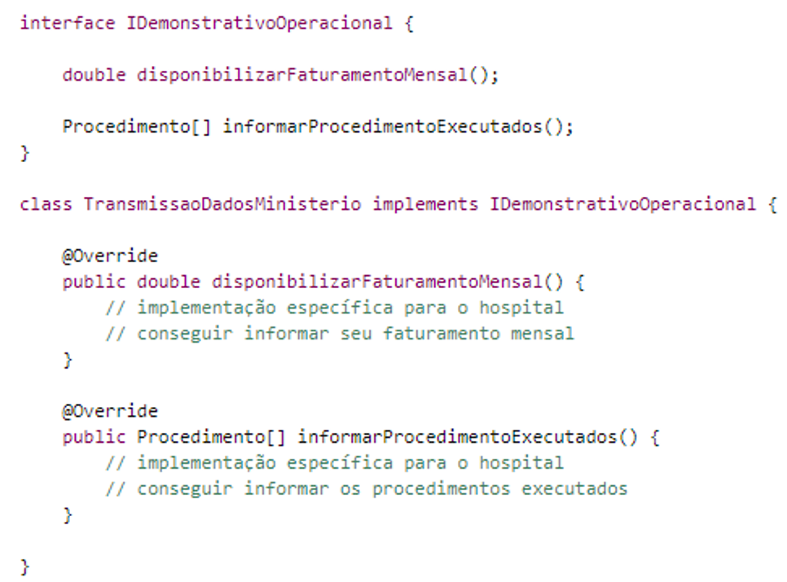
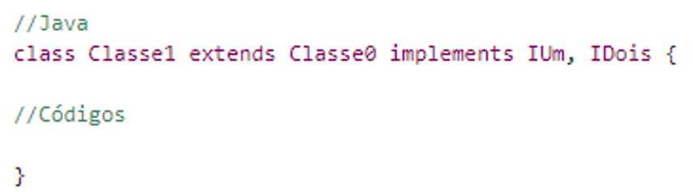

# Conceitos relacionais

Nesta nota de aula, veremos como implementar conceitos já discutidos nas notas de aula anteriores, como heranças e associações.

### Índice

1. [Herança](#herança)
2. [Associação](#associação)
3. [Interface](#interface)
4. [Exercícios complementares](#exercícios-complementares)

## Herança

O conceito de herança nada mais é do que uma possibilidade de representar algo que já existe no mundo real. Um exemplo clássico disto é quando, na escola, estudamos sobre “classificação biológica” na aula de ciências. Nela, é feita a seguinte divisão entre os seres vivos: Reino, Filo, Classe, Ordem, Família, Gênero, Espécie.

Cada divisão mais baixa herda o que for necessário da divisão superior, e isto ocorre porque a mais baixa é um subtipo da divisão acima. Espécie herda de Gênero, que, por sua vez, herda de Família e assim por diante.

Dentro da Orientação a Objetos, quando desejamos usar o conceito de herança, é necessário fazer uma classe herdar de outra.

Herança é o relacionamento entre classes em que uma classe chamada de subclasse (classe filha, classe derivada) é uma extensão, um subtipo, de outra classe chamada de superclasse (classe pai, classe mão, classe base). Devido a isto, a subclasse consegue reaproveitar os atributos e métodos dela. Além dos que venham a ser herdados, a subclasse pode definir seus próprios membros.

Essa definição deixa bem claro que herança só ocorre entre classes, então é incorreto dizer que “o objeto X herdou de Y”. Isto ocorre porque objetos só existem em tempo de execução, impossibilitando assim sua alteração estrutural. Já as classes, por serem do tempo de desenvolvimento (compilação), poderão definir a estrutura de novas classes e, consequentemente, de objetos criados a partir destas.

A herança pode ocorrer em quantos níveis forem necessários. Porém, uma boa quantidade de níveis é de, no máximo, 4. Quanto mais níveis existirem, mais difícil de entender o código será, pois cada vez mais é gerado um distanciamento do conceito base. Esses níveis são chamados de *Hierarquia de Classe*.

O fundamento de reuso que já vimos é intrinsecamente ligado à herança e também à abstração. Quando definimos uma classe da forma mais abstrata possível, é porque necessitamos reutilizar seu conceito e seus membros em outros conceitos similares. A herança deve ser aplicada para isso.

Quando uma classe herdar de outra, ela poderá acrescentar novos membros, mas não excluir. Ora, se a ideia é reusar para evitar repetição, não teria lógica excluir código. Além disto, a grande vantagem da herança é a definição de subtipos. Embora o reuso seja importante, na verdade ele é uma consequência da herança, já que é possível também termos reuso através de outros relacionamentos.

O processo de definir o mais genérico nas classes bases e ir acrescentando nas filhas o mais específico é conhecido como *Generalização* e *Especialização*, respectivamente. Quando mais se sobe na Hierarquia de Classe, mais genérico fica, e quanto mais desce, mais específico.

Alguns cuidados devem ser tomados quando usamos a herança, como onde colocar os atributos e métodos, e quando realmente devemos usá-la. Caso os membros sejam definidos na classe errada, situações estranhas podem ocorrer, pois não representarão a realidade.

### Classes abstratas

Uma classe abstrata tem como principal função ser a implementação completa do conceito de abstração. São classes que representam conceitos tão genéricos que não vale a pena trabalhar com elas diretamente. Elas são incompletas e devem ser completadas pelas classes que herdarem delas, ou seja, seus subtipos.

Por não valer a pena trabalhar diretamente com elas, essas classes têm uma característica importante: não podem ser instanciadas. Ou seja, não podemos criar objetos diretamente a partir delas. Ao tentarmos usar o operador new com uma classe abstrata, um erro do compilador informará que classes abstratas não podem ser instanciadas.

Por serem de uso indireto, geralmente classes abstratas estão no topo da hierarquia de classe. Por exemplo, em uma especialização da superclasse `Pessoa` em classes `Funcionário` e `Paciente` em um sistema hospitalar, talvez não seja útil utilizar diretamente objetos do tipo `Pessoa`, afinal é importante distinguir quem é funcionário e quem é paciente. Cada um executará uma tarefa diferente dentro do hospital e deverá ser tratado da forma adequada.

Além de definir a classe como abstrata - que servirá de molde para outras classes -, podemos também definir métodos como abstratos. A ideia de definir um método como abstrato é para que ele também sirva de molde. Para isso, ele não deve possuir uma implementação, mas sim apenas a definição de sua assinatura.

Métodos abstratos só podem ser definidos em classes abstratas. Porém, classes abstratas podem também possuir métodos não abstratos, ou seja, que possuam sua implementação.

É importante destacar que não existe “atributo abstrato”!

### Classes concretas

Quando uma classe não é abstrata, ela só pode ser concreta. Ao contrário das abstratas, estas não são genéricas, e sim bem específicas. Elas representam o conceito de uso direto que deve ser trabalhado e, por isso, não só podem, como devem, ser instanciadas. Manipulá-las é vital para o bom funcionamento da aplicação.

Para definir classes como concretas, basta definir as classes como já vínhamos fazendo, antes de explicar o conceito das abstratas. No caso, basta usar a palavra `class` seguida no nome da classe. O que separa uma classe abstrata de uma concreta é apenas uma questão conceitual, que deve ser bem entendida.

Então, o uso da palavra `abstract` para a definição de classes abstratas deve ser utilizado quando houver a necessidade de aplicar esse conceito de abstração, ou seja, quando for de grande valor conceitual e relevante para nossa situação. Caso isso não se aplique, é só não usar essa palavra, assim estaremos criando classes concretas que deverão ser manipuladas diretamente.

Quando classes concretas herdam a partir de uma classe abstrata que possua métodos abstratos, elas terão a obrigatoriedade de prover a implementação para tais métodos. Porém, se uma classe abstrata herdar de outra abstrata, essa obrigatoriedade não é válida.

Para finalizar, embora seja possível fazer uma classe concreta herdar de outra concreta, isto deve ser desencorajado ou mesmo nunca realizado.

### Tipos de herança

Existem dois tipos de herança: a simples e a múltipla. A simples ocorre quando uma subclasse tem apenas uma superclasse. Neste caso, a classe filha precisou apenas especializar e reutilizar membros de apenas um conceito, uma classe mão da aplicação.

A herança múltipla ocorre quando uma subclasse necessita não de apenas uma, mas duas ou mais superclasses. Assim, essa classe filha poderá especializar mais de um conceito de uma aplicação. Podemos pensar no seguinte como exemplo:

> Um sistema hospitalar possui como classes `Gerente` e `Médico`. Pode existir uma situação na qual um médico assume um papel de chefe de departamento, e ele pode executar ações gerenciais, como aprovação de férias. Sendo assim, poderíamos criar uma subclasse `ChefeDeDepartamento`, que herdaria das classes `Gerente` e `Médico`.

A linguagem Java não possui suporte para heranças múltiplas. Esta foi uma decisão de projeto dos criadores dessa linguagem, e o principal motivo para isso é para evitar conflito de nomes, o que é um risco nas linguagens que suportam. Esse conflito se dá quando as duas superclasses possuem atributos ou métodos com os mesmos nomes. Por exemplo, tanto `Gerente` quanto `Médico` poderiam ter o atributo `cargaHorária`, com significados diferentes.

Dentre as linguagens atuais que possuem suporte a heranças múltiplas, podemos citar C++, Python, Perl, Eiffel e R. Java possui formas de emular a herança múltipla, que vamos ver logo mais.

### _Upcast_ e _Downcast_

Quando trabalhamos com herança, podem surgir duas operações realizadas com os objetos que foram criados a partir das classes envolvidas em uma hierarquia: _upcast_ e _downcast_.

O _upcast_ é uma operação de conversão, na qual subclasses são promovidas a superclasses. Como uma classe filha é do tipo de sua classe mãe, esta conversão é permitida.

Quando falamos sobre “cast” em linguagens estruturadas, logo lembramos dos tipos primitivos, de como realizar o “cast” de um `long` para um `int`, de um `double` para um `int`. Quando fazemos uma conversão (cast) de um `int` para `float`, a simples codificação é feita: `float = int`. Isso ocorreporque um `int` cabe dentro de um `float`.

Essa ideia de “caber” também se aplica aos objetos, só que com outro nome (no caso, subtipo). Se uma subclasse é subtipo de sua classe mãe, então ela “cabe” nela. Por isto é permitido fazer _upcast_ de forma implícita entre objetos.

O _downcast_ é a operação inversa, assim superclasses são convertidas em subclasses. Porém, embora seja um conceito válido, este deve ser desencorajado. Isto ocorre porque podem ocorrer várias especializações distintas a partir de uma generalização.

### Polimorfismo

Em determinados momentos em uma hierarquia de classes, precisamos que um mesmo método (nome e lista de parâmetro, ou seja, assinatura) se comporte de forma diferente dependendo do objeto instanciado a partir de uma classe de uma hierarquia qualquer. Isto surge devido à necessidade de flexibilidade que a hierarquia de classe deseja fornecer.

Por exemplo, sabemos que cada tipo de médico pode ter uma forma diferente de realizar sua ação de operar um paciente de acordo com o procedimento. Em um parto, por exemplo, o anestesista aplica uma injeção anestésica, o obstetra realiza a preparação e a retirada da criança, o pediatra realiza um conjunto de verificações para atestar a saúde do recém-nascido, etc.

Cada médico realiza suas determinadas ações dependendo de sua função no parto, mas todos estão “operando” naquele momento. Esta possibilidade de uma mesma ação poder se moldar de acordo com o objeto em questão é chamado de polimorfismo. Em cada subclasse, a ação de operar é realizada de forma distinta, pois cada uma tem suas peculiaridades. Mas mesmo assim, a ação é a mesma em sua forma mais íntima: operar. Esta foi herdada a partir da superclasse `Medico`.

A grande vantagem do uso do polimorfismo é que podemos utilizar objetos distintos e continuar executando a mesma ação, sendo que esta se moldará ao objeto corrente. Essa é a “flexibilidade” citada anteriormente.

A melhor forma de possibilitarmos o uso de polimorfismo é trabalhar com classes e métodos abstratos. Assim, podemos apenas definir a assinatura do método (ação) e deixar para a subclasse realmente definir o comportamento desta operação.

Em Java, é necessário o uso da instrução `@Override` antes da definição do método na subclasse.

Para existir polimorfismo, é necessário que se tenha uma herança. Só assim será possível prover o comportamento para um método abstrato herdado, com o intuito de que este tenha um comportamento diferente de acordo com o objeto. Porém, ao usarmos a herança, não precisamos necessariamente utilizar o polimorfismo.

### Sobrecarga

Como o próprio nome sugere, sobrescrita é quando uma “escrita“, uma implementação de um método, sofre uma “escrita por cima”, ou seja, é redefinida. A sobrescrita é utilizada quando é necessário modificar um comportamento herdado. Essa alteração pode acrescentar ou eliminar algo do comportamento herdado.

Em Java, assim como no polimorfismo, a utilização do `@Override` deve ser feita. Assim, a subclasse redefine o método herdado e a sobrescrita é realizada.

Entretanto, em alguns casos, o método sobrescrito na subclasse precisa utilizar integralmente o comportamento do método da superclasse, e depois realizar seus passos específicos. Para realizar esta tarefa, as linguagens orientadas a objeto proveem sintaxes específicas: em Java, é a palavra `super`.

Do ponto de vista de implementação, a sobrescrita é idêntica ao polimorfismo. No entanto, conceitualmente são diferentes. A sobrescrita “sobrescreve” algo existente - no caso, um comportamento padrão da superclasse. De acordo com a necessidade, podemos muda-lo ou não. Já no polimorfismo, não há necessidade de se ter um comportamento padrão.

## Associação

Até o momento, foi visto apenas um tipo de relacionamento: a herança. Este é útil para quando precisamos definir subtipos e, consequentemente, obter reuso de membros. Embora estas situações sejam comuns e úteis em aplicações orientadas a objetos, não é a única necessidade de relacionamento.

Por exemplo, dentro de um hospital, existem vários tipos de médicos. Para podermos aplicar o reuso e a especialização, podemos ter uma superclasse `Medico` e subclasses `Anestesista`, `Obstetra`, `Pediatra`, etc.

Mas e se for necessário representar, no modelo do hospital, os endereços dos médicos? Tanto um anestesista quanto um obstetra precisarão de um endereço. Este teria um nome de rua, bairro, cidade, entre outros atributos que seriam necessários para representa-lo.

É comum iniciantes aplicarem a seguinte solução: fazer as classes `Anestesista` e `Obstetra`, ou mesmo `Medico`, herdarem da classe `Endereco`. Assim, todos os atributos de um endereço seriam compartilhados com todas essas classes. À primeira vista, isso parece uma solução aceitável, mas infelizmente não é, afinal de contas, um endereço não é um médico.

Associação possibilita um relacionamento entre classes/objetos, no qual estes possam pedir ajuda a outros e representar de forma completa o conceito no qual se destinam. Neste tipo de relacionamento, as classes e os objetos interagem entre si para atingir seus objetivos.

A associação pode ser realizada de duas formas: estrutural e comportamental. A primeira possui dois tipos: agregação e composição. A segunda, somente um: dependência.

A estrutural tem como característica a associação ocorrer na estrutura de dados da classe, mais precisamente em seus atributos. Assim, um dos atributos de uma classe é do tipo de outra classe.

No exemplo anterior, temos uma associação estrutural, já que `Medico` tem um de seus atributos que é do tipo `Endereco`.

A associação estrutural do tipo composição ocorre quando um relacionamento da forma “parte todo” ocorre. Ou seja, a parte não pode existir sem a existência do todo. Utilizando o exemplo anterior, o endereço “Rua 123 de Oliveira 4, nº 10” só pode existir se pertencer a um (e unicamente um) médico. Não teria finalidade alguma esse endereço existir sem estar ligado a um médico, empresa, entre outros.

Neste caso, notamos uma forte relação entre a parte (o endereço) e o todo (o médico). Assim, o médico é composto por um endereço, e este pertence somente a esse médico.

Já a associação estrutural do tipo agregação ocorre quando o relacionamento “parte todo” não ocorre. Ou seja, a parte pode ser compartilhada entre vários objetos (todos) distintos. Por exemplo, o procedimento `parto` será executado na “Sala 02” no período da manhã. Já o procedimento `revascularizacaoMiocardio` também será executado na “Sala 02”, só que pela tarde.

Do ponto de vista de implementação, composição e agregação são idênticos, mas conceitualmente são diferentes. Essa divisão surgiu principalmente por conta da UML, pois a visualização das duas associações é diferente. No entanto, quando estamos falando de implementação do código, a execução é a mesma.

Por fim, temos a associação comportamental, no caso, a dependência. Muitas vezes precisamos passar objetos como parâmetros para os métodos, ou mesmo instanciar objetos dentro do corpo dos métodos. Com isso, temos acessos aos membros desses objetos/classes para nos “ajudar” a realizar as atividades necessárias. Isto nada mais é do que um outro exemplo de associação, porém essa agora não está ligada à estrutura da classe/objeto, já que não é um atributo.

### Características de uma associação

As associações possuem algumas características que visam facilitar a sua usabilidade e também o seu entendimento. A seguir, serão demonstradas situações que visam expor essas características.

Geralmente, os hospitais atendem pacientes por meio de um plano de saúde. Nestes planos, existe um conceito que é o beneficiário, uma pessoa que possui um plano para cobrir suas necessidades médias. Esse beneficiário termina se transformando no paciente quando ele é atendido no hospital.

É comum também que ele possua dependentes, tipo uma mãe que paga o plano de saúde de seu filho, juntamente com seu próprio plano. Assim, define-se um autorrelacionamento, pois tanto a mãe quanto o filho são beneficiários. A diferença é que o filho está relacionado com a mãe (depende dela).

Para identificar separadamente o titular e o dependente, poderíamos definir um atributo. A codificação a seguir ilustra essa situação.

O atributo `dependente` na classe `Beneficiario` é do seu próprio tipo. Isto é uma associação _unária_, pois somente uma classe/objeto foi usada, no caso, a classe `Beneficiario`. Para diferenciar quem é o titular e quem é o dependente, foi criado um atributo `tipoBeneficiario`, no qual possíveis valores poderiam ser “titular” ou “dependente”.

Já na classe `Parto`, temos uma associação múltipla, pois vários tipos de classes são usados nas associações. `Parto` tem o atributo `sala` do tipo `Sala`, e tem um vetor de médicos do tipo `Medico`. Ou seja, teve mais de um tipo de classe envolvida na associação.

Ainda na classe `Parto`, notamos que são exatamente 3 médicos e 1 sala envolvidos neste procedimento. Esta quantidade de médicos e sala corresponde à cardinalidade destas associações. As cardinalidades podem ter quantidades fixas, como a deste exemplo, ou não ter uma quantidade definida - ou seja, terá quantos objetos forem necessários. Ela serve para identificar quantos objetos a associação possui.

Por fim, vamos ver a navegabilidade. Ela pode ser unidirecional ou bidirecional. A primeira determina que a associação acontece somente de um lado. No caso da classe `Parto`, o tipo é unidirecional, pois só é relevante saber a sala na qual o parto será executado. Assim, criou-se um atributo em `Parto` do tipo `Sala`.

Caso fosse necessário saber a qual procedimento uma sala pertencesse, deveríamos então ter um vetor de `Parto` na classe `Sala`, pois só assim seria possível obter essa rastreabilidade. Ao fazer isso, a navegabilidade seria bidirecional, pois as duas classes envolvidas tinham uma a referência da outra.

## Interface

Em algumas aplicações orientadas a objetos que necessitam de uma modelagem um pouco mais elaborada, muitas vezes é preciso determinar um conjunto de métodos que devem obrigatoriamente ser usados. Porém, como eles são realmente implementados, não importa a quem definiu tal conjunto. Essa obrigatoriedade de definição de métodos é chamada de interface.

> Interface define um contrato que deve ser seguido pela classe que a implementa. Quando uma classe implementa uma interface, ela se compromete a realizar todos os comportamentos que a interface disponibiliza.

Por exemplo, imagine que o hospital que estamos usando como exemplo terá que prestar contas ao Ministério da Saúde. Ele sabe que deve informar ao ministério quanto faturou no mês corrente, quais procedimentos foram executados, entre outras necessidades.

O próprio ministério sabe que precisa dessas informações, mas não sabe como obtê-las, afinal, elas estão em poder do hospital. É para possibilitar essa troca de informações entre o hospital e o ministério, que deve ser definida uma interface.

Assim, o ministério deve disponibilizar um conjunto de métodos (no caso, a interface), para que o hospital seja obrigado e tenha como fornecê-las. Para o ministério, não importa quais atividades foram realizadas para se chegar a tais informações, apenas importa as informações em si. Como estas foram obtidas é de responsabilidade do hospital.

Quando um outro hospital for repassar suas informações, este também deverá implementar a mesma interface. Entretanto, a sua implementação poderá ser completamente diferente em relação ao primeiro hospital.

Essa situação reforça a definição de interface: é obrigatório prover o comportamento, mas como este será realizado para a interface é irrelevante.

Assim como existe uma palavra reservada para criar uma classe, existe uma para a interface - no caso, `interface`. Em Java, devemos usar a palavra reservada `implements`.

O exemplo demonstra a situação que, quando a classe `TransmissaoDadosMinisterio` implementou a interface `IDemonstrativoOperacional`, ela necessitou realizar a implementação dos métodos da interface. A prova disto é que osmétodos estavam sem corpo na interface, isto é, havia um “;” logo após os parênteses, e não havia chaves delimitando seu corpo.

Todavia, quando a classe implementou a interface, os métodos tiveram seu corpo definido. Temos um detalhe a mais: é uma boa prática colocar a letra `I` no início do nome das interface, para assim diferenciarmos o que é uma classe e o que é uma interface.

Mais alguns detalhes sobre interfaces:

- Por padrão, todo método em uma interface é abstrato, portanto não precisamos colocar a palavra `abstract`;
- A interface se comporta como uma classe abstrata, só que mais restritiva. Em classes abstratas vimos que, se necessário, podemos ter métodos não abstratos. Mas em uma interface isso não é possível;
- Usualmente, interfaces não possuem atributos. No entanto, se necessário, podemos definir atributos, e eles serão sempre **públicos**, **estáticos** e **constantes**. Usamos o termo “estático” quando queremos definir um atributo que é compartilhado entre as instâncias de uma classe ou interface;
- Um atributo “constante” não varia durante a execução do código. Em Java utilizamos a expressão **final** para indicar constantes;
- Como vimos, Java não disponibiliza a possibilidade de se implementar herança múltipla. Entretanto, em relação às interfaces, ela permite implementação múltipla. Ou seja, uma classe pode implementar mais de uma interface e, para isso, basta separá-las por vírgula. Portanto, utilizando o recurso de interface, podemos emular, de certa forma, a possibilidade de heranças múltiplas em Java.

## Exercícios complementares

. Considere que o modelo conceitual desenvolvido na nota de aula anterior evoluiu para uma perspectiva de implementação, sendo detalhado [neste link](https://drive.google.com/file/d/10tCu5qsdaT_GQvRYBJNIMl9FtzwQoTqa/view?usp=sharing). Utilizando os conceitos discutidos nesta nota de aula, implemente em Java o modelo proposto.
