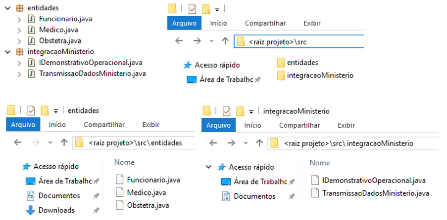
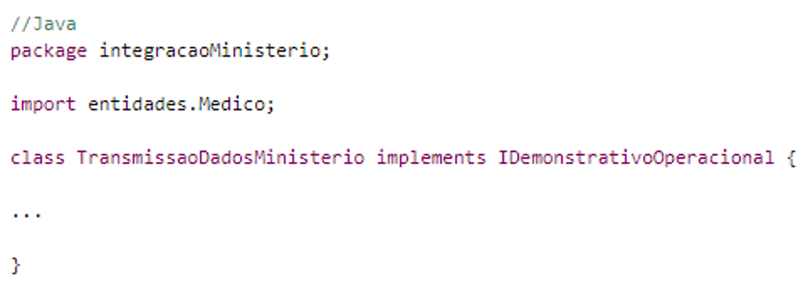
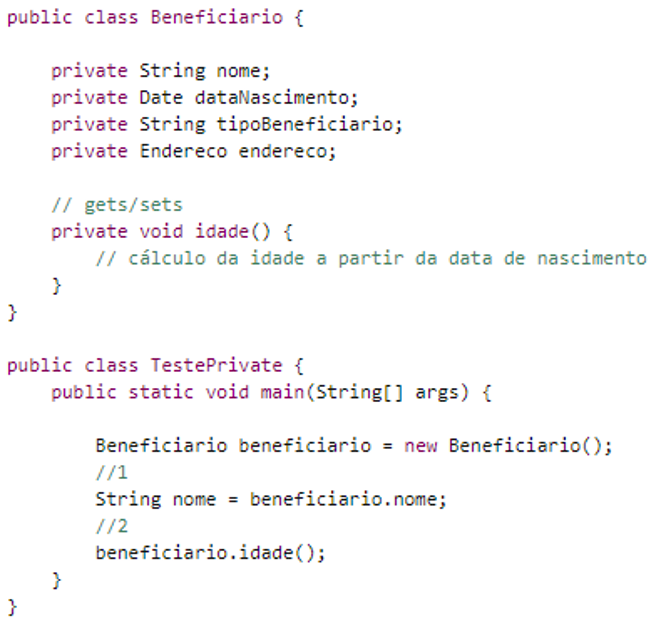
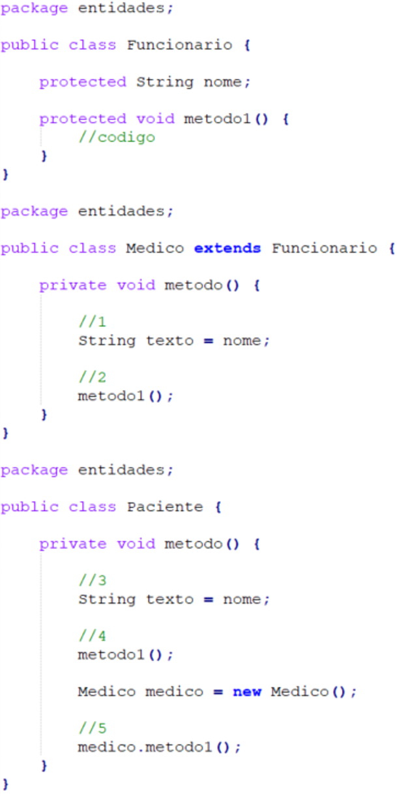
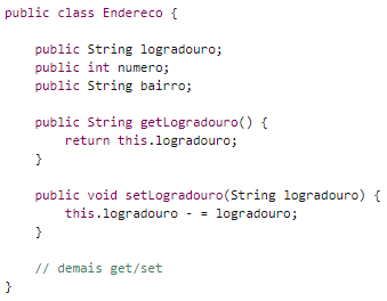

# Conceitos organizacionais

Até o momento, temos trabalhado com projetos orientados a objeto onde todos os arquivos ficam armazenados em um mesmo diretório. Em alguns dos exemplos, já temos percebido que o código tende a não ficar muito organizado. Várias classes ficam "misturadas", o que dificulta a localicação de entidades similares.

Dentro da POO, os conceitos de pacotes e visibilidades visam à melhor organização e localização do código, simplificando o processo de desenvolvimento em projetos muito grandes e com vários desenvolvedores ao mesmo tempo.

### Índice

- [Índice](#índice)
- [Pacotes](#pacotes)
- [Visibilidades](#visibilidades)
    - [Privada](#privada)
    - [Protegida](#protegida)
    - [Pública](#pública)

## Pacotes

É comum surgir a seguinte situação: o sistema terá dezenas de classe que representarão os conceitos do domínio da aplicação, como classes utilitárias, classes de acesso a bancos de dados, entre outros tipos possíveis. Porém, se simplesmente deixarmos todas estas juntas, ficará difícil de achar uma classe quando desejado. A mistura de classes com finalidades e conceitos diferentes dificulta a organização e pesquisa. É para isso que existem os pacotes.

> Um pacote é uma organização física ou lógica criada para separar classes com responsabilidades distintas. Com isso, espera-se que a aplicação fique mais organizada e seja possível separar classes de finalidades e representatividades diferentes.

Em Java, utilizamos a palavra reservada **package** para criar pacotes. Ao usarmos essa palavra, o Java cria uma pasta no sistema de arquivos do computador com o intuito de juntar as classes que possuam representatividades semelhantes. Para possibilitar isso, cada classe deve declarar a definição de pacote de forma igual.

Caso precisemos criar pacotes dentro de pacotes (no caso, subpacotes), estes devem ser separados por um ponto. Poderíamos ter, por exemplo, `package integracaoMinisterio.saude` ou `package integracaoMinisterio.fazenda`.

Existe um padrão, em Java, para a definição de nomes dos pacotes. O padrão é a URL da empresa, de trás para frente, que está desenvolvendo a aplicação. Logo após isto, temos o nome do projeto e, ao final, os reais pacotes que se deseja criar.

No nosso caso, usando a URL do IBMEC como base (br.ibmec), teríamos o seguinte: `br.ibmec.progoo.organizacionais`, `br.ibmec.progoo.relacionais`, e por aí vai.

Para podermos usar classes dentro de outros pacotes, precisamos utilizar a palavra reservada `import`, para que uma classe “enxergue” a outra.

## Visibilidades

Também chamadas de _modificadores de acesso_, as visibilidades têm como finalidade controlar o acesso (manipulação) de classes, atributos e métodos.

> Um modificador de acesso tem como finalidade determinar até que ponto uma classe, atributo ou método pode ser usado. A utilização de modificadores de acesso é fundamental para o uso efetivo da Orientação a Objetos. Algumas boas práticas e conceitos só são atingidos com o uso correto deles.

A OO provê três visibilidades, que são: privada, protegida e pública, sendo respectivamente as palavras **private**, **protected** e **public**, utilizadas para indicar tais visibilidades. Apesar de Java utilizar essas palavras, nem toda linguagem implementa completamente o conceito de visibilidade. A linguagem Python é um exemplo disto, pois nela todos os atributos e métodos são públicos, por exemplo.

Embora todas as visibilidades possam ser aplicadas a classes, os conceitos de classes privadas e classes protegidas são mais avançados e não serão abordados nesse curso.

Veremos então as visibilidades para atributos e métodos. Em cada situação, um modificador de acesso diferente deve ser usado. Via de regra, todo atributo deve ser privado. Em casos esporádicos protegidos e em casos excepcionais, podem ser públicos. Já os métodos, via de regra são todos públicos. Em casos esporádicos protegidos e em poucos casos, podem ser privados.

Pela Orientação a Objetos, existem apenas esses três modificadores de acesso. Entretanto, algumas linguagem oferecem visibilidades a mais, que não fazem parte da teoria de OO.

Em Java, por exemplo, existe a visibilidade **default**, em que membros e classes definidos com esta podem ser usados por classes dentro de um mesmo pacote, independente de qualquer relacionamento entre elas. Apesar de existir, o seu uso em um projeto OO é desencorajado, principalmente porque podem contrariar alguns dos preceitos do paradigma.

### Privada

Essa visibilidade define que atributos e métodos só podem ser manipulados no local de sua definição. Ou seja, se definirmos membros com essa visibilidade, eles só poderão ser manipulados dentro da classe onde foram estipulados.

No código abaixo, teríamos erros em `//1` e `//2`, pois, como os atributos e os métodos foram definidos como `private`, só serão acessíveis dentro da classe `Beneficiario`. Na classe `TestePrivate`, é impossível acessá-los. 

Em Java é necessário estipular essa visibilidade de forma explícita. Dada a sua importância, outras linguagens, como C#, consideram-na como sendo a visibilidade padrão caso o programador não especifique.

### Protegida

Essa visibilidade define que atributos e métodos podem ser manipulados apenas no local de sua definição e nas classes que herdam da classe na qual foram definidos. Ou seja, se forem feitos membros com essa visibilidade, eles só poderão ser manipulados dentro da classe e nas subclasses desta classe.

No exemplo ao lado, são apresentadas as marcações `//1` e `//2` na classe `Medico`, e nelas é possível acessar o atributo `nome` e o método `metodo1()`, respectivamente. Isso porque a classe `Medico` é uma subclasse de `Funcionario`, e ela definiu estes membros como protected`. Entretanto, a classe `Paciente`, que não é uma classe filha de `Funcionario`, apresentará erros nas marcações `//3` e `//4`.

Caso se precisasse de algum método de `Medico` ou `Funcionario` seria preciso criar um objeto destas classes para se ter acesso aos seus membros. A linha `//5` evidencia isso e reforça que a classe `Paciente` não tem acesso direto a membros de `Funcionario` ou `Medico`, pois não é uma subclasse destas.

### Pública

Todos os membros definidos com essa visibilidade são acessíveis em qualquer lugar, independente de qualquer relacionamento entre as classes. À primeira vista, pode parecer a melhor visibilidade, mas não é.

Tornar todos os membros de uma classe públicos pode possibilitar acessos indevidos de atributos e uso indevido de métodos. O uso da visibilidade `public` deve ser feito com cuidado para não ferir alguns dos preceitos da Orientação a Objetos.

Por ser uma visibilidade de uso livre, mostramos ao lado apenas a exemplificação da definição. Não é necessário exemplificar seu uso, já que, por ser de acesso livre, basta utilizá-lo da forma que já vinha sendo exposta nas outras visibilidades. Entretanto, agora nenhum erro ocorrerá.

