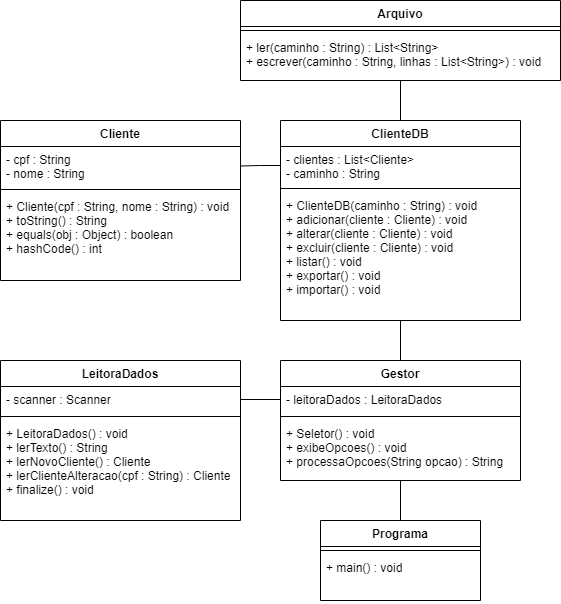

# Leitura e escrita de arquivos em Java

Até o momento, todos os nossos exemplos de aplicação não persistem dados. Ou seja, toda vez que iniciamos o sistema precisamos inserir novos dados de teste. Isso não é o usual em aplicações reais.

Para aplicações reais, normalmente conectamos o nosso sistema a bancos de dados (em SQL, por exemplo). Como este não é o propósito desta disciplina, vamos utilizar uma forma mais simples de persistir os dados, armazenando-os através de arquivos de texto, na extensão .txt. Para isso, usaremos funcionalidades disponíveis no pacote [java.io](https://docs.oracle.com/javase/7/docs/api/java/io/package-summary.html).

### Índice

- [Leitura e escrita de arquivos em Java](#leitura-e-escrita-de-arquivos-em-java)
    - [Índice](#índice)
  - [Organizando o nosso caso](#organizando-o-nosso-caso)
  - [Criando as classes de cliente](#criando-as-classes-de-cliente)
  - [Manipulação de arquivos](#manipulação-de-arquivos)
  - [Classe `Gestor`](#classe-gestor)
  - [Lendo os inputs do usuário](#lendo-os-inputs-do-usuário)
  - [Chamando o programa](#chamando-o-programa)
  - [Considerações finais](#considerações-finais)

## Organizando o nosso caso

Considere o seguinte diagrama de classes:



O projeto possui apenas uma classe conceitual, `Cliente`. As demais classes foram criadas para dar apoio e possibilitar a execução do código. Elas podem ser descritas conforme abaixo:

- `Arquivo`: realiza as operações básicas de leitura e escrita de arquivos;
- `ClienteDB`: realiza as operações de persistência de dados, conhecidas pelo acrônimo CRUD (_create_, _retrieve_, _update_ e _delete_);
- `Seletor`: inclui as opções de execução do programa, e aciona o banco de dados quando necessário;
- `LeitoraDados`: realiza as operações de leitura dos dados inseridos pelo usuário;
- `Programa`: inicializa o programa e chama as opções de `Seletor` em um loop infinito;

## Criando as classes de cliente

Para preparar o nosso programa de exemplo para persistência de dados, vamos criar uma classe de cliente simples, listada abaixo. Precisamos implementa os métodos `equals()`, `hashCode()` e `toString()` para realizar as operações de comparação e exibição dos dados do cliente.

``` java
package br.ibmec.progoo.entidades;

import java.util.Objects;

public class Cliente {
    private String cpf;
    private String nome;

    public Cliente(String cpf) {
        this.cpf = cpf;
        this.nome = "";
    }

    public Cliente(String cpf, String nome) {
        this.cpf = cpf;
        this.nome = nome;
    }

    @Override
    public boolean equals(Object obj) {
        if (obj == this)
            return true;
        if (!(obj instanceof Cliente)) {
            return false;
        }
        Cliente cliente = (Cliente) obj;
        return cliente.cpf.equals(this.cpf);
    }

    @Override
    public int hashCode() {
        return Objects.hash(cpf, nome);
    }

    @Override
    public String toString() {
        return cpf + " - " + nome;
    }
}
```

A classe `Cliente` possui dois construtores possíveis. Para o primeiro caso, que possui como entrada apenas o CPF, usaremos apenas nos casos das consultas, procura de dados no nosso banco, etc.

Para persistir nossos dados, utilizaremos uma classe `ClienteDB`. Essa classe fará a interface entre `Cliente` e as demais classes de apoio. Dessa forma, temos uma separação dos conceitos do projeto (aquilo que realmente faz parte do projeto e atende às regras de negócio) daquilo que é necessário implementar para que o projeto possa ser executado.

Observe que alguns métodos, nesse caso, possuem a expressão `throws IOException`. Essa é uma instrução necessária para tratar possíveis exceções que possam ser executadas no projeto. Precisamos utilizá-la quando tivermos algum método que possa provocar essa exceção. No nosso projeto, os métodos da classe `Arquivo` poderão causar essa exceção, portanto precisamos utilizar a instrução `throws`. `IOException` é uma classe que precisa ser importada.

``` java
package br.ibmec.progoo.persistencia;

import java.io.IOException;
import java.util.ArrayList;
import java.util.Collections;
import java.util.List;

import br.ibmec.progoo.entidades.Cliente;
import br.ibmec.progoo.util.Arquivo;

public class ClienteDB {
    private List<Cliente> clientes = new ArrayList<>();
    private String caminho;

    public ClienteDB(String caminho) throws IOException {
        this.caminho = caminho;
        this.importar();
    }

    public void adicionar(String[] dadosCliente) {
        Cliente cliente = new Cliente(dadosCliente[0], dadosCliente[1]);
        if (!this.clientes.contains(cliente)) {
            this.clientes.add(cliente);
        }
    }

    public void alterar(String[] dadosCliente) {
        Cliente cliente = new Cliente(dadosCliente[0], dadosCliente[1]);
        int posicao = this.clientes.indexOf(cliente);
        this.clientes.set(posicao, cliente);
    }

    public void excluir(String cpf) {
        Cliente cliente = new Cliente(cpf);
        if (this.clientes.contains(cliente)) {
            this.clientes.remove(cliente);
        }
    }

    public Cliente consultar(String cpf) {
        Cliente clienteEncontrado = new Cliente(cpf);
        for (Cliente cliente : this.clientes) {
            if (cliente.equals(clienteEncontrado)) {
                return cliente;
            }
        }

        return null;
    }

    public List<Cliente> listar() {
        return Collections.unmodifiableList(this.clientes);
    }

    public void exportar() throws IOException {
        List<String> linhas = new ArrayList<>();

        for (Cliente cliente : this.listar()) {
            linhas.add(cliente.toString());
        }

        Arquivo.escrever(this.caminho, linhas);
    }

    public void importar() throws IOException {
        List<String> linhas = Arquivo.ler(this.caminho);

        for (String linha : linhas) {
            String[] dadosCliente = linha.split(" - ");
            this.adicionar(dadosCliente);
        }
    }

    @Override
    public String toString() {
        String msg = "";
        for (Cliente cliente : this.listar()) {
            msg += cliente + "\n";
        }
        return msg;
    }
}
```

Abaixo está apresentada uma breve descrição para cada método desta classe:

- O método `ClienteDB` inicializa um `ArrayList` vazio e faz a operação de importar os dados de um arquivo que será definido quando o programa começar;
- Os métodos `adicionar`, `alterar` e `remover` respectivamente criam, alteram ou excluem uma instância de `Cliente`. Para isso, são usados os métodos `contains` e `indexOf` da estrutura `ArrayList`;
- O método `consultar` busca ao longo do `ArrayList` por uma instância que possua o mesmo CPF procurado. Caso encontre, retorna aquele cliente, e retorna `null` caso contrário;
- O método `listar` retorna a lista completa de clientes. Para isso, utilizamos a operação `Collections.unmodifiableList`;
- Os métodos `importar` e `exportar` utilizam a classe `Arquivo` para ler ou escrever os dados a partir de um arquivo especificado no atributo `caminho`;
- O método `toString` precisa ser sobrescrito aqui para podermos exibir todos os clientes armazenados na estrutura de dados.

## Manipulação de arquivos

Nesta parte do projeto temos a manipulação de leitura e escrita do arquivo, de fato. Colocamos aqui no pacote `util`. Este código é como uma receita de bolo, é possível inclui-lo no seu projeto diretamente, sem ter necessidade de alterá-lo. Cabe apenas entender que:

- O método `ler` lê um arquivo espeficicado em um dado caminho e retorna um `ArrayList` contendo as linhas do arquivo. Caso o arquivo ainda não exista, o método simplesmente retorna um `ArrayList` em branco;
- O método `escrever` recebe um `ArrayList` contendo as linhas a serem escritas e as insere em um determinado arquivo.

``` java
package br.ibmec.progoo.util;

import java.io.BufferedReader;
import java.io.BufferedWriter;
import java.io.File;
import java.io.FileReader;
import java.io.FileWriter;
import java.io.IOException;
import java.util.ArrayList;
import java.util.List;

public class Arquivo {
    public static List<String> ler(String caminho) throws IOException {
        File arquivo = new File(caminho);
        BufferedReader buffRead;
        List<String> linhas = new ArrayList<>();
        String linha = "";

        // Verifica se o arquivo em caminho existe
        // Retorna o ArrayList vazio caso não exista
        if (!arquivo.exists() || arquivo.isDirectory()) {
            return linhas;
        }

        buffRead = new BufferedReader(new FileReader(caminho));
        while (true) {
            if (linha != null) {
                if (!linha.equals("")) {
                    linhas.add(linha);
                }
            } else {
                break;
            }

            linha = buffRead.readLine();
        }

        buffRead.close();
        return linhas;
    }

    public static void escrever(String caminho, List<String> linhas) throws IOException {
        BufferedWriter buffWrite = new BufferedWriter(new FileWriter(caminho));

        for (String linha : linhas) {
            buffWrite.append(linha + "\n");
        }

        buffWrite.close();
    }
}
```

## Classe `Gestor`

Esta classe é responsável pela gestão da nossa estrutura de dados e pela interpretação dos dados inseridos pelo usuário para cada opção do programa.

``` java
package br.ibmec.progoo.programa;

import java.io.IOException;

import br.ibmec.progoo.persistencia.ClienteDB;
import br.ibmec.progoo.util.LeitoraDados;

public class Gestor {
    LeitoraDados leitoraDados;
    ClienteDB db;

    public Gestor(String caminho) throws IOException {
        this.leitoraDados = new LeitoraDados();
        this.db = new ClienteDB(caminho);
    }

    public void exibeOpcoes() {
        System.out.println("Selecione um número, ou aperte qualquer outro valor para sair:");
        System.out.println("1 - Cadastrar um cliente;");
        System.out.println("2 - Atualizar um cliente;");
        System.out.println("3 - Remover um cliente;");
        System.out.println("4 - Pesquisar um cliente pelo CPF;");
        System.out.println("5 - Exibir todos os clientes cadastrados;");
    }

    public String processaOpcoes() throws IOException {
        String opcao = this.leitoraDados.lerTexto();
        switch(opcao) {
            case "1":
                db.adicionar(leitoraDados.lerNovoCliente());
                break;
            case "2":
                System.out.print("Digite o CPF do cliente a ser alterado: ");
                String cpfAlterar = leitoraDados.lerTexto();
                if (db.consultar(cpfAlterar) != null) {
                    db.alterar(leitoraDados.lerClienteAlteracao(cpfAlterar));
                } else {
                    System.out.println("O CPF inserido não foi localizado!");
                }
                break;
            case "3":
                System.out.print("Digite o CPF do cliente a ser excluído: ");
                String cpfExcluir = leitoraDados.lerTexto();
                if (db.consultar(cpfExcluir) != null) {
                    db.excluir(cpfExcluir);
                    System.out.println("CPF excluído com sucesso!");
                } else {
                    System.out.println("CPF não encontrado!");
                }
                break;
            case "4":
                System.out.print("Digite o CPF do cliente: ");
                String cpf = leitoraDados.lerTexto();
                if (db.consultar(cpf) != null) {
                    System.out.println(db.consultar(cpf));
                } else {
                    System.out.println("CPF não encontrado!");
                }
                break;
            case "5":
                System.out.println(db);
                break;
            default:
                db.exportar();
                System.out.println("Volte sempre!");
                opcao = "";
        }

        return opcao;
    }
}
```

Aqui a classe possui apenas três métodos:

- O construtor inicializa um novo `ArrayList` para armazenar os dados (que, por sua vez, importa os dados já salvos a partir do caminho especificado);
- O método `exibeOpcoes` exibe, de forma estruturada, as opções disponíveis para o usuário no programa;
- O método `processaOpcoes` recebe uma determinada opção e chama a operação adequada. Observe que, caso o usuário passe uma opção inválida, o programa deverá ser encerrado. Por isso, o método já chama a operação `db.exportar` para salvar o conteúdo dos clientes em um arquivo de texto.

Nós utilizamos apenas uma classe de gestão porque temos apenas uma classe de dados, `ClienteDB`. Caso tenhamos mais de uma classe de dados, pode ser interessante em pensar em vários gestores, um para cada classe diferente, contendo operações similares, porém podendo realizar operações distintas para alguns casos específicos. Utilize os conceitos de herança e polimorfismo!

## Lendo os inputs do usuário

A classe `LeitoraDados` é bem direta, criando um `Scanner` e lendo os dados conforme seja necessário. Apenas duas observações:

- Os métodos `lerNovoCliente` e `lerClienteAlteracao` retornam um array de `String` com dois elementos;
- O método destrutor (`finalize`) precisa ser implementado nesse caso para fechar o scanner caso a instância da classe seja destruída.

``` java
package br.ibmec.progoo.util;

import java.util.Scanner;

public class LeitoraDados {
    private Scanner scanner;

    public LeitoraDados() {
        scanner = new Scanner(System.in);
    }

    public String lerTexto() {
        return scanner.nextLine();
    }

    public String[] lerNovoCliente() {
        System.out.print("Informe o cpf: ");
        String cpf = this.lerTexto();

        System.out.print("Informe o nome: ");
        String nome = this.lerTexto();

        return new String[] {cpf, nome};
    }

    public String[] lerClienteAlteracao(String cpf) {
        System.out.print("Informe o nome: ");
        String nome = this.lerTexto();

        return new String[] {cpf, nome};
    }

    @Override
    protected void finalize() {
        scanner.close();
    }
}
```

## Chamando o programa

Finalmente, podemos encerrar a implementação do nosso programa com uma classe "main". Essa classe interage apenas com o `Gestor`, exibindo as informações e processando as opções informadas em um loop infinito, até que o usuário insira uma opção diferente das disponíveis.

``` java
package br.ibmec.progoo.programa;

public class Programa {
    public static void main(String[] args) throws Exception {
        Gestor seletor = new Gestor("clientes.txt");
        String opcao = "0";

        while (!opcao.equals("")) {
            seletor.exibeOpcoes();
            opcao = seletor.processaOpcoes();
        }
   }
}
```

## Considerações finais

O exemplo apresentado nessa nota de aula introduz uma série de conceitos que poderão ser usados para o desenvolvimento de projetos mais complexos. A organização de classes e estruturação dos esquemas de leitura e escrita de arquivos, bem como a relação entre as classes de entidades e as classes de dados, é uma prática comum de mercado, que pode ser ajustada conforme o projeto em uso.

Como sugestão de prática para consolidação do conhecimento, é recomendado que o aluno expanda os conceitos vistos aqui, trazendo mais entidades e implementando as regras de negócio conforme o projeto exigir.
