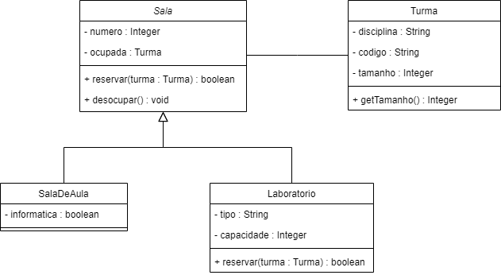

## Pedido da AS

1. Crie um novo projeto Java no VSCode;
2. Na classe App.java, implemente um método estático `numeros()` que execute as seguintes ações:
   - Crie quatro objetos do tipo `List<Integer>`: `primeiroQuartil`, `segundoQuartil`, etc.;
   - Em um loop infinito, leia um número;
   - Quando o número for maior que 100 ou menor ou igual a zero, interrompa o loop;
   - Inclua o número em um dos elementos do array, conforme o seu valor:
     - Entre 1 e 25: `primeiroQuartil`;
     - Entre 26 e 50: `segundoQuartil`;
     - Entre 51 e 75: `terceiroQuartil`;
     - Entre 76 e 100: `quartoQuartil`;
   - Quando sair do loop, exiba as listas de valores;
   - Altere o método `main()` da classe `App` para chamar o método `numeros()`;
3. Crie no projeto um pacote `entidades`;
4. Dentro do pacote produtos, implemente as classes conforme no modelo UML abaixo:

    

5. Para o método `reservarTurma()` da classe `Sala`, considere as seguintes regras de negócio:
    - Verifica se o atributo `ocupada` está definido como `null`;
    - Se estiver, altera seu valor para o parâmetro passado no método e retorna `true`;
    - Se não estiver, exibe na tela que a turma já está reservada e retorna `false`;
6. Na classe `Laboratório`, o método `reservarTurma()` deve ser sobrescrito. Antes das ações detalhadas acima, o método deve verificar que o tamanho da turma é igual ou inferior à capacidade do laboratório. Se este teste não for verdadeiro, o método deve exibir `"Capacidade da sala menor que tamanho da turma!"` e retornar `false`. Se for, deve retornar a operação implementada na superclasse;
7. O método `descoupar()` na classe `Sala` deve simplesmente trocar o valor do atributo `ocupada` para `null`;
8. *Não é necessário fazer uma interface de texto.*

Compacte todo o projeto e envie para o email victor.silva@professores.ibmec.edu.br. Prazo de envio: 06/12.
