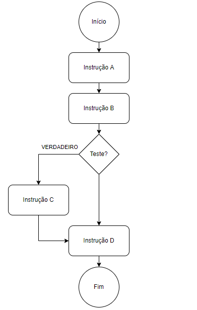
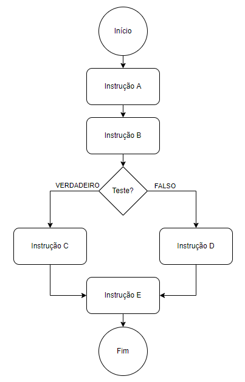
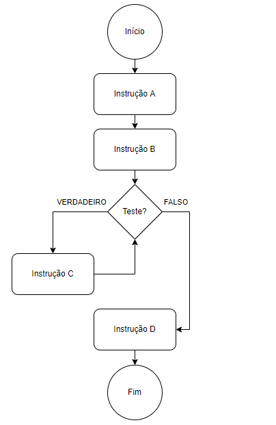

# Algoritmos e Lógica de Programação

Antes de mergulharmos na programação em Python, é necessário discutir um pouco como vamos criar os nossos primeiros programas. Apesar do Python ser uma linguagem poderosa e relativamente intuitiva, para conseguirmos desenvolver programas eficazes e eficientes é necessário aplicarmos conceitos específicos que são independentes de qualquer linguagem de programação.

### Índice

1. [O que são algoritmos?](#o-que-são-algoritmos)
2. [Como representar algoritmos](#como-representar-algoritmos)
3. [Estruturas de seleção](#estruturas-de-seleção)
4. [Estruturas de repetição](#estruturas-de-repetição)
5. [Exercícios resolvidos](#exercícios-resolvidos)
6. [Exercícios complementares](#exercícios-complementares)
7. [Sugestões de conteúdos](#sugestões-de-conteúdos)

## O que são algoritmos?

Uma resposta geral para a pergunta "o que é um algoritmo?" seria "um conjunto de etapas para executar uma tarefa". Todos nós executamos algoritmos na nossa vida diária, desde escovar os dentes ao dirigir um carro.

Para fritar um ovo, por exemplo, temos uma sequência de etapas: pegar um ovo na geladeira, selecionar uma frigideira e colocá-la no fogão, acender a chama do fogão, colocar um pouco de óleo na frigideira, quebrar o ovo, aguardar N segundos, temperar, servir. Basicamente, para qualquer tarefa do dia-a-dia, precisamos de uma sequência de etapas, que normalmente já está internalizado nas nossas cabeças.

Da mesma forma como precisamos de algoritmos para termos um funcionamento básico no nosso dia, os computadores também o precisam. Quando vamos dirigir e colocamos a rota num aplicativo como o Waze, este app utiliza o GPS do celular para executar um algoritmo que define qual o caminho mínimo para se chegar ao destino informado. Quando você compra um produto na Amazon, o programa por trás utiliza uma série de etapas para garantir que seus dados bancários estão sendo criptografados corretamente. Quando definimos um tempo para o micro-ondas, o computador interno lê essa informação, lê as informações de potência e/ou temperatura, e executa um conjunto de etapas para que ele funcione naquelas condições pelo tempo definido.

A principal diferença entre os algoritmos dos humanos e os de computador é que, nos humanos, conseguimos tolerar uma pouca precisão nas descrições. Quando falamos que precisamos "quebrar um ovo" para fritá-lo, intuitivamente assumimos que precisamos quebrá-lo dentro da frigideira. Se isso fosse um algoritmo de computador, seria necessário informar exatamente qual a posição da frigideira, em qual lado da frigideira o ovo precisaria ser quebrado, e até mesmo o quê do ovo seria depositado na frigideira, a casca ou o seu conteúdo interno.

Portanto, quando definimos um algoritmo de computador, precisamos descrever como sendo "um conjunto de etapas para executar uma tarefa descrita com precisão suficiente para que um computador possa executá-la".

Usualmente, um bom algoritmo de computador (a partir de agora chamado apenas de "algoritmo") precisa de algumas características, quais sejam:

* É preciso: todas as etapas e pré-condições precisam ser bem definidas. Lembre-se, apesar de um computador ser extremamente rápido, ele é "burro" -- precisamos passar todos os detalhes necessários para que ele execute o algoritmo corretamente;
* Deve possuir um nível adequado de corretude: o seu resultado deve ser preciso ou, pelo menos, com um grau de precisão suficientemente adequado para o problema que precisa ser resolvido;
* Precisa ser eficiente: um bom algoritmo deve consumir o mínimo possível de recursos do computador (processamento, memória, armazenamento), no mínimo possível de tempo. Nem sempre conseguimos ter o mínimo de consumo em todos esses critérios, mas devemos sempre tentar atingir uma solução ótima.

## Como representar algoritmos

Sempre temos a opção de descrever um algoritmo com um programa executável em uma linguagem de programação comumente usada, como Java, C, C++, Python ou FORTRAN. O problema de usar linguagens de programação reais para especificar algoritmos é que você pode se atolar nos detalhes da linguagem e não perceber as ideias que fundamentam os algoritmos. Outra abordagem é usar pseudocódigo, que parece uma mistura de várias linguagens.

Nas primeiras aulas deste curso, vamos evitar usar linguagens de programação **e** pseudocódigo. Vamos descrever os algoritmos em português, usando analogias com cenários do mundo real, sempre que puder. Se quiserem implementar um dos algoritmos em Python ou outra linguagem de programação, certamente você será capaz de traduzi-los em um código executável.

Para construir os algoritmos do curso, teremos que usar alguma terminologia específica. Dizemos que programas de computador contêm **procedimentos** (também conhecidos como funções) que especificam como fazer algo. Para conseguir que o procedimento realmente faça o que deve fazer, nós o **chamamos**. Quando chamamos um procedimento, nós lhe fornecemos entrada (usualmente, no mínimo, uma, mas alguns procedimentos não precisam de nenhuma). Especificamos a entrada como parâmetros entre parênteses após o nome do procedimento. Por exempo, para calcular a raiz quadrada de um número, podemos definir um procedimento `raiz_quadrada(x)`; nesse caso, nos referimos à entrada para o procedimento como **parâmetro** `x`.

A chamada de um procedimento pode ou não produzir resultado, dependendo de como especificamos o procedimento. Se o procedimento produzir resultado (ou saída), usualmente consideramos que tal resultado é algo que é passado de volta aos seu chamador. Em jargão de computação, dizemos que o procedimento **retorna** um valor.

Como referência de uso dessas terminologias, considere o algoritmo (um tanto inútil) abaixo, que **retorna** um número `valor` recebido acrescido em uma unidade:

```
PROCEDIMENTO incremento(valor)
-----------------------------
# Entrada: parâmetro valor é um número.
# Saída: o parâmetro valor acrescido de uma unidade.
-----------------------------
1. Encerra o procedimento, retornando valor + 1.
```

Podemos montar um outro algoritmo (tão inútil quanto o anterior), que **chama** o algoritmo `incremento` para adicionar uma unidade a um número pré-definido:

```
PROCEDIMENTO algoritmo_inutil()
-----------------------------
# Entrada: Nada.
# Saída: Nada.
-----------------------------
1. Atribui 1 à variável numero.
2. Atribui à variável numero o retorno do procedimento incremento(numero).
3. Encerra o procedimento.
```

Um outro elemento comum em programação é o de um **arranjo**. Um arranjo agrega dados do mesmo tipo em uma única entidade. Pense em um arranjo como se ele fosse uma tabela, na qual, dado o **índice** de uma **entrada**, podemos falar sobre o **elemento** do arranjo que está naquele índice. Considere o arranjo abaixo, que podemos chamar de `lista_compras`:

| **Índice** | **Item para comprar** |
|:----------:|:---------------------:|
|      0     |          Pão          |
|      1     |         Queijo        |
|      2     |          Ovo          |
|      3     |         Carne         |
|      4     |        Manteiga       |

Nesse caso, o elemento de índice 3 na tabela acima é `Carne`, e podemos representá-lo como `lista_compras[3]`. Pensamos que a tabela é uma única entidade (um arranjo), contendo cinco entradas. O índice do arranjo é sempre um número inteiro não negativo, consecutivo e começando do zero. Por motivos que não vamos entrar aqui neste curso, em programação é usual que arranjos como listas, coleções, dicionários e outros comecem seus elementos pelo índice zero.

Uma característica importante de arranjos em computadores é que o tempo para localizar qualquer elemento é o mesmo, independente da sua posição. Ou seja, a consulta ao elemento de índice 0 leva exatamente o mesmo tempo para consultar o elemento no índice `i`, independentemente do valor de `i`.

Além das instruções "avulsas" que podemos incluir nos algoritmos, e dos conceitos vistos acima, usaremos dentro da descrição o caractere `#` em todas as linhas que quisermos inserir alguma informação adicional sobre o algoritmo, como explicações adicionais acerca das entradas ou saídas. Por fim, existem duas estruturas sintáticas em algoritmos que são utilizados para controlar o fluxo do seu processamento. Veremos ambas as estruturas logo abaixo.

## Estruturas de seleção

Em uma estrutura de seleção, descrevemos para o computador um teste que ele deverá fazer para poder decidir por onde o algoritmo continuará. Para representar essa estrutura, utilizamos a palava **se**, seguida pelo teste que deve ser realizado.



Considere, por exemplo, o seguinte algoritmo, que adiciona uma mensagem de parabéns caso um aluno tenha tirado nota acima de 9.0.

```
PROCEDIMENTO exibe_nota(nota)
-----------------------------
# Entrada: parâmetro nota é um número entre 0 e 10.
# Saída: nenhuma.
-----------------------------
1. Se nota > 9.0 faça:
  1.1. Exiba na tela a mensagem "Parabéns!".
2. Exiba na tela a mensagem "Sua nota foi ", seguida pelo valor de nota.
3. Encerre o procedimento.
```

Veja que o passo 1.1. só é executado no caso em que a nota passada como entrada for maior que 9.0. Caso, por exemplo, `nota` seja 6.5, o programa exibirá na tela apenas a informação contida na instrução 2.

As estruturas de seleção possuem alguns elementos não obrigatórios. É relativamente comum o uso do elemento **senão** ou **caso contrário**, como na figura abaixo:



Seguindo com o mesmo exemplo anterior, considere agora que, caso o aluno tenha tirado menos que 9.0, o programa deve exibir na tela uma mensagem "Continue estudando!".

```
PROCEDIMENTO exibe_nota(nota)
-----------------------------
# Entrada: parâmetro nota é um número entre 0 e 10.
# Saída: nenhuma.
-----------------------------
1. Se nota > 9.0 faça:
  1.1. Exiba na tela a mensagem "Parabéns!".
2. Senão, faça:
  2.1. Exiba na tela a mensagem "Continue estudando!".
3. Exiba na tela a mensagem "Sua nota foi ", seguida pelo valor de nota.
4. Encerre o procedimento.
```

Com esse algoritmo, a resposta do computador para um valor de `nota` igual a 7.5 seria:

```
Continue estudando!
Sua nota foi 7.5
```

Já se `nota` for 9.2, a resposta é:

```
Parabéns!
Sua nota foi 9.2
```

## Estruturas de repetição

Já em uma estrutura de repetição, o objetivo é informar ao computador para ele repetir um determinado conjunto de instruções, quantas vezes for necessário para se atingir critérios de parada pré-determinados. O tipo mais comum de uso de estrutura de repetição é quando queremos que um código seja executado **enquanto** um determinado teste lógico seja verdadeiro. Considere o fluxograma abaixo:



Nesse cenário, a "instrução C" é executada enquanto o teste realizado for verdadeiro. Cada vez que a "instrução C" é executada, damos o nome de **iteração** ou **laço**.

Quando usamos esse tipo de estrutura, não sabemos exatamente quantas vezes o computador vai executar o a "instrução C", mas sabemos exatamente quando ele deverá ser interrompido. A principal preocupação ao utilizar este tipo de estrutura é ter a certeza de que, em algum momento, o computador encerrará as instruções, do contrário entraremos em uma situação de **loop infinito**, um problema comum principalmente entre iniciantes.

Considere como exemplo o procedimento `progressao_geometrica` abaixo, que lê um valor `base` e exibe na tela todos os elementos de uma PG cuja base é `base` e que sejam menores que 1000. Veja que, de imediato, não sabemos quantos números seão exibidos na tela, já que essa informação depende completamente do valor de `base`.

```
PROCEDIMENTO progressao_geometrica(base)
-----------------------------
# Entrada: parâmetro base é um número inteiro.
# Saída: nenhuma.
-----------------------------
1. Considere uma variável valor igual a 1.
2. Enquanto valor < 1000, faça:
  2.1. Exiba valor na tela.
  2.2. Atribua para valor o resultado de valor * base.
3. Encerre o procedimento.
```

Veja que nesse algoritmos temos um potencial problema. Se o parâmetro `base` for passado como número negativo, eventualmente poderíamos ter um valor maior que 1000, nem que seja em módulo, exibido na tela. Podemos corrigir isso colocando uma estrutura de seleção logo antes da instrução 1, como abaixo:

```
PROCEDIMENTO progressao_geometrica(base)
-----------------------------
# Entrada: parâmetro base é um número inteiro.
# Saída: nenhuma.
-----------------------------
1. Se base < 0, encerre o procedimento.
2. Considere uma variável valor igual a 1.
3. Enquanto valor < 1000, faça:
  3.1. Exiba valor na tela.
  3.2. Atribua para valor o resultado de valor * base.
4. Encerre o procedimento.
```

Nesse caso, não precisamos de uma estrutura "senão" no algoritmo, já que caso o teste da instrução 1 seja verdadeiro, o procedimento será encerrado de qualquer forma. A título de referência do uso da saída do procedimento, podemos fazer um último incremento, para que ele retorne o número de elementos da progressão geométrica que são menores que 1000.

```
PROCEDIMENTO progressao_geometrica(base)
-----------------------------
# Entrada: parâmetro base é um número inteiro.
# Saída: nenhuma.
-----------------------------
1. Se base < 0, encerre o procedimento.
2. Considere uma variável valor igual a 1, e uma total_elementos igual a 0.
3. Enquanto valor < 1000, faça:
  3.1. Exiba valor na tela.
  3.2. Acrescente 1 a total_elementos.
  3.3. Atribua para valor o resultado de valor * base.
4. Encerre o procedimento, retornando total_elementos como saída.
```

Um segundo tipo de estrutura de repetição que temos comumente nos algoritmos é aquela na qual sabemos exatamente o valor máximo de iterações que aquele programa poderá ter. Dentro dessa estrutura, é bem comum "percorrermos" um arranjo na ordem dos seus índices, começando no índice 0 e indo até o último.


Considere um algoritmo simples de busca, que chamamos de **busca linear** através de um arranjo. Neste tipo de problema, temos um arranjo `A` em que não sabemos se os seus elementos estão ordenados. Dessa forma, o método mais simples de buscar um determinado valor é percorrer cada elemento do arranjo e verificando se o elemento é igual ao valor que estamos procurando.

```
PROCEDIMENTO busca_linear(A, n, x)
-----------------------------
# Entradas:
#   - A: um arranjo.
#   - n: o número de elementos em A no qual procurar.
#   - x: o valor que está sendo procurado.
# Saída: um índice i para o qual A[i] = x ou o valor -1,
#   que indica que o valor de x não foi encontrado no arranjo.
-----------------------------
1. Para i = 0 até n, faça:
  1.1. Se A[i] = x, então retorne o valor de i como saída.
2. Retorne -1 como saída.
```

Neste algoritmo, sabemos exatamente quantas iterações o algoritmo precisará executar no pior caso, que seria aquele no qual `x` não é igual a nenhum dos elementos do arranjo `A`. Neste cenário, o computador precisaria executar a instrução 1.1 exatamente `n + 1` vezes. Este cálculo de quantas instruções o computador precisa executar em um algoritmo é a base para o que chamamos de **análise de complexidade de algoritmos**. Não veremos este conteúdo nessa disciplina, mas é muito recomendado que seja estudado para que você possa elaborar algoritmos cada vez mais eficientes.

## Exercícios resolvidos

Para a resolução dos exercícios, consulte a página de [gabaritos](./000-gabaritos_exercicios.md).

1. Faça um procedimento `maior` que receba dois números e retorne o maior deles.
2. Faça um procedimento `fatorial` que receba um número (assumindo inteiro positivo) e devolva o fatorial dele.
3. Faça um procedimento `maximo` que receba um arranjo de números e o número de elementos deste arranjo e retorne o maior valor contido no arranjo.
4. Faça um procedimento `contagem_regressiva` que receba um número (assumindo inteiro positivo) e exiba na tela uma contagem regressiva deste número até zero, inclusive.
5. Uma loja de tintas possui galões de 18 litros que custam R$80.00 a unidade, e latas de 3.6 litros que custam R$25.00 a unidade. É conhecido que essa marca de tintas consome aproximadamente um litro para cada 6 metros quadrados de parede. Considere que um cliente da loja apresenta uma `área` a ser pintada, e que, por segurança, adotamos 10% de margem de segurança, ou seja, compramos sempre, pelo menos, 10% a mais de tinta do que o suficiente para cobrir `área`. Desenvolva um algoritmo para um procedimento `otimiza_tinta` que receba `area` e determine a melhor combinação de galões e latas a serem compradas, de forma que o preço seja sempre o menor.
6. Desenvolva um procedimento `inverte_arranjo` que inverta os elementos de um arranjo `A`, de índice máximo `n`. Por exemplo, o retorno do procedimento com um arranjo `[1, 2, 3]` seria `[3, 2, 1]`.
7. Elabore um procedimento `busca_binaria`, que recebe os parâmetros `A` (um arranjo ordenado), `inicio` (índice em que o algoritmo deve buscar no arranjo), `fim` (índice até onde o algoritmo deve buscar no arranjo) e `x` (valor a ser procurado). O algoritmo de busca binária é aplicado para localizar valores em arranjos ordenados. O procedimento deve devolver o índice do arranjo em que foi encontrado o valor, ou -1 caso o valor não tenha sido encontrado. O conceito do algoritmo é o seguinte:

    * Para um determinado arranjo, vá até o meio deste e leia o valor do elemento.
    * Se o valor procurado for igual ao valor do elemento, encerre a busca.
    * Se o valor procurado for maior que o valor do elemento, continue procurando na metade maior do arranjo.
    * Se o valor procurado for menor que o valor do elemento, continue procurando na metade menor do arranjo.
    * Se todo o arranjo tiver sido percorrido e não for encontrado o valor, retorne um erro.

    Considere por exemplo o arranjo `[1, 4, 5, 16, 20, 25, 33]` e queremos procurar um valor `4`. Temos a seguinte execução:

    * Olhamos para o meio do arranjo, ou `16`.
    * `4` é menor que `16`,  então continuamos procurando na primeira parte do arranjo, `[1, 4, 5]`.
    * Agora olhamos para a metade da primeira parte do arranjo, que seria `4`.
    * `4` é igual a `4`, então retornamos esse valor e encerramos a busca.

## Exercícios complementares

1. Faça um procedimento `soma` que recebe dois números e retorne a soma deles.
2. Faça um procedimento `média` que recebe três notas e retorne a média aritmética simples.
3. Faça um procedimento `nota` que recebe três notas, chame o procedimento `média` do exercício anterior e informe se o aluno está aprovado ou reprovado. Considere aprovado um aluno que tenha obtido média superior ou igual a 7.0.
4. Faça um procedimento `pares` que recebe um número `maximo` e exibe todos os números pares, de zero a `maximo`.
5. Faça um procedimento `valida_nota` que recebe uma nota e retorna VERDADEIRO se a nota for válida (maior ou igual a zero, e menor ou igual a 10), ou retorna FALSO caso contrário.
6. Faça um procedimento `fibo` que recebe um número `n` (assumindo inteiro e positivo) e exibe na tela o n-ésimo elemento na sequência de Fibonacci, que é formada pelos valores 1, 1, 2, 3, 5, 8, 13, 21, 34, ... Ou seja, um valor na posição `i` é igual à soma dos valores nas posições `i - 1` e `i - 2`. Considere que os dois primeiros elementos são iguais a 1.
7. Faça um procedimento `e_primo` que recebe um número `n` (assumindo inteiro e positivo) e retorna VERDADEIRO se o valor é primo, ou retorna FALSO caso contrário.
8. Faça um programa `junta` que recebe dois arranjos `A` e `B` e retorna um único arranjo `C`, contendo os valores de `A` e `B`, intercalados (o primeiro elemento de `A`, o primeiro elemento de `B`, o segundo elemento de `A`, o segundo elemento de `B`, etc.).
9. Para o procedimento `busca_binaria` visto anteriormente, quantas chamadas ao procedimento são realizadas, incluindo a primeira chamada, considerando o arranjo `[1, 4, 9, 16, 25, 30, 45, 46, 70, 85, 88, 92]` e o valor `87`?

## Sugestões de conteúdos

* Livros:
  * CORMEN, T. [Desmistificando Algoritmos](https://www.amazon.com.br/Desmistificando-algoritmos-Thomas-Cormen-ebook/dp/B00L1CACXQ/ref=sr_1_1?__mk_pt_BR=%C3%85M%C3%85%C5%BD%C3%95%C3%91&crid=1Z20VMLM0CRNS&keywords=desmistificando+algoritmos&qid=1646607000&sprefix=desmistificando+algoritmo%2Caps%2C185&sr=8-1). Rio de Janeiro: Elsevier, 2014.
  * MACCORMICK, J. [Nine Algorithms that Changed the Future](https://www.amazon.com.br/Nine-Algorithms-That-Changed-Future/dp/0691209065/ref=sr_1_1?__mk_pt_BR=%C3%85M%C3%85%C5%BD%C3%95%C3%91&crid=1JS9Z3DQKIN1G&keywords=nine+algorithms+that+changed+the+future&qid=1646607172&sprefix=nine+algorithms+that+changed+the+futur%2Caps%2C170&sr=8-1&ufe=app_do%3Aamzn1.fos.6d798eae-cadf-45de-946a-f477d47705b9). Princeton: Princeton University Press, 2020.
* Material online:
  * [Este vídeo](https://www.youtube.com/watch?v=KVlGx-9CuO4) e [sua continuação](https://www.youtube.com/watch?v=UQzCFkRbIrE) sobre complexidade de algoritmos e notação Big O.
