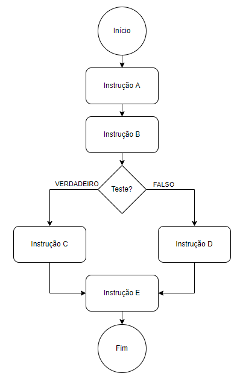

# Estruturas de Seleção

Nós já discutimos, de forma breve, o que são estruturas de seleção e como elas funcionam, sob o ponto de vista do algoritmo. Na aula de hoje, vamos discutir sobre como podemos implementar essas estruturas de seleção em Python.

### Índice

- [Estruturas de Seleção](#estruturas-de-seleção)
    - [Índice](#índice)
  - [Relembrando](#relembrando)
  - [Sintaxe básica](#sintaxe-básica)
  - [Instrução `elif`](#instrução-elif)
  - [Instrução `match/case`](#instrução-matchcase)
  - [Exercícios resolvidos](#exercícios-resolvidos)
  - [Exercícios complementares](#exercícios-complementares)
  - [Sugestões de conteúdos](#sugestões-de-conteúdos)

## Relembrando

Em uma estrutura de seleção, descrevemos para o computador um teste que ele deverá fazer para poder decidir por onde o algoritmo continuará. Utilizamos esse recurso quando o computador precisa fazer uma "bifurcação" no processamento, dependendo do estado dos dados naquele momento.



Uma aplicação da estrutura indicada na imagem acima é o algoritmo abaixo. Veja que o computador só pode realizar uma (e apenas uma) das ações 1.1 e 2.1. Não existe a possibilidade do computador executar ambas.

```
PROCEDIMENTO exibe_nota(nota)
-----------------------------
# Entrada: parâmetro nota é um número entre 0 e 10.
# Saída: nenhuma.
-----------------------------
1. Se nota > 9.0 faça:
  1.1. Exiba na tela a mensagem "Parabéns!".
2. Senão, faça:
  2.1. Exiba na tela a mensagem "Continue estudando!".
3. Exiba na tela a mensagem "Sua nota foi ", seguida pelo valor de nota.
4. Encerre o procedimento.
```

Com esse algoritmo, a resposta do computador para um valor de `nota` igual a 7.5 seria:

```
Continue estudando!
Sua nota foi 7.5
```

Já se `nota` for 9.2, a resposta é:

```
Parabéns!
Sua nota foi 9.2
```

## Sintaxe básica

Para representar a estrutura de seleção, utilizamos as instruções `if` e `else`, como indicado abaixo:

``` python
if <condição>:
    # <instruções se condição for True>
else:
    # <instruções se condição for False>
```

Repare na indentação do código. Assim como no uso de funções, as instruções `if` e `else` **precisam** ser encerradas com um sinal de dois pontos (`:`). Sempre que utilizamos o dois pontos em Python, isso é um sinal para o interpretador iniciar um novo bloco de código, e este bloco precisa ser indentado. Como nos outros casos, o [PEP-8](https://peps.python.org/pep-0008/) indica o uso de quatro espaços para realizar a indentação.

Portanto, o procedimento apresentado na seção anterior seria implementado da seguinte forma:

``` python
def exibe_nota(nota):
    if nota > 9.0:
        print("Parabéns!")
    else:
        print("Continue estudando!")

    print("Sua nota foi", nota)
```

Veja que a instrução que exibe a nota do usuário está incluída no mesmo nível do `if` e do `else`. Isso é indicativo de que ela pertence à função `exibe_nota`, e não à instrução `else`.

## Instrução `elif`

Considere agora uma função que precisaria dar um conceito para a nota passada, seguindo a regra:

* Conceito "A": nota maior que 9.0;
* Conceito "B": nota maior que 7.0 e menor ou igual a 9.0;
* Conceito "C": nota maior que 5.0 e menor ou igual a 7.0;
* Conceito "D": nota menor ou igual a 5.0.

Utilizando os conceitos que vimos até agora, uma possível solução seria:

``` python
def conceito(nota):
    if nota > 9:
        conceito = "A"
    else:
        if nota > 7:
            conceito = "B"
        else:
            if nota > 5:
                conceito = "C"
            else:
                conceito = "D"

    return conceito
```

Veja que o número de indentações começa a ficar um tanto excessivo. Se tivéssemos 10 conceitos diferentes, a situação só ficaria pior. Para converter esse problema visual, temos a instrução `elif`, que nada mais é que uma contração das instruções `else` e `if`, quando usadas uma após a outra, como no nosso exemplo.

O código ficaria melhorado, portanto, como apresentado abaixo:

``` python
def conceito(nota):
    if nota > 9:
        conceito = "A"
    elif nota > 7:
        conceito = "B"
    elif nota > 5:
        conceito = "C"
    else:
        conceito = "D"

    return conceito
```

Lemos a instrução `elif` exatamente como se estivéssemos lendo as instruções `else` e `if` juntas.

Na prática, devemos evitar o uso excessivo de estruturas de seleção com várias opções, pois essa situação cria bifurcações demais no código, dificultando análise, depuração e teste. Para alguns casos, podemos usar soluções mais elegantes, como dicionários. No entanto, o uso do `elif` ainda é razoável de se usar em alguns casos isolados.

## Instrução `match/case`

A partir da versão 3.10 do Python, foi disponibilizada um segundo tipo de estrutura de seleção, que é bem comum em outras linguagens de programação com o nome de instrução `switch`, porém em Python nunca havia sido implementada. Suponha que você está desenvolvendo um menu com interface por linha de comando:

``` python
mensagem = """Bem-vindo ao sistema acadêmico! Selecione uma das opções a seguir, ou pressione qualquer outra tecla para encerrar o programa:
1 - Cadastro de alunos
2 - Cadastro de professores
3 - Lançamento de notas
"""

opcao = input(mensagem)
```

Anteriormente à versão 3.10 de Python, o usual seria tratar a variável `opcao` com um `elif`:

``` python
if opcao == "1":
    # realiza cadastro de alunos
elif opcao == "2":
    # realiza cadastro de professores
elif opcao == "3":
    # realiza lançamento de notas
else:
    print("encerrando o programa")
```

A estrutura `match/case` serve para simplificar a seleção em cenários em que há uma análise de uma variável de controle (no caso desse exemplo, a variável `opcao`). Importante ressaltar que a comparação é sempre de igualdade. Nesse caso, a solução seria:

``` python
match opcao:
    case "1":
        # realiza cadastro de alunos
    case "2":
        # realiza cadastro de professores
    case "3":
        # realiza lançamento de notas
    case _:
        print("encerrando o programa")
```

O caractere `_` na penúltima linha indica um cenário `wildcard`, ou seja, caso o código não entre em nenhum outro outro `case`, ele necessariamente entrará nesse. A instrução `case _:` é completamente opcional, e caso você não queira executar nada se a variável de controle não atender a nenhum critério, basta não usar essa linha.

Os valores em cada linha de `case` podem ser valores simples (`"1"`, `True` ou `4.2`, por exemplo), ou então um padrão, utilizando o caractere pipe (`|`):

``` python
match dia_semana:
    case "Domingo" | "Sábado":
        print("Final de semana")
    case _:
        print("Dia útil")
```

Para mais informações, consulte a [documentação oficial do Python](https://docs.python.org/3/whatsnew/3.10.html#pep-634-structural-pattern-matching).

## Exercícios resolvidos

Para a resolução dos exercícios, consulte a página de [gabaritos](./000-gabaritos_exercicios.md).

1. Elabore uma função `e_par`, que recebe um número e retorna `True` ou `False` conforme o número seja par ou não.
2. Implemente um programa que receba dois números e retorne o maior deles.
3. Crie uma função que receba um valor e retorne se ele é positivo ou negativo.
4. Faça um programa que verifique se uma letra é vogal ou consoante.
5. Faça um programa que receba três notas, calcule sua média aritmética simples e apresente na tela uma das seguintes informações:

    * A mensagem "Aprovado", se a média alcançada for maior ou igual a sete;
    * A mensagem "Reprovado", se a média for menor do que sete;
    * A mensagem "Aprovado com Distinção", se a média for igual a dez;
    * A mensagem "Nota inválida!" toda vez que for inserido um valor inválido.

## Exercícios complementares

1. Faça um programa que leia três números e mostre o maior deles.
2. Faça um programa que leia três números e mostre o maior e o menor deles.
3. Faça uma função `saudacao()`, que recebe o parâmetro `turno` como entrada, podendo ser “M” para matutino, “V” para vespertino ou “N” para noturno. Exiba na tela a mensagem "Bom Dia!", "Boa Tarde!" ou "Boa Noite!" ou "Valor Inválido!", conforme o caso.
4. Uma empresa resolveu dar um aumento de salário aos seus colaboradores e lhe contrataram para desenvolver o programa que calculará os reajustes. Faça um programa que recebe o salário de um colaborador e o reajuste segundo a tabela a seguir, baseado no salário atual. Após o aumento ser realizado, informe na tela:

    * O salário antes do reajuste;
    * O percentual de aumento aplicado;
    * O valor do aumento;
    * O novo salário, após o aumento.

    ```
    Salários até R$ 280,00 (incluindo)      Aumento de 20%
    Salários entre R$ 280,00 e R$ 700,00    Aumento de 15%
    Salários entre R$ 700,00 e R$ 1500,00   Aumento de 10%
    Salários de R$ 1500,00 em diante        Aumento de 5%
    ```

5. Faça um programa para o cálculo de uma folha de pagamento, sabendo que os descontos são dados na lista abaixo. O Salário Líquido corresponde ao Salário Bruto menos os descontos (imposto e sindicato). O programa deverá pedir ao usuário o valor da sua hora e a quantidade de horas trabalhadas no mês, e deve imprimir todos os cálculos realizados. O desconto do IR é calculado conforme a tabela em seguida.

    * Imposto de Renda, que depende do salário bruto (conforme tabela abaixo);
    * 3% do salário bruto para o Sindicato;
    * O FGTS corresponde a 11% do Salário Bruto, mas não é descontado (é a empresa que deposita).

    ```
    Salário bruto até R$900 (inclusive)     isento;
    Salário bruto até R$1500 (inclusive)    desconto de 5%;
    Salário bruto até R$2500 (inclusive)    desconto de 10%;
    Salário bruto acima de R$2500           desconto de 20%.
    ```

6. Uma loja de tintas possui galões de 18 litros que custam R$80.00 a unidade, e latas de 3.6 litros que custam R$25.00 a unidade. É conhecido que essa marca de tintas consome aproximadamente um litro para cada 6 metros quadrados de parede. Considere que um cliente da loja apresenta uma `área` a ser pintada, e que, por segurança, adotamos 10% de margem de segurança, ou seja, compramos sempre, pelo menos, 10% a mais de tinta do que o suficiente para cobrir `área`. Implemente uma função `otimiza_tinta` que receba `area` e determine a melhor combinação de galões e latas a serem compradas, de forma que o preço seja sempre o menor.
7. Implementa uma função que receba um número e exiba o dia correspondente da semana (1-Domingo, 2- Segunda, etc.), se digitar outro valor deve aparecer valor inválido.
8. Faça um Programa que peça os 3 lados de um triângulo. O programa deverá informar se os valores podem ser um triângulo. Indique, caso os lados formem um triângulo, se o mesmo é: equilátero, isósceles ou escaleno. Dicas:

    * Três lados formam um triângulo quando a soma de quaisquer dois lados for maior que o terceiro;
    * Triângulo Equilátero: três lados iguais;
    * Triângulo Isósceles: quaisquer dois lados iguais;
    * Triângulo Escaleno: três lados diferentes.

9. Faça um programa que calcule as raízes de uma equação do segundo grau, na forma `ax^2 + bx + c`. O programa deverá receber os valores de `a`, `b` e `c` e fazer as consistências, informando ao usuário nas seguintes situações:

    * Se o usuário informar o valor de `a` igual a zero, a equação não é do segundo grau e o programa não deve fazer pedir os demais valores, sendo encerrado;
    * Se o delta calculado for negativo, a equação não possui raízes reais. Informe ao usuário e encerre o programa;
    * Se o delta calculado for igual a zero a equação possui apenas uma raiz real, informe-a ao usuário;
    * Se o delta for positivo, a equação possui duas raízes reais, informe-as ao usuário.

10. Elabore uma função `e_bissexto()` que receba um número correspondente a um determinado ano e em seguida informe se este ano é ou não bissexto. Um ano é bissexto se ele é múltiplo de quatro. No entanto anos múltiplos de 100 que não são múltiplos de 400 não são bissextos. Então 1995 não é bissexto, 2012 é bissexto, 1900 não é bissexto e 2000 é bissexto.

## Sugestões de conteúdos

* Material online:
  * [Documentação oficial sobre estruturas de seleção](https://docs.python.org/pt-br/3/tutorial/controlflow.html#if-statements);
  * [Este artigo no medium](https://towardsdatascience.com/ternary-operators-in-python-49c685183c50) sobre operadores ternários;
  * [Este artigo no medium](https://towardsdatascience.com/elegant-and-efficient-usage-of-if-else-clauses-d41d3e88fe07) sobre como usar o `if` de forma eficiente.
