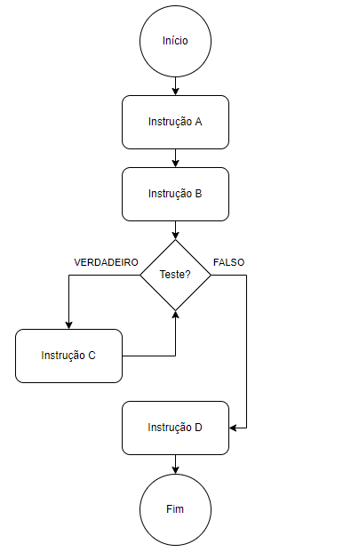

# Estruturas de Repetição

Nesta nota de aula, vamos falar sobre estruturas de repetição, que também abordamos brevemente em aulas anteriores. Vamos ver as diferentes formas de se implementar esse tipo de estrutura em Python, e algumas instruções que podem alterar o nosso fluxo.

### Índice

1. [Relembrando](#relembrando)
2. [Instrução `while`](#sintaxe-básica)
3. [A função `range()`](#a-função-range)
4. [Instrução `for`](#instrução-for)
5. [Instrução `break`](#instrução-break)
6. [Instrução `continue`](#instrução-continue)
7. [Instrução `else`](#instrução-else)
8. [Exercícios resolvidos](#exercícios-resolvidos)
9. [Exercícios complementares](#exercícios-complementares)

## Relembrando

Como vimos anteriormente, o objetivo das estruturas de repetição é informar ao computador para ele repetir um determinado conjunto de instruções, quantas vezes for necessário para se atingir critérios de parada pré-determinados.

Temos dois tipos principais de estruturas de repetição, aquelas com critério de parada e aquelas com limite definido.

### Estruturas de repetição com critério de parada



Nesse cenário, a "instrução C" é executada enquanto o teste realizado for verdadeiro. Cada vez que a "instrução C" é executada, damos o nome de **iteração** ou **laço**.

Quando usamos esse tipo de estrutura, não sabemos exatamente quantas vezes o computador vai executar o a "instrução C", mas sabemos exatamente quando ele deverá ser interrompido. A principal preocupação ao utilizar este tipo de estrutura é ter a certeza de que, em algum momento, o computador encerrará as instruções, do contrário entraremos em uma situação de **loop infinito**, um problema comum principalmente entre iniciantes.

### Estruturas de repetição com limite de iterações definido


Considere um algoritmo simples de busca, que chamamos de **busca linear** através de um arranjo. Neste tipo de problema, temos um arranjo `A` em que não sabemos se os seus elementos estão ordenados. Dessa forma, o método mais simples de buscar um determinado valor é percorrer cada elemento do arranjo e verificando se o elemento é igual ao valor que estamos procurando.

```
PROCEDIMENTO busca_linear(A, n, x)
-----------------------------
# Entradas:
#   - A: um arranjo.
#   - n: o número de elementos em A no qual procurar.
#   - x: o valor que está sendo procurado.
# Saída: um índice i para o qual A[i] = x ou o valor -1,
#   que indica que o valor de x não foi encontrado no arranjo.
-----------------------------
1. Para i = 0 até n, faça:
  1.1. Se A[i] = x, então retorne o valor de i como saída.
2. Retorne -1 como saída.
```

Neste algoritmo, sabemos exatamente quantas iterações o algoritmo precisará executar no pior caso, que seria aquele no qual `x` não é igual a nenhum dos elementos do arranjo `A`. Neste cenário, o computador precisaria executar a instrução 1.1 exatamente `n + 1` vezes. Este cálculo de quantas instruções o computador precisa executar em um algoritmo é a base para o que chamamos de **análise de complexidade de algoritmos**. Não veremos este conteúdo nessa disciplina, mas é muito recomendado que seja estudado para que você possa elaborar algoritmos cada vez mais eficientes.

## Instrução `while`

Em Python, a instrução `while` representa o primeiro tipo de estrutura de repetição, aquela com um critério de parada pré-estabelecido. Para esta estrutura, utilizamos a seguinte sintaxe:

``` python
while <condição>:
    # <instruções para serem executadas caso condição seja True>
```

Considere, por exemplo, um procedimento de contagem regressiva, em que é passada uma variável `num`, e deve-se contar de `num` até 0, inclusive. Uma implementação em Python seria:

``` python
def contagem_regressiva(num):
    """
    Faz uma contagem de num até zero, inclusive.
    """
    while num >= 0:
        print(num)
        num -= 1   # num = num - 1
```

Nesse caso, testamos se `num` é maior ou igual a zero. Caso esse teste seja `True`, executamos o bloco referente ao `while`, ou seja, exibimos `num` na tela e tiramos 1 de `num` (a instrução `num -= 1` é equivalente a `num = num - 1`). Encerradas essas duas operações, o interpretador volta ao teste lógico, e caso `num` permaneça maior ou igual a zero, ele continua executando o bloco de instruções, até o resultado do teste ser `False`.

Um uso recorrente para o `while` é em casos onde é necessário ter um valor válido passado pelo usuário. O exemplo abaixo é um caso desses. O algoritmo pede uma nota, e caso o valor da nota não seja composto apenas por caracteres numéricos (utilizamos a função [`.isnumeric()`](https://docs.python.org/3/library/stdtypes.html?highlight=str%20isnumeric#str.isnumeric) para ter essa informação), ele devolve para o usuário a informação de que a nota não é válida, e pede uma nota outra vez.

``` python
def pede_nota():
    """
    Retorna uma nota inteira entre 0 e 10, informada pelo usuário.
    """
    texto = input("Informe uma nota: ")

    while not texto.isnumeric():
        print("A nota informada não é válida!")
        texto = input("Informe um outro valor: ")

    return int(texto)
```

Repare que, neste caso, estamos assumindo que o valor passado pode não ser inteiro. Por isso, não fazemos a conversão para `int()` diretamente no `input()` já que, caso o valor seja inválido, o programa vai subir uma exceção.

## A função `range()`

Para conseguirmos falar da instrução `for`, precisamos discutir um pouco sobre objetos iteráveis. Ainda não falamos sobre estes objetos, mas eles funcionam de forma muito similar a um arranjo. O objeto mais simples, e por enquanto o único que veremos, é a função `range()`, que estabelece uma faixa de valores inteiros.

A função `range()` pode receber até três parâmetros, quais sejam:

* `start`: o valor no qual a faixa de valores deve começar. Caso não seja especificado, considera-se que este valor é `0`;
* `stop`: o valor até o qual a faixa de valores deve ir, exclusive (ou seja, não considerando o próprio valor de `stop`). Este é o único parâmetro obrigatório;
* `step`: o intervalo entre valores na faixa estabelecida por `start` e `stop`. Caso não seja especificado, considera-se que este valor é `1`.

Caso apenas um parâmetro seja passado, considera-se que este é `stop`. Caso dois parâmetros sejam passados, são considerados como `start` e `stop`, nessa ordem. Por fim, caso três parâmetros sejam passados, são considerados `start`, `stop` e `step`, nessa ordem. Para ilustrar, alguns exemplos são exibidos abaixo:

``` python
range(5)        # 0, 1, 2, 3, 4
range(2, 7)     # 2, 3, 4, 5, 6
range(-2, 4, 2) # -2, 0, 2
range(5, 2, -1) # 5, 4, 3
```

## Instrução `for`

Entendido o que a função `range()` faz, podemos partir para o segundo tipo de estruturas de repetição, que é representado em Python através da instrução `for`. Essa instrução faz com que o interpretador percorra um objeto iterável, até chegar ao final do objeto e, para cada elemento deste objeto, executa o bloco de instruções especificado.

A instrução `for`, portanto, utiliza a seguinte sintaxe:

``` python
for <iterador> in <iterável>:
    # <instruções para cada iterador dentro de iteravel>
```

Vamos considerar, como exemplo, a função de contagem regressiva que vimos anteriormente. Para utilizar o `for`, precisamos de um iterável que me devolva todos os valores contidos de 0 a `num`, em ordem reversa. Podemos fazer isso através do `range(num, -1, -1)`, já que o parâmetro `stop` não é considerado na faixa de valores resultante. Sendo assim, nossa implementação ficaria:

``` python
def contagem_regressiva(num):
    """
    Faz uma contagem de num até zero, inclusive.
    """
    for cont in range(num, -1, -1):
        print(cont)
```

Veja que, ao contrário da nossa implementação usando `while`, neste caso não precisamos fazer alterção na variável `num`. Ao invés disso, criamos um **iterador**, que nada mais é que uma variável que possui escopo apenas dentro do bloco `for`, e demos o nome de `cont`. Dentro do bloco `for`, essa variável se comporta como uma outra qualquer.

Veja também que não precisamos fazer alterações de valores em `cont`, como havíamos feito com `num` no caso anterior. Isso se deve à própria natureza da instrução `for`, que vai percorrer toda a faixa de valores gerada pelo nosso iterável.

Às vezes precisamos passar por um iterável, mas não queremos atribuir o valor do iterável a nenhuma variável. Para poupar a memória do computador, podemos usar um _placeholder_ `_` no `for`, no lugar do iterador. Veja o exemplo abaixo, em que queremos apenas imprimir `palavra` 10 vezes:

``` python
def exibe_palavra(palavra):
    for _ in range(10):
        print(palavra)
```

Como comentamos anteriormente, a instrução `for` é muito utilizada quando já temos uma faixa de valores a serem percorridos, então sabemos o número máximo de iterações que a nossa estrutura de repetição deve executar. Sempre que pensarmos em algo como "para cada elemento no arranjo...", "para cada i entre um valor e outro...", ou "para todos os elementos em xpto...", muito possivelmente a melhor solução será usar um `for`.

## Instrução `break`

As estruturas de repetição possuem algumas instruções especiais que podem alterar um fluxo pré-estabelecido. A mais comum delas é a instrução `break`, que simplesmente aborta a estrutura de repetição na qual ela está inserida.

Vamos pensar em uma solução alternativa à função `pede_nota()`, discutida anteriormente. Ao invés de usar o teste `not texto.isnumeric()` como critério de parada na própria instrução `while`, podemos "forçar" um loop infinito, utilizando o comando `while True`. O interpretador vai verificar o teste implícito `True == True`, que é sempre verdadeiro, e nunca vai interromper o fluxo.

Se a própria instrução `while` não dá instrumentos para o interpretador interromper o fluxo, devemos fazê-lo de alguma forma. Considere a implementação abaixo:

``` python
def pede_nota_alt():
    """
    Retorna uma nota inteira entre 0 e 10, informada pelo usuário.
    """
    while True:
        texto = input("Informe um valor: ")
        if texto.isnumeric():
            break

        print("A nota informada não é válida!")

    return int(texto)
```

Ao contrário de fazermos o teste na declaração do `while`, incluímos um `if` dentro do laço. Caso o teste no `if` seja `True`, o interpretador chega na instrução `break`. Chegando nesse ponto, ele imediatamente interrompe a execução do `while` e vai para a linha do `return`.

Portanto, neste caso, estabelecemos um `break` para interromper o fluxo que não seria interrompido pelo critério de parada definido no `while`.

O `break` pode ser usado normalmente em qualquer caso em que seja necessário abortar a nossa estrutura de repetição, independente do tipo de estrutura usado, `for` ou `while`. Importante destacar também que a instrução `break` quebra apenas a estrutura de repetição mais interna. Veja o exemplo abaixo:

``` python
def repeticao():
    """Faz uma repetição qualquer."""
    num = 1
    while num < 5:
        for cont in range(num):
            if cont == 3:
                break
            print(cont)
        num += 1
```

Quando o interpretador chegar na instrução `break`, a única estrutura de repetição a ser interrompida é o `for`, que contém o `break` diretamente. A instrução `while` permanece ativa.

## Instrução `continue`

Vamos considerar uma função que imprima na tela todos os valores divisíveis por `div`, em uma faixa que começa em `inicio` e termina em `fim`, e indica o total de números divisíveis por `div` nessa faixa. Uma possível implementação seria:

``` python
def imprime_divisiveis(div, inicio, fim):
    """Imprime todos os divisíveis por div entre inicio e fim."""
    total_nums = 0

    for num in range(inicio, fim + 1):
        if num % div != 0:
            continue

        total_nums += 1
        print(num)

    print(total_nums, "números divisíveis por", div, "entre", inicio, "e", fim)
```

Nesta implementação, utilizamos a instrução `continue` para dar prosseguimento à iteração, sem considerar o restante do bloco. Ao executar esta função, quando o teste apontado no `if` for verdadeiro, o interpretador lê a instrução `continue` e não faz o incremento em `total_nums` ou a impressão na tela, pulando diretamente para o próximo valor de `num`.

Perceba a diferença entre o `continue` e o `break`: enquanto que o primeiro prossegue na estrutura de repetição, simplesmente ignorando o bloco naquela iteração em particular, o `break` interrompe a estrutura por completo, saindo do loop definido.

Apesar de ter um uso mais pontual, a estrutura `continue` é bem importante para estruturas de repetição mais complexas.

## Instrução `else`

A instrução `else`, quando usada em estruturas de repetição, pode servir para criar instruções que devem ser executadas após o encerramento da estrutura, **apenas** caso o interpretador não tenha passado por uma instrução `break`.

Considere o exemplo abaixo, que verifica se um determinado número é primo (assuma que `num` é maior ou igual a 2):

``` python
def e_primo(num):
    """Imprime na tela se um número é primo, ou indica um divisor de num."""
    for div in range(2, num):
        if num % div == 0:
            print(num, "é divisível por", div)
            break
    else:
        print(num, "é primo!")
```

Veja que a instrução `else` está alinhada com a instrução `for`, e não com o `if`! Neste caso, o comando `print(num, "é primo!")` só ocorre quando a instrução `for` se encerrar normalmente, indo de `2` a `num` sem passar por um `break`.

A instrução `else` em estruturas de repetição é relativamente incomum no dia-a-dia, mas, em alguns cenários, utilizá-la pode trazer uma solução elegante para o problema a ser resolvido.

## Exercícios resolvidos

Para a resolução dos exercícios, consulte a página de [gabaritos](./000-gabaritos_exercicios.md).

1. Elaborar uma função `conta_pares(min, max)` para exibir todos os valores entre `min` e `max`, com um incremento de 2, separando-os com um hífen. Ex.: `2 – 4 – 6 – 8 – 10 – 12 – 14`.
2. Faça um programa que peça um nome de usuário e a sua senha, e exiba uma mensagem de erro caso os dois valores sejam iguais. O programa deve continuar pedindo uma nova senha até que o valor seja válido.
3. Desenvolva um gerador de tabuada, capaz de gerar a tabuada de qualquer número inteiro entre 1 a 10. O usuário deve informar de qual número ele deseja ver a tabuada. A saída deve ser conforme o exemplo abaixo:

    ```
    Tabuada de 5:
    5 X 1 = 5
    5 X 2 = 10
    ...
    5 X 10 = 50
    ```

4. Faça um programa que calcule o fatorial de um número inteiro positivo fornecido pelo usuário. Ex.: 5! = 5 * 4 * 3 * 2 * 1 = 120.
5. Supondo que a população de um país A seja da ordem de `pop_a` habitantes com uma taxa anual de crescimento de 3% e que a população de B seja `pop_b` habitantes com uma taxa de crescimento de 1.5%. Faça um programa que calcule e escreva o número de anos necessários para que a população do país A ultrapasse ou iguale a população do país B, mantidas as taxas de crescimento.

## Exercícios complementares

1. Faça um programa que receba 5 números e informe o maior número.
2. Implemente uma função `fibo(num)` que recebe `num` e calcule o "num-ésimo" elemento da série de Fibonacci. Considere que a série é formada pela sequência 1, 1, 2, 3, ...
3. Elabore uma função `e_primo(num)` que retorna se um número `num` é primo ou não. Caso `num` não seja primo, liste todos os números pelos quais `num` é divisível.
4. Crie uma função `lista_primos(min, max)`, que exibe na tela todos os primos entre `min` e `max`.
5. Elabore um programa que lê votos de uma zona eleitoral, com candidatos "A", "B" e "C". O mesário insere os votos, um a um, e quando não há mais votos, ele pressiona "ENTER". O programa deve, por fim, calcular o número de votos para cada candidato, além dos votos nulos (aquelas entradas diferentes de qualquer candidato), e exibir o número de votos e o percentual de votos para cada opção.
6. Faça um programa que receba o valor de uma dívida e mostre uma tabela com os seguintes dados: valor da dívida, valor dos juros, quantidade de parcelas e valor da parcela. Os juros e a quantidade de parcelas seguem a tabela abaixo, e logo em seguida é apresentado um exemplo da saída do programa. No momento, não é necessário formatar os valores.

    ```
    Quantidade de Parcelas  % de Juros sobre o valor inicial da dívida
    1                       0
    3                       10
    6                       15
    9                       20
    12                      25
    ```

    ```
    Valor da Dívida Valor dos Juros Quantidade de Parcelas  Valor da Parcela
    R$ 1.000,00     0               1                       R$  1.000,00
    R$ 1.100,00     R$ 100,00       3                       R$    366,00
    R$ 1.150,00     R$ 150,00       6                       R$    191,67
    ```

7. Faça um programa que leia uma quantidade indeterminada de números positivos e conte quantos deles estão nos seguintes intervalos: [0-25], [26-50], [51-75] e [76-100]. A entrada de dados deverá terminar quando for lido um número negativo.
