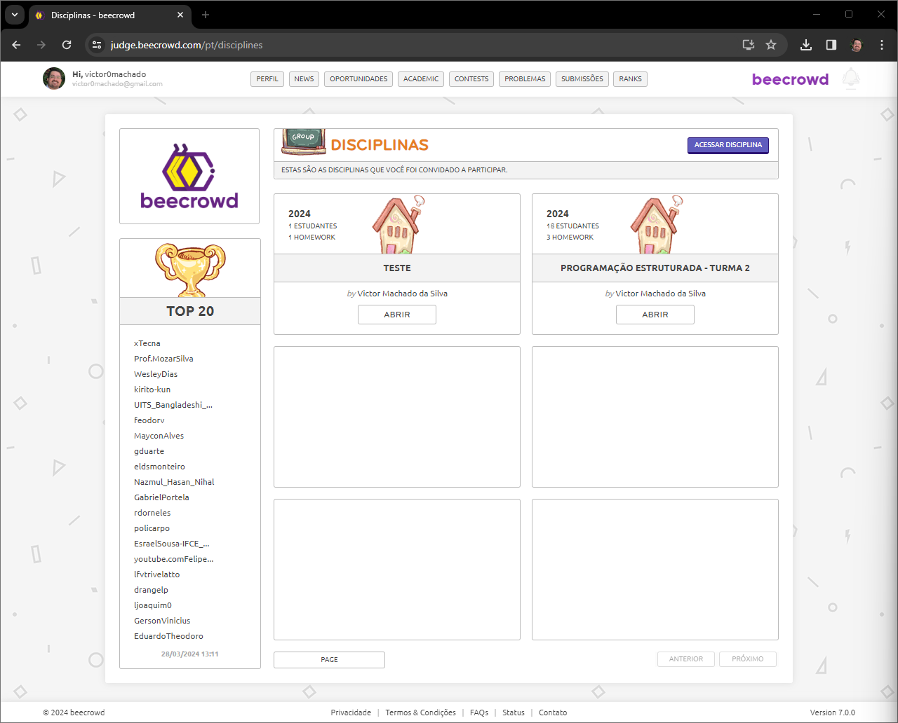
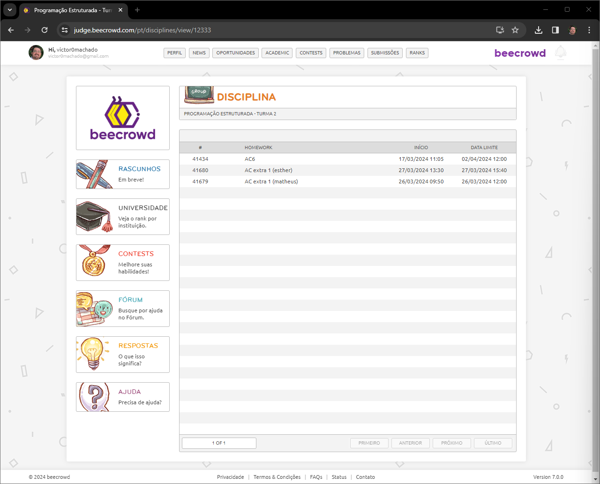
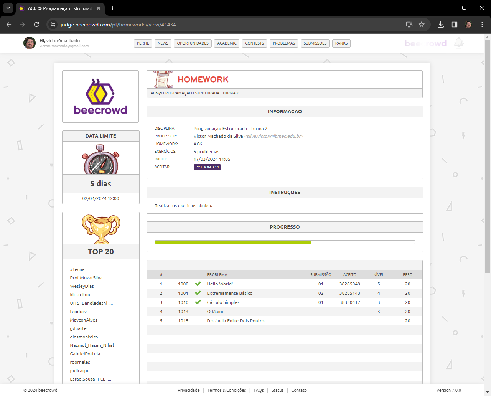

# Usando o Beecrowd

O Beecrowd é uma ferramenta online para avaliação automática de código. Ela possui diversas questões de programação, algumas de olimpíadas e competições avançadas. É usada como instrumento para prática de programação em diversas linguagens.

## Cadastro

O cadastro pode ser feito de forma simples em https://judge.beecrowd.com/, bastando logar com sua conta do Google ou do Github. Caso tenha recebido o convite pelo sem e-mail do Ibmec, faça o cadastro normalmente com este e-mail.


## Acessando a turma

Para acessar a turma, clique no botão "Academic", e abra a sua turma:




Em seguida, escolha a AC desejada e clique nela:





Para resolver os exercícios, basta clicar em um deles e tentar resolvê-los. Veja que a saída do programa deve ser idêntica a como está nos exemplos. Portanto, sempre que for fazer uma leitura de dados, é necessário utilizar a função `input` sem nenhum parâmetro, como no exemplo abaixo:

``` python
x = input()
```

Veja os vídeos abaixo para exemplos de como resolver problemas no Beecrowd em Python:

* [Exercício 1010](https://www.youtube.com/watch?v=TuVl-PXmF4o)
* [Exercício 1011](https://www.youtube.com/watch?v=I5kgyc02eEA)
* [Exercício 1015](https://www.youtube.com/watch?v=AknpYTySik4)
